# PRD — LibreSync: Google Drive Client para Linux

> **Status:** Rascunho
> **Versão:** 1.0
> **Última atualização:** 2026-07-26
> **Responsável:** Product Team

---

## 1. Resumo Executivo

LibreSync é um cliente desktop nativo para Linux que sincroniza arquivos entre o computador local e o Google Drive, preenchendo a lacuna deixada pela ausência de um cliente Google Drive oficial para Linux. O produto oferece sincronização bidirecional confiável, detecção eficiente de mudanças via inotify, suporte a múltiplas contas, operação em background com ícone na system tray, e arquitetura preparada para distribuição open source com potencial de versões comerciais futuras.

O projeto resolve a dor de milhares de usuários Linux que precisam alternar entre navegador, ferramentas de terceiros instáveis ou soluções via linha de comando para acessar arquivos do Google Drive.

---

## 2. Visão do Produto

Tornar a sincronização com Google Drive no Linux tão simples, rápida e confiável quanto é no Windows/macOS, com uma experiência nativa que respeita as convenções do desktop Linux e os padrões de segurança do ecossistema.

### Diferenciais
- **Nativo Linux:** sem camadas de compatibilidade, Electron ou runtime pesado
- **Código aberto:** transparência, auditabilidade, contribuição comunitária
- **Performance:** mínimo consumo de recursos, detecção de mudanças via inotify
- **Confiabilidade:** recuperação automática, fila com retry exponencial, checksum e hash

---

## 3. Personas

### Persona Principal — Maria (Desenvolvedora/DevOps)
- **Perfil:** 28-40 anos, engenheira de software, usa Ubuntu/Arch como daily driver
- **Dores:** Precisa sincronizar dotfiles, projetos pessoais e documentos entre máquinas. Soluções atuais (rclone, Insync pago, Google Drive via navegador) são lentas, quebram ou não são nativas
- **Ganhos esperados:** Sincronização automática confiável sem precisar abrir terminal. Múltiplas contas (pessoal + trabalho). Performance sem comprometer recursos
- **Cenário de uso:** Trabalha o dia todo com a aplicação em background. Arquivos de projeto são sincronizados automaticamente. Ao salvar um arquivo no VS Code, a sincronização dispara em segundos

### Persona Secundária — Carlos (Usuário corporativo)
- **Perfil:** 35-50 anos, gerente de projetos, usa Fedora no notebook corporativo
- **Dores:** Precisa de sincronização confiável para apresentações, planilhas e documentos compartilhados com a equipe. Não tem paciência para configurar ferramentas complexas
- **Ganhos esperados:** "Funciona depois de instalado". Notificações claras. Recuperação automática sem perder arquivos
- **Cenário de uso:** Abre o notebook, a sincronização já está rodando. Edita uma planilha, fecha, e o upload acontece sem intervenção

### Persona Terciária — Alice (Power User / Criadora de Conteúdo)
- **Perfil:** 25-35 anos, editora de vídeo/fotógrafa, usa Debian com arquivos grandes (multimídia)
- **Dores:** Arquivos de 5-20 GB que falham no upload/download em soluções instáveis. Precisa de controle de banda e sincronização seletiva
- **Ganhos esperados:** Upload confiável com retomada (resumable upload). Controle de banda para não saturar a rede. Sincronizar apenas pastas específicas
- **Cenário de uso:** Exporta um vídeo de 10 GB, a sincronização faz upload por chunks com retry, enquanto ela navega normalmente

---

## 4. Casos de Uso

| ID | Caso de Uso | Ator | Descrição |
|----|------------|------|-----------|
| UC-01 | Autenticar com Google | Maria | Realizar login via OAuth2 com escopo drive.file |
| UC-02 | Sincronizar pasta local | Maria | Configurar pasta local para sincronizar com Google Drive |
| UC-03 | Upload automático | Carlos | Arquivo salvo localmente é enviado automaticamente ao Drive |
| UC-04 | Download automático | Carlos | Arquivo criado/editado no Drive é baixado automaticamente |
| UC-05 | Resolver conflito | Maria | Arquivo editado simultaneamente local e remoto gera conflito |
| UC-06 | Pausar/Retomar sincronização | Alice | Pausar sync para liberar banda, retomar depois |
| UC-07 | Sincronização seletiva | Alice | Escolher quais pastas do Drive sincronizar localmente |
| UC-08 | Trabalhar offline | Maria | Editar arquivos sem conexão, sincronizar quando online |
| UC-09 | Múltiplas contas | Maria | Adicionar conta pessoal e corporativa simultaneamente |
| UC-10 | Visualizar logs | Carlos | Consultar logs de sincronização para diagnosticar problemas |

---

## 5. Requisitos Funcionais

### 5.1 MVP

| ID | Funcionalidade | Descrição | Prioridade |
|----|---------------|-----------|-----------|
| RF-01 | Autenticação OAuth2 | Login via navegador com PKCE, refresh token automático | Alta |
| RF-02 | Sincronização bidirecional | Sincronizar arquivos entre pasta local e Google Drive | Alta |
| RF-03 | Upload automático | Detectar mudanças locais e fazer upload | Alta |
| RF-04 | Download automático | Detectar mudanças remotas e fazer download (polling) | Alta |
| RF-05 | System tray | Ícone na bandeja do sistema com menu de ações | Alta |
| RF-06 | Notificações | Notificar sobre sincronizações, erros e conflitos | Alta |
| RF-07 | Resolução de conflitos | Detectar conflitos e gerar arquivos com sufixo | Alta |
| RF-08 | Configuração de pasta | Escolher pasta local para sincronização | Alta |
| RF-09 | Monitor de mudanças locais | inotify para detectar criação/remoção/alteração | Alta |
| RF-10 | Fila de sincronização | Jobs em fila com prioridade e retry exponencial | Alta |
| RF-11 | Pausar/Retomar | Controle manual de pausa da sincronização | Média |
| RF-12 | Logs detalhados | Logs com níveis (debug, info, warn, error) | Média |
| RF-13 | Recuperação automática | Reconectar e retomar sincronização após falha | Alta |
| RF-14 | Cache local SHA256 | Cache de hashes para detectar mudanças eficientemente | Alta |
| RF-15 | Configuração persistente | Arquivo de configuração YAML | Alta |

### 5.2 Pós-MVP (v1.0)

| ID | Funcionalidade | Fase |
|----|---------------|------|
| RF-16 | Sincronização seletiva | v1.0 |
| RF-17 | Múltiplas contas | v1.0 |
| RF-18 | Controle de banda | v1.0 |
| RF-19 | Suporte a ARM64 | v1.0 |
| RF-20 | Upload de arquivos grandes (resumable) | v1.0 |
| RF-21 | Modo offline completo | v1.0 |
| RF-22 | Tray com progresso | v1.0 |
| RF-23 | Preferências via GUI | v1.0 |

### 5.3 v1.5

| RF-24 | Versionamento de arquivos | v1.5 |
| RF-25 | Compartilhamento de links | v1.5 |
| RF-26 | Google Docs/Sheets/Slides export | v1.5 |
| RF-27 | Proxy e autenticação corporativa | v1.5 |
| RF-28 | Backup criptografado local | v1.5 |

### 5.4 v2.0

| RF-29 | Sync entre múltiplos dispositivos (P2P) | v2.0 |
| RF-30 | Extensões/plugins | v2.0 |
| RF-31 | WebDAV bridge | v2.0 |
| RF-32 | CLI avançado | v2.0 |

---

## 6. Requisitos Não Funcionais

| Categoria | Requisito | Critério de Aceitação |
|-----------|-----------|----------------------|
| Performance | Consumo de RAM | < 80 MB em idle, < 200 MB durante sincronização |
| Performance | Consumo de CPU | < 1% em idle, < 15% durante sincronização intensa |
| Performance | Detecção de mudanças | < 1s para arquivos < 10 MB via inotify |
| Performance | Upload arquivos pequenos | < 3s para arquivos < 1 MB (conexão 50 Mbps) |
| Performance | Sincronização paralela | Até 4 uploads + 4 downloads simultâneos |
| Performance | Arquivos grandes | Suporte a arquivos de até 50 GB com resumable upload |
| Performance | Máximo de arquivos | Sincronizar pastas com até 500.000 arquivos |
| Segurança | Armazenamento de tokens | Linux Secret Service (GNOME Keyring/KWallet) |
| Segurança | OAuth | PKCE obrigatório, sem client_secret em código |
| Segurança | Criptografia em trânsito | TLS 1.3 obrigatório |
| Confiabilidade | Uptime do processo | Auto-restart em caso de crash (systemd ou watchdog) |
| Confiabilidade | Integridade de dados | Checksum SHA256 antes e depois de transferências |
| Confiabilidade | Recuperação | Retry com backoff exponencial (1s, 2s, 4s, 8s, max 5min) |
| Usabilidade | Onboarding | < 3 cliques para começar a sincronizar |
| Usabilidade | Notificações | Não mais que 1 notificação por minuto em operação normal |
| Portabilidade | Distribuições | Ubuntu 22.04+, Fedora 38+, Debian 12+, Arch, openSUSE Leap 15.5+ |
| Portabilidade | Arquiteturas | x86_64 (MVP), ARM64 (v1.0) |

---

## 7. Arquitetura

### 7.1 Decisões Tecnológicas

#### Frontend: Tauri (Rust + HTML/CSS/JS)
| Alternativa | Prós | Contras | Veredito |
|------------|------|---------|----------|
| **Tauri** | Nativo, baixo consumo (~5 MB), Rust no core, webview para UI flexível | Ecossistema mais novo | ✅ **Recomendado** |
| Electron | Maduro, vasto ecossistema | Alto consumo (~100 MB+ RAM) | ❌ |
| Qt (C++) | Nativo, maduro, widgets ricos | Curva de aprendizado, build complexo | ⚠️ Alternativa |
| Flutter Desktop | Cross-platform, performance boa | Imaturo no Linux, runtime grande | ❌ |
| GTK4 + Rust | Nativo GNOME, baixo consumo | UI limitada para designs complexos | ⚠️ Alternativa |

**Decisão:** Tauri oferece o melhor equilíbrio: frontend moderno e flexível (webview do sistema), core em Rust com performance nativa, consumo mínimo de memória, e binários pequenos.

#### Backend/Core: Rust
| Alternativa | Prós | Contras | Veredito |
|------------|------|---------|----------|
| **Rust** | Performance C++, safety de memória, zero-cost abstractions, ecossistema tokio assíncrono, enums/pattern matching para state machine | Curva de aprendizado | ✅ **Recomendado** |
| Go | Goroutines excelentes, simples, boa stdlib | Runtime GC, menos safety, ecossistema FFI mais limitado | ⚠️ Alternativa |
| C++ | Performance máxima, maturidade | Safety manual, build complexo, vulnerabilidades de memória | ❌ |

**Decisão:** Rust é a escolha ideal para um sync engine que exige concorrência segura, gerenciamento de estado complexo (state machine de sincronização), e interação com system calls (inotify) sem overhead.

#### Banco Local: SQLite via rusqlite
Justificativa: Embarcado, zero configuração, transacional, maduro, perfeito para cache local e fila de jobs.

### 7.2 Diagrama de Arquitetura

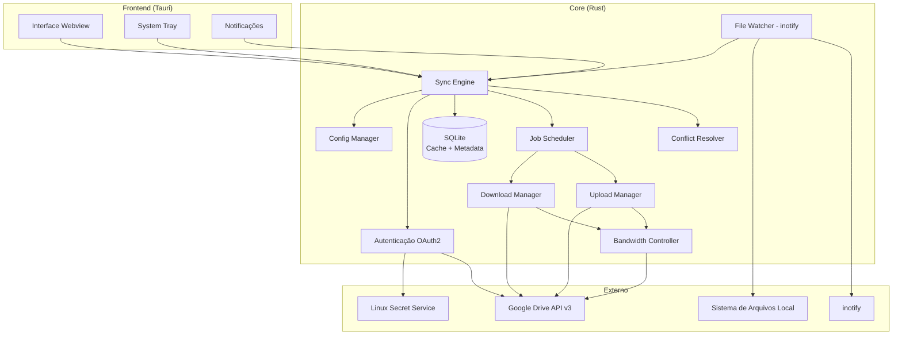

### 7.3 Diagrama de Camadas

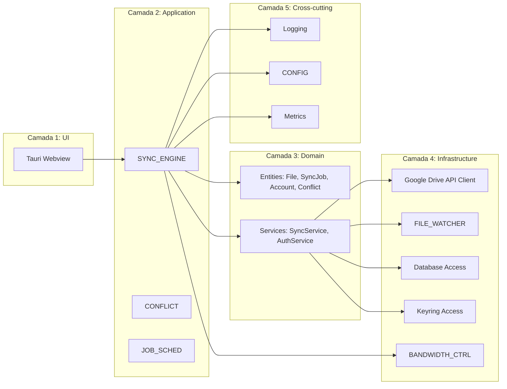

### 7.4 State Machine da Sincronização

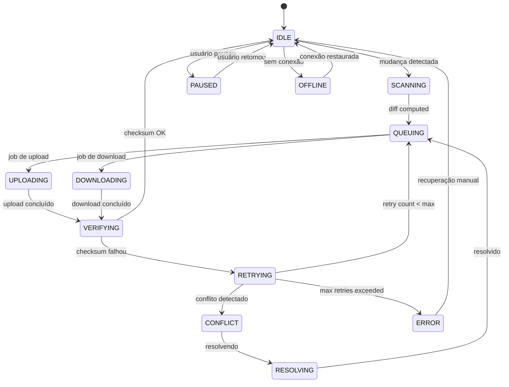

---

## 8. Modelo de Dados

### 8.1 Modelo de Domínio

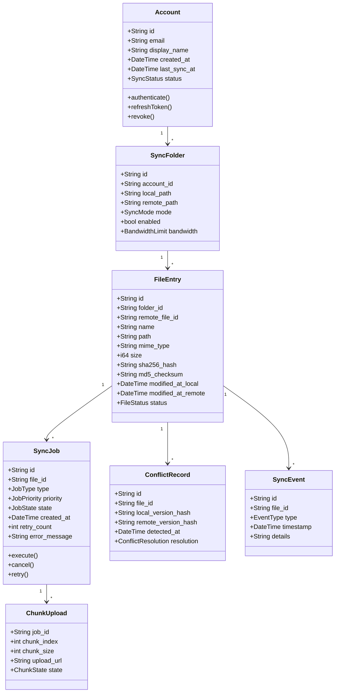

### 8.2 Agregados

- **Agregado Raiz:** `Account` — contém `SyncFolder`s, que contêm `FileEntry`s
- **Agregado Job:** `SyncJob` — contém `ChunkUpload`s, referência `FileEntry`
- **Agregado Conflito:** `ConflictRecord` — referência `FileEntry`, contém decisão de resolução

### 8.3 Objetos de Valor

| VO | Tipo | Descrição |
|----|------|-----------|
| `SHA256Hash` | String (64 hex) | Hash do conteúdo do arquivo |
| `MD5Hash` | String (32 hex) | MD5 do Google Drive |
| `FileStatus` | Enum | Created, Modified, Deleted, Moved, Synced, Conflict, Ignored |
| `JobType` | Enum | Upload, Download, Delete, Move, Metadata |
| `JobPriority` | Enum (i8) | Low=0, Normal=5, High=10, Critical=20 |
| `SyncMode` | Enum | Bidirectional, UploadOnly, DownloadOnly |
| `BandwidthLimit` | Struct | { download_kbps: Option<u32>, upload_kbps: Option<u32> } |
| `ConflictResolution` | Enum | KeepLocal, KeepRemote, KeepBoth, Manual |

---

## 9. Fluxos de Sincronização

### 9.1 Fluxo Completo de Sincronização

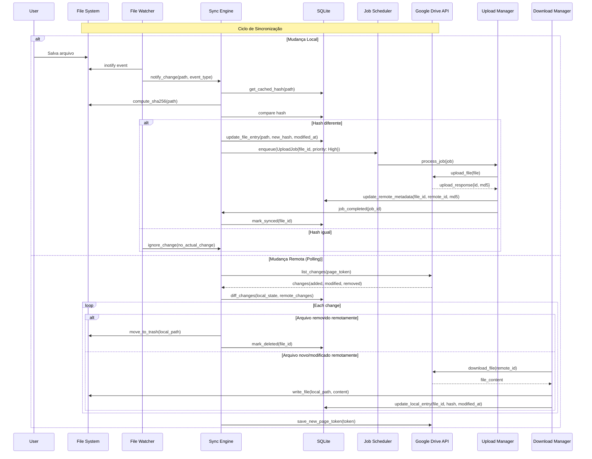

### 9.2 Detecção de Mudanças Locais (inotify)

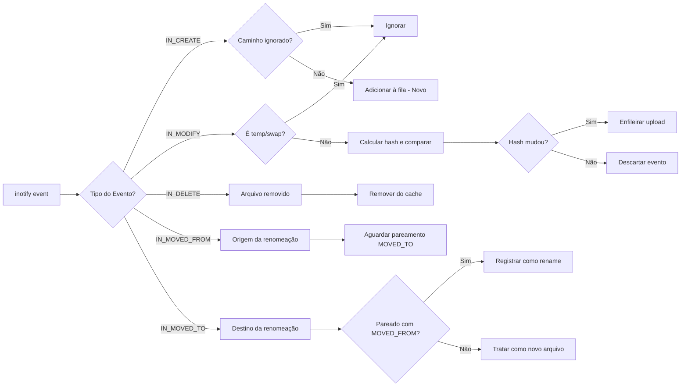

### 9.3 Estratégia de Polling para Mudanças Remotas

```mermaid
flowchart TD
    A[Iniciar polling] --> B[Aguardar intervalo]
    B --> C[Verificar conectividade]
    C --> D{Online?}
    D -->|Não| E[Aguardar reconexão]
    E --> C
    D -->|Sim| F[Chamar changes.list com page_token]
    F --> G{Resposta OK?}
    G -->|Não| H{HTTP 429?}
    G -->|Não| I{HTTP 5xx?}
    H --> J[Backoff: esperar Retry-After]
    J --> F
    I --> K[Backoff exponencial: 1s, 2s, 4s...]
    K --> F
    G -->|Sim| L[Processar changes]
    L --> M{Has more?}
    M -->|Sim| F
    M -->|Não| N[Salvar novo page_token]
    N --> O[Dynamic interval: 5s (ativo) a 60s (idle)]
    O --> B

    style B fill:#f9f,stroke:#333
    style O fill:#bbf,stroke:#333
```

### 9.4 Resolução de Conflitos

```mermaid
flowchart TD
    A[Conflito detectado] --> B{Edição local vs remota?}
    B -->|Arquivo modificado local E remotamente| C[Comparar timestamps]
    B -->|Arquivo removido local mas modificado remoto| D[Manter remoto]
    B -->|Arquivo removido remoto mas modificado local| E[Manter local]
    B -->|Criação simultânea| F[Criar ambos]

    C --> G{Timestamp local > remoto?}
    G -->|Sim| H[Manter local como principal]
    G -->|Não| I[Manter remoto como principal]

    H --> J[Criar cópia remota com sufixo<br/>"arquivo (conflito NOME).ext"]
    I --> K[Criar cópia local com sufixo<br/>"arquivo (conflito NOME).ext"]

    J --> L[Notificar usuário]
    K --> L
    D --> M[Notificar usuário: arquivo restaurado]
    E --> N[Notificar usuário: exclusão ignorada]
    F --> O[Criar cópia local com sufixo]
    O --> L
```

---

## 10. API e Integração

### 10.1 Endpoints Google Drive API v3 Utilizados

| Endpoint | Método | Uso |
|----------|--------|-----|
| `https://www.googleapis.com/auth/drive.file` | Scope | Acesso a arquivos criados/abertos pela app |
| `https://www.googleapis.com/auth/drive.metadata.readonly` | Scope | Leitura de metadados (opcional, para sinc. seletiva) |
| `https://oauth2.googleapis.com/token` | POST | Obter/refresh tokens OAuth |
| `https://oauth2.googleapis.com/device/code` | POST | Device flow para login |
| `drive.files.list` | GET | Listar arquivos da raiz |
| `drive.files.get` | GET | Obter metadados de arquivo |
| `drive.files.create` | POST | Upload de novo arquivo |
| `drive.files.update` | PATCH | Atualizar arquivo existente |
| `drive.files.delete` | DELETE | Remover arquivo |
| `drive.changes.list` | GET | Listar changes desde page_token |
| `drive.changes.getStartPageToken` | GET | Obter page_token inicial |
| `drive.files.watch` | POST | Webhook para notificações push |
| `drive.about.get` | GET | Obter informações da conta (quota, storage) |

### 10.2 Estratégia de Detecção de Mudanças Remotas

**Recomendação: Polling com mudanças (changes.list)**

O Google Drive API oferece webhooks via `drive.files.watch`, mas:
- Webhooks expiram a cada hora (Channel expiration)
- Precisam de endpoint HTTP público para receber notificações
- Não funcionam em máquinas locais sem exposição pública

**Estratégia híbrida:**
1. Usar `changes.list` com `page_token` (polling)
2. Intervalo dinâmico: 5s após mudanças detectadas, 60s após período sem mudanças
3. Backoff exponencial em caso de erro (429 Too Many Requests ou 5xx)
4. Usar `includeRemoved=true` e `includeItemsFromAllDrives=true`

### 10.3 Rate Limits

| Limite | Valor | Estratégia |
|--------|-------|-----------|
| Requests por 100s por usuário | 10.000 | Controle interno de taxa |
| Requests por dia | 1.000.000.000 | Fila e rate limiting |
| Upload size | 5 TB por arquivo máximo | Resumable upload obrigatório para > 5 MB |
| Changes.list quota | Alta, mas monitorar | Paginar com pageSize=1000 |

### 10.4 Paginação

```rust
// Estratégia de paginação para changes.list
let mut page_token = get_start_page_token().await;
let mut all_changes = Vec::new();

loop {
    let response = drive.changes()
        .list(&page_token)
        .page_size(1000)
        .spaces("drive")
        .include_removed(true)
        .include_items_from_all_drives(false)
        .doit().await?;

    all_changes.extend(response.changes);

    if response.new_start_page_token.is_some() {
        page_token = response.new_start_page_token.unwrap();
        save_page_token(&page_token);
    }

    if !response.next_page_token.is_some() {
        break;
    }
    page_token = response.next_page_token.unwrap();
}
```

### 10.5 Resumable Upload para Arquivos Grandes

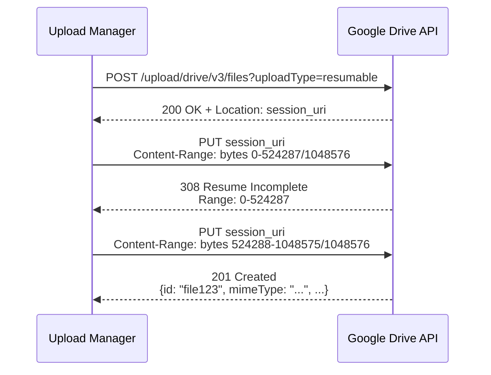

---

## 11. Segurança

### 11.1 OAuth2 com PKCE

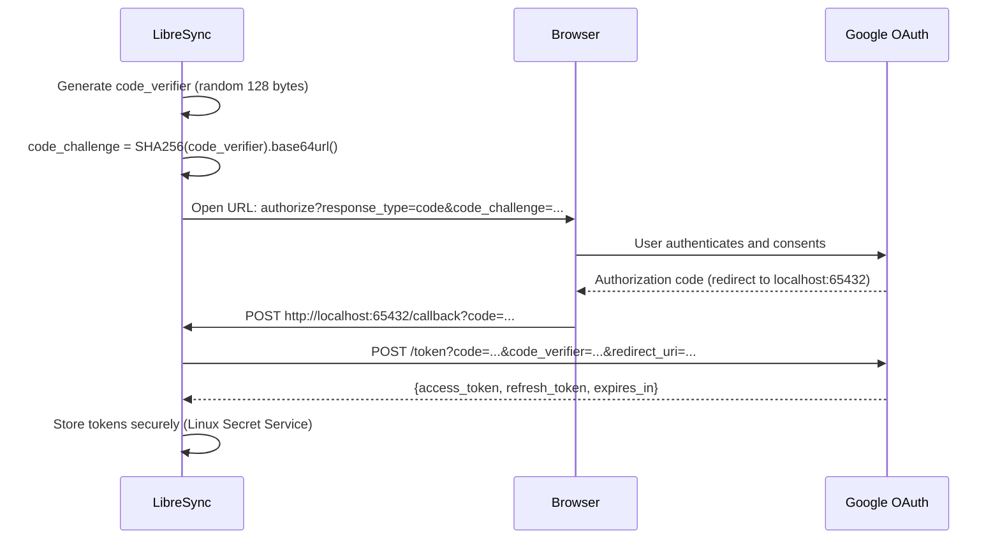

### 11.2 Armazenamento Seguro de Tokens

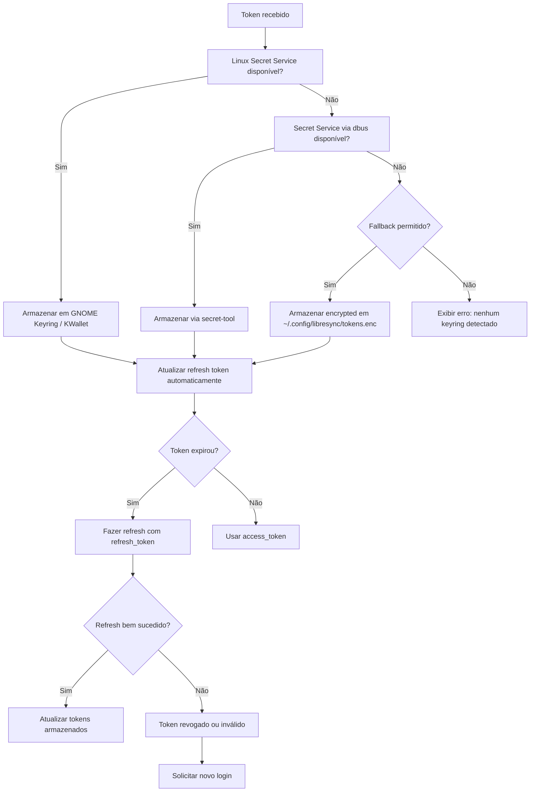

### 11.3 Proteção contra Corrupção de Cache

- **Integridade de metadados:** SQLite com WAL mode + checksum row na tabela de metadados
- **Rollback automático:** Transações SQLite garantem atomicidade
- **Verificação periódica:** Scan de consistência entre cache e filesystem a cada 24h
- **Recuperação de corrupção:** Se SQLite detectar corrupção → backup automático do cache + recriação

### 11.4 Verificação de Integridade de Arquivos

- **Antes do upload:** Calcular SHA256, comparar com cache, transferir apenas se diferente
- **Após upload:** Comparar MD5 retornado pela Google Drive API com MD5 local
- **Após download:** Comparar SHA256 do arquivo baixado com SHA256 do arquivo remoto (obtido via metadata)
- **Em caso de divergência:** Descartar arquivo corrupto, re-enfileirar job

---

## 12. UX/UI

### 12.1 Princípios de Design

1. **Mínimo toque:** A aplicação deve funcionar sem intervenção do usuário na maioria dos casos
2. **Feedback claro:** Notificações informativas sem serem intrusivas
3. **Transparência:** O usuário pode ver o que está sincronizando e por quê
4. **Recuperação:** Mensagens de erro acionáveis, não apenas códigos de erro

### 12.2 Tela de Login

```mermaid
flowchart TD
    A[Abrir app] --> B{Token válido existe?}
    B -->|Sim| C[Ir para tela principal]
    B -->|Não| D[Mostrar tela de boas-vindas]
    D --> E[Usuário clica "Fazer login com Google"]
    E --> F[Abrir navegador para autorização OAuth]
    F --> G[Usuário autoriza]
    G --> H{Sucesso?}
    H -->|Sim| I[Tokens armazenados com segurança]
    H -->|Não| J[Mostrar erro específico]
    J --> E
    I --> C
```

### 12.3 Tela Principal

```
+--------------------------------------------------+
|  LibreSync                                        |
|  ───────────────────────────────────────────────  |
|  [≡]  [↻  Sincronizado]  [⚙ Preferências]  [✕]  |
|                                                    |
|  ● maria@gmail.com              Última sync: ago  |
|  ┌──────────────────────────────────────────────┐ │
|  │ 📁 Meu Drive        ───  /home/maria/Drive  │ │
|  │    ↑ Sincronizando (3 arquivos...)           │ │
|  │    ↓ 2 arquivos atualizados                  │ │
|  │    ⏸ Pausado                                │ │
|  │  📁 Documentos       ───  /home/maria/Docs   │ │
|  │    ✓ 1.234 arquivos sincronizados            │ │
|  │    ⚠ Conflito: relatorio.docx               │ │
|  ├──────────────────────────────────────────────┤ │
|  │  Atividade Recente                           │ │
|  │  10:23 ↑ plano.pdf     (1.2 MB)    ✓        │ │
|  │  10:22 ↓ foto.png      (3.5 MB)    ✓        │ │
|  │  10:20 ✕ projeto.zip   (10 MB)     ⚠ Erro   │ │
|  +──────────────────────────────────────────────+ |
+--------------------------------------------------+
```

### 12.4 Preferências

```
+--------------------------------------------------+
|  Preferências                            [✕]     |
|  ───────────────────────────────────────────────  |
|                                                    |
|  Geral | Contas | Sincronização | Rede | Logs     |
|  ───────────────────────────────────────────────  |
|                                                    |
|  [Contas]                                          |
|  ● maria@gmail.com                       [Sair]   |
|  ○ carlos@corp.com                       [Sair]   |
|  [+ Adicionar conta]                              |
|                                                    |
|  [Sincronização]                                   |
|  ☑ Iniciar sincronização automática ao logar      |
|  ☑ Sincronizar ao ligar o computador              |
|  ☐ Notificar sobre cada arquivo sincronizado      |
|  ☑ Notificar apenas erros e conflitos             |
|                                                    |
|  [Rede]                                            |
|  Limite de upload: [  ████████░░  80%  ]          |
|  Limite de download: [ ██████░░░░  60%  ]         |
|  Número de uploads paralelos: [4]  [-] [+]        |
|                                                    |
|  [Pastas]                                          |
|  Pasta padrão: /home/maria/Drive        [Alterar] |
|  ☑ Sincronizar apenas estas pastas:               |
|    ☑ Documentos                                   |
|    ☑ Planilhas                                    |
|    ☐ Fotos                                        |
|    ☐ Backup                                       |
+--------------------------------------------------+
```

### 12.5 Notificações

| Tipo | Conteúdo | Ação |
|------|----------|------|
| Info | "Sincronização concluída (142 arquivos)" | Nenhuma |
| Warning | "Conflito em relatorio.docx — cópia local mantida" | Abrir pasta |
| Error | "Erro ao sincronizar projeto.zip — verifique logs" | Abrir logs |
| Progress | "Sincronizando 5/12 arquivos (42%)" | Abrir app |

### 12.6 Estados de Erro e Primeira Execução

**Primeira execução (Onboarding):**
1. Tela de boas-vindas com ilustração e "Vamos começar?"
2. Botão "Fazer login com Google"
3. Após login: "Escolha onde sincronizar seus arquivos" (selecionar pasta)
4. "Tudo pronto! Seus arquivos estão sendo sincronizados."
5. Abre tela principal com sync inicial em andamento

**Estados de erro na tela principal:**
- ⚠ Amarelo: Conflitos ou erros não críticos
- 🔴 Vermelho: Erro de autenticação (token expirado sem refresh)
- ⚪ Cinza: Offline / Pausado
- 🟢 Verde: Sincronizado

---

## 13. Wireframes

### 13.1 System Tray Menu

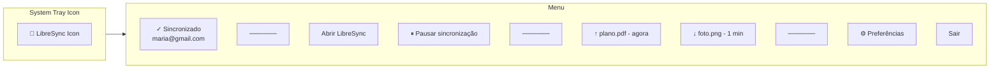

### 13.2 Fluxo de Sincronização Seletiva

```mermaid
flowchart TD
    A[Abrir Preferências > Sincronização] --> B[Lista de pastas do Drive]
    B --> C[Usuário marca/desmarca pastas]
    C --> D[Confirmar]
    D --> E{Ação necessária?}
    E -->|Pasta desmarcada| F[Remover arquivos locais?]
    F --> G[Manter local] --> H[Só para de sincronizar]
    F --> I[Remover local (cache only)] --> H
    E -->|Pasta marcada| J[Download inicial]
    J --> H
    H --> K[Mostrar progresso]
```

---

## 14. Banco de Dados

### 14.1 Esquema SQL Completo

```sql
-- Enable WAL mode for better concurrent performance
PRAGMA journal_mode=WAL;
PRAGMA foreign_keys=ON;

-- ============================================
-- Accounts
-- ============================================
CREATE TABLE accounts (
    id              TEXT PRIMARY KEY,  -- UUID v4
    email           TEXT NOT NULL UNIQUE,
    display_name    TEXT,
    avatar_url      TEXT,
    access_token    TEXT NOT NULL,      -- Encrypted
    refresh_token   TEXT,               -- Encrypted
    token_expires_at INTEGER,           -- Unix timestamp
    scope           TEXT NOT NULL,
    created_at      INTEGER NOT NULL DEFAULT (strftime('%s', 'now')),
    last_sync_at    INTEGER,
    is_active       INTEGER NOT NULL DEFAULT 1,
    quota_total     INTEGER DEFAULT 0,  -- Bytes
    quota_used      INTEGER DEFAULT 0,
    quota_trash     INTEGER DEFAULT 0
);

CREATE INDEX idx_accounts_email ON accounts(email);

-- ============================================
-- Sync Folders
-- ============================================
CREATE TABLE sync_folders (
    id              TEXT PRIMARY KEY,  -- UUID v4
    account_id      TEXT NOT NULL REFERENCES accounts(id) ON DELETE CASCADE,
    local_path      TEXT NOT NULL,
    remote_path     TEXT NOT NULL DEFAULT '/',
    remote_id       TEXT,               -- Google Drive folder ID
    sync_mode       TEXT NOT NULL DEFAULT 'bidirectional'
                    CHECK (sync_mode IN ('bidirectional', 'upload_only', 'download_only')),
    is_enabled      INTEGER NOT NULL DEFAULT 1,
    bandwidth_upload_kbps    INTEGER,
    bandwidth_download_kbps  INTEGER,
    created_at      INTEGER NOT NULL DEFAULT (strftime('%s', 'now')),
    UNIQUE(account_id, local_path)
);

CREATE INDEX idx_sync_folders_account ON sync_folders(account_id);
CREATE INDEX idx_sync_folders_path ON sync_folders(local_path);

-- ============================================
-- File Entries (Cache)
-- ============================================
CREATE TABLE file_entries (
    id                TEXT PRIMARY KEY,  -- UUID v4
    folder_id         TEXT NOT NULL REFERENCES sync_folders(id) ON DELETE CASCADE,
    remote_file_id    TEXT,               -- Google Drive file ID (NULL for local-only)
    parent_remote_id  TEXT,               -- Parent folder remote ID
    name              TEXT NOT NULL,
    local_path        TEXT NOT NULL,
    mime_type         TEXT DEFAULT 'application/octet-stream',
    size              INTEGER DEFAULT 0,
    sha256_hash       TEXT,               -- 64 hex chars
    md5_checksum      TEXT,               -- 32 hex chars (Google Drive MD5)
    modified_at_local  INTEGER,           -- Unix timestamp (ns precision)
    modified_at_remote INTEGER,           -- Unix timestamp from Google
    created_at_local   INTEGER,
    created_at_remote  INTEGER,
    status            TEXT NOT NULL DEFAULT 'synced'
                      CHECK (status IN (
                          'synced', 'pending_upload', 'pending_download',
                          'uploading', 'downloading', 'conflict',
                          'deleted_remote', 'deleted_local', 'ignored'
                      )),
    is_directory      INTEGER NOT NULL DEFAULT 0,
    trashed           INTEGER NOT NULL DEFAULT 0,
    version           INTEGER NOT NULL DEFAULT 1,
    last_checked_at   INTEGER,
    last_synced_at    INTEGER,
    UNIQUE(folder_id, local_path)
);

CREATE INDEX idx_file_entries_folder ON file_entries(folder_id);
CREATE INDEX idx_file_entries_status ON file_entries(status);
CREATE INDEX idx_file_entries_remote_id ON file_entries(remote_file_id);
CREATE INDEX idx_file_entries_parent ON file_entries(parent_remote_id);
CREATE INDEX idx_file_entries_path ON file_entries(local_path);
CREATE INDEX idx_file_entries_modified ON file_entries(modified_at_remote);

-- ============================================
-- Sync Jobs
-- ============================================
CREATE TABLE sync_jobs (
    id              TEXT PRIMARY KEY,  -- UUID v4
    file_entry_id   TEXT REFERENCES file_entries(id) ON DELETE SET NULL,
    folder_id       TEXT NOT NULL REFERENCES sync_folders(id) ON DELETE CASCADE,
    job_type        TEXT NOT NULL CHECK (job_type IN (
                        'upload', 'download', 'delete_remote', 'delete_local',
                        'move_remote', 'move_local', 'metadata'
                    )),
    priority        INTEGER NOT NULL DEFAULT 5,  -- 0 (low) to 20 (critical)
    state           TEXT NOT NULL DEFAULT 'queued'
                    CHECK (state IN (
                        'queued', 'running', 'paused', 'completed',
                        'failed', 'cancelled'
                    )),
    retry_count     INTEGER NOT NULL DEFAULT 0,
    max_retries     INTEGER NOT NULL DEFAULT 5,
    error_message   TEXT,
    error_code      TEXT,
    created_at      INTEGER NOT NULL DEFAULT (strftime('%s', 'now')),
    started_at      INTEGER,
    completed_at    INTEGER,
    next_retry_at   INTEGER,
    source          TEXT DEFAULT 'local' CHECK (source IN ('local', 'remote', 'manual'))
);

CREATE INDEX idx_sync_jobs_state ON sync_jobs(state);
CREATE INDEX idx_sync_jobs_priority ON sync_jobs(priority, created_at);
CREATE INDEX idx_sync_jobs_folder ON sync_jobs(folder_id);
CREATE INDEX idx_sync_jobs_file ON sync_jobs(file_entry_id);
CREATE INDEX idx_sync_jobs_retry ON sync_jobs(next_retry_at) WHERE state = 'failed';

-- ============================================
-- Chunk Uploads (for resumable uploads)
-- ============================================
CREATE TABLE chunk_uploads (
    id              INTEGER PRIMARY KEY AUTOINCREMENT,
    job_id          TEXT NOT NULL REFERENCES sync_jobs(id) ON DELETE CASCADE,
    chunk_index     INTEGER NOT NULL,
    chunk_size      INTEGER NOT NULL,
    offset_start    INTEGER NOT NULL,
    offset_end      INTEGER NOT NULL,
    upload_url      TEXT,               -- Resumable session URI
    state           TEXT NOT NULL DEFAULT 'pending'
                    CHECK (state IN ('pending', 'uploading', 'uploaded', 'failed')),
    retry_count     INTEGER DEFAULT 0,
    uploaded_at     INTEGER,
    UNIQUE(job_id, chunk_index)
);

CREATE INDEX idx_chunk_uploads_job ON chunk_uploads(job_id);

-- ============================================
-- Conflict Records
-- ============================================
CREATE TABLE conflict_records (
    id                  TEXT PRIMARY KEY,
    file_entry_id       TEXT NOT NULL REFERENCES file_entries(id) ON DELETE CASCADE,
    local_sha256        TEXT,
    remote_sha256       TEXT,
    local_modified_at   INTEGER,
    remote_modified_at  INTEGER,
    detected_at         INTEGER NOT NULL DEFAULT (strftime('%s', 'now')),
    resolution          TEXT CHECK (resolution IN (
                            'keep_local', 'keep_remote', 'keep_both', 'pending'
                        )) DEFAULT 'pending',
    resolved_at         INTEGER,
    resolved_by         TEXT DEFAULT 'auto' CHECK (resolved_by IN ('auto', 'user'))
);

CREATE INDEX idx_conflicts_file ON conflict_records(file_entry_id);
CREATE INDEX idx_conflicts_pending ON conflict_records(resolution) WHERE resolution = 'pending';

-- ============================================
-- Sync Events (Activity Log)
-- ============================================
CREATE TABLE sync_events (
    id              INTEGER PRIMARY KEY AUTOINCREMENT,
    folder_id       TEXT REFERENCES sync_folders(id) ON DELETE SET NULL,
    file_entry_id   TEXT REFERENCES file_entries(id) ON DELETE SET NULL,
    event_type      TEXT NOT NULL CHECK (event_type IN (
                        'sync_started', 'sync_completed', 'file_uploaded',
                        'file_downloaded', 'file_deleted', 'file_moved',
                        'conflict_detected', 'conflict_resolved',
                        'error', 'warning', 'info', 'auth_refresh',
                        'paused', 'resumed', 'offline', 'online'
                    )),
    file_path       TEXT,
    file_size       INTEGER,
    message         TEXT,
    level           TEXT NOT NULL DEFAULT 'info'
                    CHECK (level IN ('debug', 'info', 'warn', 'error')),
    created_at      INTEGER NOT NULL DEFAULT (strftime('%s', 'now'))
);

CREATE INDEX idx_sync_events_folder ON sync_events(folder_id);
CREATE INDEX idx_sync_events_type ON sync_events(event_type);
CREATE INDEX idx_sync_events_created ON sync_events(created_at);
CREATE INDEX idx_sync_events_level ON sync_events(level);

-- ============================================
-- Remote Changes State (Polling cursor)
-- ============================================
CREATE TABLE remote_changes_state (
    account_id      TEXT PRIMARY KEY REFERENCES accounts(id) ON DELETE CASCADE,
    page_token      TEXT NOT NULL,
    last_polled_at  INTEGER,
    next_poll_in    INTEGER DEFAULT 30  -- seconds
);

-- ============================================
-- Ignored Paths (patterns)
-- ============================================
CREATE TABLE ignored_paths (
    id              INTEGER PRIMARY KEY AUTOINCREMENT,
    folder_id       TEXT NOT NULL REFERENCES sync_folders(id) ON DELETE CASCADE,
    pattern         TEXT NOT NULL,  -- Glob pattern
    is_regex        INTEGER NOT NULL DEFAULT 0,
    description     TEXT,
    UNIQUE(folder_id, pattern)
);

-- ============================================
-- App Configuration
-- ============================================
CREATE TABLE app_config (
    key             TEXT PRIMARY KEY,
    value           TEXT NOT NULL,
    updated_at      INTEGER NOT NULL DEFAULT (strftime('%s', 'now'))
);

-- Seed default config
INSERT OR IGNORE INTO app_config (key, value) VALUES
    ('poll_interval_active', '5'),
    ('poll_interval_idle', '60'),
    ('max_parallel_uploads', '4'),
    ('max_parallel_downloads', '4'),
    ('max_retries', '5'),
    ('backoff_base_seconds', '1'),
    ('backoff_max_seconds', '300'),
    ('log_level', 'info'),
    ('log_max_files', '5'),
    ('log_max_size_mb', '10'),
    ('cache_verification_interval_hours', '24'),
    ('first_run_completed', 'false'),
    ('last_version', '');

-- ============================================
-- Schema Version
-- ============================================
CREATE TABLE schema_version (
    version     INTEGER PRIMARY KEY,
    applied_at  INTEGER NOT NULL DEFAULT (strftime('%s', 'now')),
    description TEXT
);

INSERT INTO schema_version (version, description) VALUES (1, 'Initial schema');
```

---

## 15. Diagramas Mermaid

### 15.1 Diagrama de Deployment

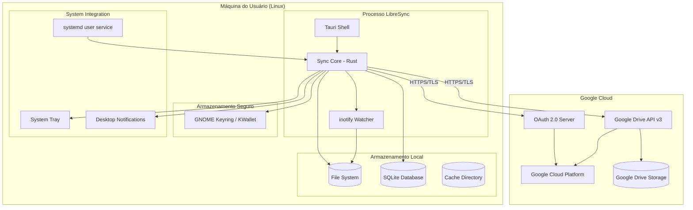

### 15.2 Diagrama de Componentes

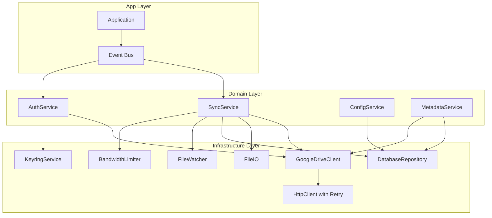

### 15.3 Diagrama de Sequência: Upload com Retry

```mermaid
sequenceDiagram
    participant FW as FileWatcher
    participant SE as SyncEngine
    participant DB as Database
    participant JS as JobScheduler
    participant UM as UploadManager
    participant GAPI as GoogleDriveAPI

    FW->>SE: file_modified(path)
    SE->>DB: get_cached_hash(path)
    SE->>SE: compute_sha256(path)
    SE->>DB: compare_hash
    alt hash_changed
        SE->>DB: update_file_entry(status: pending_upload)
        SE->>JS: enqueue(UploadJob, priority=10)
        JS->>UM: dequeue()
        UM->>DB: update_job_state(state: running)
        UM->>GAPI: upload_file(content, metadata)
        alt success
            GAPI-->>UM: 200 OK {id, md5}
            UM->>DB: update_file_entry(remote_id, md5, status: synced)
            UM->>DB: update_job_state(state: completed)
            UM->>SE: on_job_completed(id)
        alt network_error
            GAPI-->>UM: timeout / connection reset
            UM->>DB: increment_retry(job_id)
            alt retry_count < max
                UM->>UM: wait(backoff_delay)
                UM->>GAPI: retry upload
            else max_retries_exceeded
                UM->>DB: update_job_state(state: failed)
                UM->>UM: notify_error("Upload failed after 5 retries")
            end
        else conflict
            GAPI-->>UM: 409 Conflict
            UM->>SE: handle_conflict(file_id)
            SE->>DB: create_conflict_record(file_id)
            SE->>SE: resolve_conflict(file_id)
        end
    end
```

---

## 16. Plano de Testes

### 16.1 Estratégia de Testes

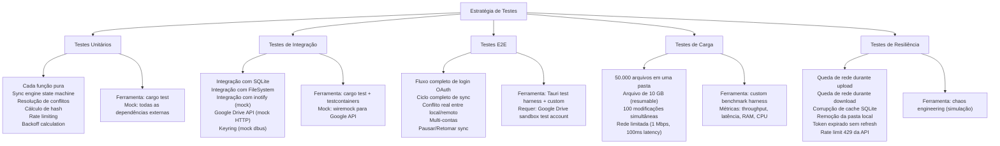

### 16.2 Cobertura de Testes por Camada

| Camada | Cobertura Mínima | Técnica |
|--------|-----------------|---------|
| Domain (Sync Engine state machine) | 95% | Property-based testing (proptest) |
| Application Services | 85% | Testes com mocks |
| Infrastructure (Google API Client) | 90% | Wiremock para simular API |
| Infrastructure (Database) | 90% | Testes com SQLite em memória |
| Infrastructure (File Watcher) | 80% | Testes com tempdir + inotify |
| UI (Tauri) | 70% | Testes de integração com webview |
| E2E | 10 cenários críticos | Fluxos completos |

### 16.3 Mocks da Google Drive API

```rust
// Mock implementado com wiremock-rs
// Exemplo de mock para upload de arquivo
#[cfg(test)]
mod tests {
    use wiremock::{Mock, MockServer, ResponseTemplate};
    use wiremock::matchers::{method, path};

    #[tokio::test]
    async fn test_upload_small_file() {
        let mock_server = MockServer::start().await;

        // Mock do upload
        Mock::given(method("POST"))
            .and(path("/upload/drive/v3/files"))
            .respond_with(ResponseTemplate::new(200)
                .set_body_json(serde_json::json!({
                    "id": "test_file_id_123",
                    "name": "test.txt",
                    "md5Checksum": "d41d8cd98f00b204e9800998ecf8427e",
                    "size": "0"
                })))
            .mount(&mock_server)
            .await;

        let client = GoogleDriveClient::new(mock_server.uri(), "fake_token");
        let result = client.upload_file("test.txt", b"").await;
        assert!(result.is_ok());
        assert_eq!(result.unwrap().id, "test_file_id_123");
    }
}
```

---

## 17. CI/CD

### 17.1 Pipeline GitHub Actions

```yaml
name: Build and Test

on:
  push:
    branches: [main, develop]
  pull_request:
    branches: [main]

env:
  CARGO_TERM_COLOR: always
  RUST_BACKTRACE: 1

jobs:
  lint:
    runs-on: ubuntu-latest
    steps:
      - uses: actions/checkout@v4
      - uses: actions-rust-lang/setup-rust-toolchain@v1
        with:
          components: rustfmt, clippy
      - name: Format check
        run: cargo fmt --check
      - name: Clippy
        run: cargo clippy -- -D warnings
      - name: Tauri lint
        run: cargo tauri lint

  test:
    strategy:
      matrix:
        os: [ubuntu-latest, ubuntu-22.04]
    runs-on: ${{ matrix.os }}
    steps:
      - uses: actions/checkout@v4
      - uses: actions-rust-lang/setup-rust-toolchain@v1
      - name: Install system dependencies
        run: |
          sudo apt-get update
          sudo apt-get install -y libwebkit2gtk-4.1-dev \
            libgtk-3-dev libayatana-appindicator3-dev \
            librsvg2-dev libssl-dev libdbus-1-dev
      - name: Unit tests
        run: cargo test --lib
      - name: Integration tests
        run: cargo test --test '*'

  build:
    strategy:
      matrix:
        arch: [x86_64, aarch64]
        distro: [ubuntu-22.04, ubuntu-24.04]
    runs-on: ${{ matrix.distro }}
    steps:
      - uses: actions/checkout@v4
      - uses: actions-rust-lang/setup-rust-toolchain@v1
      - name: Install dependencies
        run: |
          sudo apt-get update
          sudo apt-get install -y libwebkit2gtk-4.1-dev \
            libgtk-3-dev libayatana-appindicator3-dev \
            librsvg2-dev libssl-dev libdbus-1-dev
      - name: Build
        run: cargo tauri build
      - name: Upload artifacts
        uses: actions/upload-artifact@v4
        with:
          name: libresync-${{ matrix.distro }}-${{ matrix.arch }}
          path: |
            target/release/libresync
            target/release/bundle/deb/*.deb
            target/release/bundle/rpm/*.rpm
            target/release/bundle/appimage/*.AppImage

  security-audit:
    runs-on: ubuntu-latest
    steps:
      - uses: actions/checkout@v4
      - uses: actions-rust-lang/setup-rust-toolchain@v1
      - name: Install cargo-audit
        run: cargo install cargo-audit
      - name: Security audit
        run: cargo audit

  release:
    needs: [lint, test, build, security-audit]
    if: github.event_name == 'push' && startsWith(github.ref, 'refs/tags/v')
    runs-on: ubuntu-latest
    steps:
      - uses: actions/checkout@v4
      - name: Download artifacts
        uses: actions/download-artifact@v4
      - name: Generate checksums
        run: |
          for f in libresync-*/*; do
            sha256sum "$f" > "$f.sha256"
          done
      - name: Create release
        uses: softprops/action-gh-release@v1
        with:
          files: |
            libresync-*/*
          generate_release_notes: true
```

---

## 18. Distribuição

### 18.1 Comparação de Formatos

| Formato | Tamanho | Sandbox | Auto-update | Integração Desktop | Manutenção |
|---------|---------|---------|-------------|-------------------|------------|
| **.deb** | Pequeno | Não | APT | Nativa (Debian/Ubuntu) | Baixa |
| **.rpm** | Pequeno | Não | DNF/Yum | Nativa (Fedora/openSUSE) | Baixa |
| **AppImage** | Médio | Parcial | Manual | Portátil | Média |
| **Flatpak** | Grande | Sim | Flathub | Sandbox + Portal | Média |
| **Snap** | Grande | Sim | Snap Store | Confinamento restrito | Alta |

### 18.2 Estratégia Recomendada

| Prioridade | Formato | Justificativa |
|-----------|---------|---------------|
| 1 | .deb + .rpm | Empacotamento nativo para as distribuições alvo. Acesso total ao sistema (inotify, keyring, system tray) |
| 2 | AppImage | Portabilidade para distribuições não contempladas. Único binário, sem dependências |
| 3 | Flatpak | Sandbox e distribuição via Flathub. Pode ter limitações com inotify e keyring, exigindo portais |
| 4 | AUR (Arch Linux) | Mantido pela comunidade no Arch User Repository |

### 18.3 Script de Empacotamento (Exemplo .deb)

```bash
# Estrutura do pacote .deb
libresync_1.0.0_amd64/
├── DEBIAN/
│   ├── control
│   │   Package: libresync
│   │   Version: 1.0.0
│   │   Architecture: amd64
│   │   Maintainer: LibreSync Team
│   │   Depends: libgtk-3-0, libwebkit2gtk-4.1-0,
│   │            libayatana-appindicator3-1, libssl3,
│   │            libdbus-1-3, ca-certificates
│   │   Description: Google Drive sync client for Linux
│   ├── postinst  # systemd --user enable, schema migration
│   └── prerm     # stop service before remove
├── usr/
│   ├── bin/libresync
│   ├── lib/libresync/libresync-core.so
│   └── share/
│       ├── applications/libresync.desktop
│       ├── icons/hicolor/256x256/apps/libresync.png
│       └── doc/libresync/changelog.gz
└── etc/
    └── libresync/config.default.yaml
```

---

## 19. Roadmap

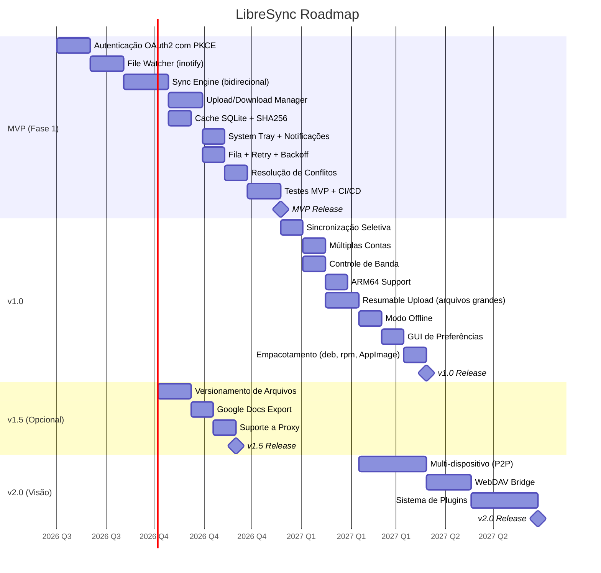

### 19.1 Marcos e Critérios de Aceite

| Fase | Data Estimada | Critério de Aceite |
|------|--------------|-------------------|
| MVP | 2026-11-15 | Sincronização bidirecional funcionando com 1 conta. Upload/download automático. Resolução de conflitos. Testes passando. Empacotamento .deb |
| v1.0 | 2027-02-15 | Sincronização seletiva, múltiplas contas, controle de banda, ARM64, resumable upload, modo offline, GUI de preferências. Empacotamento deb + rpm + AppImage |
| v1.5 | 2027-05-15 | Versionamento, Google Docs export, proxy corporativo |
| v2.0 | 2027-09-15 | Sincronização P2P entre dispositivos, plugins, WebDAV |

---

## 20. Backlog

### 20.1 Épicos

| ID | Épico | Fase |
|----|-------|------|
| EP-01 | Autenticação e Gerenciamento de Contas | MVP |
| EP-02 | Sincronização Local → Remoto | MVP |
| EP-03 | Sincronização Remoto → Local | MVP |
| EP-04 | Monitoramento de Arquivos | MVP |
| EP-05 | Confiabilidade e Resiliência | MVP |
| EP-06 | Interface com Usuário | MVP |
| EP-07 | Cache e Metadados | MVP |
| EP-08 | Sincronização Seletiva | v1.0 |
| EP-09 | Múltiplas Contas | v1.0 |
| EP-10 | Performance e Otimizações | v1.0 |
| EP-11 | Modo Offline | v1.0 |
| EP-12 | Recursos Avançados (versionamento, Docs) | v1.5 |
| EP-13 | Colaboração e Compartilhamento | v2.0 |

### 20.2 User Stories do MVP

| ID | Épico | História | Critério de Aceite | Pontos |
|----|-------|----------|-------------------|--------|
| US-01 | EP-01 | Como usuário, quero fazer login com minha conta Google para sincronizar meus arquivos | Login via OAuth2 com PKCE. Token armazenado no keyring. Refresh automático | 8 |
| US-02 | EP-02 | Como usuário, quero que arquivos salvos localmente sejam enviados automaticamente ao Google Drive | inotify detecta mudança. SHA256 compara. Upload enfileirado. Notificação ao concluir | 13 |
| US-03 | EP-03 | Como usuário, quero que arquivos criados no Google Drive sejam baixados automaticamente | Polling via changes.list. Download para pasta local. Atualização do cache | 13 |
| US-04 | EP-04 | Como usuário, quero que renomeações de arquivos sejam detectadas corretamente | Pareamento MOVED_FROM + MOVED_TO. Atualização de path no cache | 5 |
| US-05 | EP-04 | Como usuário, quero que arquivos temporários (.swp, .tmp, ~) sejam ignorados | Padrões de ignore configuráveis. Filtro no file watcher | 3 |
| US-06 | EP-05 | Como usuário, quero que a sincronização se recupere automaticamente após ficar offline | Reconexão automática. Retry com backoff. Fila persistente | 8 |
| US-07 | EP-05 | Como usuário, quero que conflitos sejam resolvidos sem perder dados | Cópia com sufixo. Notificação. Registro no banco | 8 |
| US-08 | EP-06 | Como usuário, quero ver o status da sincronização pela bandeja do sistema | Ícone na tray. Menu com status, pausa, abrir, sair | 5 |
| US-09 | EP-06 | Como usuário, quero receber notificações sobre erros e conflitos | Notificações do sistema. Níveis: info, warn, error | 3 |
| US-10 | EP-07 | Como usuário, quero que a sincronização use cache para evitar re-upload/download desnecessários | SHA256 cache. Comparação antes de transferir | 8 |
| US-11 | EP-05 | Como usuário, quero pausar e retomar a sincronização manualmente | Botão pausar/retomar na tray e na GUI. Jobs pausados retomam de onde pararam | 3 |
| US-12 | EP-02 | Como usuário, quero que uploads sejam feitos por chunks para arquivos grandes | Resumable upload para > 5 MB. Retomada após falha | 13 |

Técnicas (Tasks):

| ID | Descrição | Depende | Pontos |
|----|-----------|---------|--------|
| TK-01 | Setup do projeto Tauri + Rust | - | 3 |
| TK-02 | Integração com crate rusqlite + migrations | TK-01 | 5 |
| TK-03 | Cliente HTTP com retry e backoff (reqwest + custom) | TK-01 | 8 |
| TK-04 | Wrapper da Google Drive API v3 (endpoints CRUD) | TK-03 | 13 |
| TK-05 | Integração com Linux Secret Service (secret-service-rs) | TK-01 | 5 |
| TK-06 | File watcher com inotify (inotify-rs) | TK-01 | 8 |
| TK-07 | State machine do Sync Engine | TK-01 | 13 |
| TK-08 | Job scheduler com prioridade e persistência | TK-07 | 8 |
| TK-09 | Resolução de conflitos automática | TK-07 | 8 |
| TK-10 | Upload manager com chunking | TK-04 | 13 |
| TK-11 | Download manager | TK-04 | 8 |
| TK-12 | System tray (tray-icon crate + Tauri plugin) | TK-01 | 5 |
| TK-13 | Sistema de notificações | TK-12 | 3 |
| TK-14 | Config file YAML parser (serde + yaml-rust) | TK-01 | 3 |
| TK-15 | Wiremock test suite para Google API | TK-04 | 8 |

### 20.3 Matriz de Dependências

```
US-01 (Auth) → US-02 (Upload), US-03 (Download)
US-02 → US-06 (Retry), US-07 (Conflict)
US-04 (Rename) → US-02
US-05 (Ignore) → US-04
US-10 (Cache) → US-02, US-03
US-08 (Tray) → US-01
US-09 (Notify) → US-08
US-11 (Pause) → US-06
US-12 (Chunks) → US-02
```

---

## 21. Riscos

### 21.1 Matriz de Riscos

| ID | Risco | Probabilidade | Impacto | Mitigação |
|----|-------|--------------|---------|-----------|
| R-01 | Google Drive API rate limits excedidos | Média | Alto | Controle de taxa interno. Fila com prioridade. Backoff. Monitoramento de quota |
| R-02 | Mudanças na API Google que quebram compatibilidade | Baixa | Alto | Versionamento explícito (v3). Testes com wiremock. Acompanhamento de changelog |
| R-03 | Corrupção do cache SQLite (falta de energia, crash) | Média | Médio | WAL mode. Backup automático antes de operações críticas. Verificação de integridade periódica |
| R-04 | Conflitos em arquivos binários grandes (edição simultânea) | Alta | Médio | Cópia com sufixo claro. Notificação. Evitar perda de dados |
| R-05 | Alto consumo de memória com 500k+ arquivos | Média | Alto | Cache lazy (não carregar tudo em RAM). Paginação no SQLite. Stream de hashes |
| R-06 | Loop de sincronização (arquivo modificado → upload → download → modifica) | Média | Alto | Hash-based change detection. Ignorar se hash não mudou. Debounce no watcher |
| R-07 | Fragilidade do inotify com grandes volumes (> 8192 watches por padrão) | Média | Médio | Aumentar limits (fs.inotify.max_user_watches). Fallback para polling periódico |
| R-08 | OAuth token expirado e refresh falha | Baixa | Alto | Detecção precoce de expiração. Notificar usuário. Re-autenticação guiada |
| R-09 | Usuário remove a pasta de sincronização manualmente | Média | Alto | Watchdog no diretório raiz. Recriação ou erro claro. Nunca perder referência |
| R-10 | Competição com outros sync clients (rclone, Insync) | Alta | Médio | Foco em UX nativa, performance e open source. Diferenciais: inotify + confiabilidade |
| R-11 | Google revogar acesso ao app | Muito Baixa | Alto | Seguir política de verificação OAuth. Manter dados do usuário portáveis (SQLite exportável) |
| R-12 | Dependências Tauri/Rust com vulnerabilidades | Média | Médio | cargo-audit no CI. Dependências mínimas. Dependabot |

### 21.2 Riscos Legais

- **Termos de Serviço Google:** A aplicação deve cumprir os Google APIs Terms of Service e Google Drive Additional Terms
- **LGPD/GDPR:** Dados do usuário armazenados localmente. Tokens são dados pessoais → criptografia obrigatória
- **Licenciamento:** Código open source (GPLv3 ou MIT) → garantir que dependências sejam compatíveis

---

## 22. Decisões de Arquitetura (ADRs)

### ADR-001: Escolha do Rust como Linguagem Principal

**Contexto:** Necessitamos de uma linguagem com baixo consumo de recursos, segurança de memória, concorrência eficiente e bom suporte a system calls Linux.

**Decisão:** Rust será a linguagem principal para todo o core de sincronização.

**Consequências:**
- Positivas: Zero-cost abstractions, memory safety sem GC, async/await nativo, pattern matching para state machines, ecossistema tokio
- Negativas: Curva de aprendizado, tempo de compilação, ecossistema FFI em maturação

**Reversão:** Se a produtividade da equipe for insuficiente, Go é a alternativa de fallback.

### ADR-002: Tauri em vez de Electron para UI

**Contexto:** Precisamos de uma interface gráfica moderna sem sacrificar performance para uma aplicação que roda em background.

**Decisão:** Usar Tauri (Rust core + webview nativo para UI).

**Consequências:**
- Positivas: Binário ~5 MB vs ~150 MB do Electron, consumo de RAM 5x menor, tema escuro nativo
- Negativas: Webview pode ter inconsistências entre distribuições, ecossistema de plugins menor

**Reversão:** Portar UI para GTK4 + Rust se Tauri se mostrar limitado.

### ADR-003: Polling em vez de Webhooks para Detecção Remota

**Contexto:** Necessitamos detectar mudanças remotas no Google Drive de forma confiável.

**Opções:** (a) Webhooks via drive.files.watch, (b) Polling via changes.list

**Decisão:** Polling com intervalos dinâmicos (5-60s).

**Justificativa:** Webhooks exigem endpoint HTTP público renovado a cada hora, inviável em desktops sem exposição pública.

**Consequências:**
- Positivas: Simplicidade, confiabilidade, sem dependência de infraestrutura externa
- Negativas: Latência maior (até 60s em idle), maior uso de quota da API

### ADR-004: SQLite como Banco de Cache e Metadados

**Contexto:** Necessitamos de armazenamento local para metadados, fila de jobs, e cache de hashes.

**Decisão:** SQLite com WAL mode, usando rusqlite.

**Justificativa:** Zero configuração, transacional, embarcado, maduro, suporta concorrência com WAL.

**Consequências:** Não escala horizontalmente (intencional, app desktop), backup manual necessário.

### ADR-005: Linux Secret Service para Tokens

**Contexto:** Tokens OAuth precisam ser armazenados com segurança.

**Decisão:** Usar Linux Secret Service (dbus) via crate `secret-service-rs`.

**Fallback:** Arquivo criptografado com AES-256-GCM, chave derivada de salt + identificador da máquina.

**Justificativa:** Padrão Freedesktop, suportado por GNOME Keyring e KWallet. Evita armazenar secrets em plaintext.

---

## 23. Métricas de Sucesso (KPIs)

### 23.1 KPIs de Produto (pós-lançamento)

| KPI | Meta | Prazo | Medição |
|-----|------|-------|---------|
| Downloads totais | 10.000 | 6 meses | GitHub Releases |
| Usuários ativos (DAU) | 1.000 | 6 meses | Telemetria opcional (opt-in) |
| NPS (Net Promoter Score) | ≥ 40 | 6 meses | Survey in-app |
| Taxa de retenção D30 | ≥ 30% | 3 meses | Telemetria opt-in |
| Issues abertas | < 50 críticas | contínuo | GitHub Issues |
| Estrelas no GitHub | 500 | 6 meses | GitHub |

### 23.2 KPIs Técnicos (qualidade)

| Métrica | Meta | Como medir |
|---------|------|-----------|
| Taxa de sucesso de uploads | ≥ 99.5% | Logs de jobs |
| Taxa de sucesso de downloads | ≥ 99.5% | Logs de jobs |
| Tempo médio de detecção de mudança local | < 1s | Benchmark |
| Tempo médio de detecção de mudança remota | < 30s | Benchmark |
| MTBF (Mean Time Between Failures) | > 72h | Logs de crash |
| MTTR (Mean Time To Recover) | < 30s | Logs de retry |
| Cobertura de testes | ≥ 85% | cargo-tarpaulin |
| Cobertura de código em paths críticos | ≥ 95% | cargo-tarpaulin |
| Vulnerabilidades críticas abertas | 0 | cargo-audit |

### 23.3 KPIs de Performance (benchmark)

| Cenário | RAM (máx) | CPU (máx) | Tempo |
|---------|----------|-----------|-------|
| Idle (1 conta, 10k arquivos) | 80 MB | 0.5% | - |
| Upload 100 arquivos (1 KB cada) | 120 MB | 8% | < 30s |
| Download 100 arquivos (1 KB cada) | 120 MB | 8% | < 30s |
| Upload 1 arquivo (1 GB) | 200 MB | 12% | < 3 min (50 Mbps) |
| Sincronização inicial (50k arquivos, scan) | 150 MB | 15% | < 5 min |
| Conflito simultâneo (100 arquivos) | 130 MB | 10% | < 10s para detectar |

---

## 24. Apêndices Técnicos

### A. Estrutura de Diretórios do Projeto

```
libresync/
├── src/
│   ├── main.rs                    # Entry point
│   ├── app.rs                     # Tauri app setup
│   ├── domain/                    # Domain layer
│   │   ├── mod.rs
│   │   ├── account.rs             # Account entity
│   │   ├── file_entry.rs          # FileEntry entity
│   │   ├── sync_folder.rs         # SyncFolder entity
│   │   ├── sync_job.rs            # SyncJob entity + state machine
│   │   ├── conflict.rs            # ConflictRecord entity
│   │   ├── events.rs              # SyncEvent entity
│   │   ├── value_objects.rs       # Enums, structs de valor
│   │   └── errors.rs              # Domain errors
│   ├── application/               # Application layer
│   │   ├── mod.rs
│   │   ├── sync_service.rs        # Sync orchestration
│   │   ├── auth_service.rs        # OAuth flow
│   │   ├── config_service.rs      # Config management
│   │   └── metadata_service.rs    # Metadata operations
│   ├── infrastructure/            # Infrastructure layer
│   │   ├── mod.rs
│   │   ├── google_drive/          # Google Drive API client
│   │   │   ├── mod.rs
│   │   │   ├── client.rs          # HTTP client
│   │   │   ├── files.rs           # Files API
│   │   │   ├── changes.rs         # Changes API
│   │   │   ├── upload.rs          # Upload + resumable
│   │   │   └── auth.rs            # OAuth2 token management
│   │   ├── database/              # SQLite
│   │   │   ├── mod.rs
│   │   │   ├── connection.rs      # Connection pool
│   │   │   ├── migrations.rs      # Schema migrations
│   │   │   ├── repositories/      # Repository implementations
│   │   │   │   ├── mod.rs
│   │   │   │   ├── account_repo.rs
│   │   │   │   ├── file_entry_repo.rs
│   │   │   │   ├── sync_job_repo.rs
│   │   │   │   └── sync_event_repo.rs
│   │   │   └── models.rs          # Row types
│   │   ├── file_watcher.rs        # inotify integration
│   │   ├── keyring.rs             # Linux Secret Service
│   │   ├── file_io.rs             # File system operations
│   │   ├── http_client.rs         # Reusable HTTP client
│   │   └── bandwidth.rs           # Bandwidth limiter
│   ├── sync/                      # Sync Engine
│   │   ├── mod.rs
│   │   ├── engine.rs              # State machine
│   │   ├── job_scheduler.rs       # Priority queue
│   │   ├── upload_manager.rs      # Upload orchestration
│   │   ├── download_manager.rs    # Download orchestration
│   │   ├── conflict_resolver.rs   # Conflict detection + resolution
│   │   └── change_detector.rs     # Diff local vs remote
│   ├── ui/                        # Tauri commands
│   │   ├── mod.rs
│   │   ├── commands.rs            # Tauri IPC handlers
│   │   └── state.rs               # AppState
│   └── common/                    # Cross-cutting
│       ├── mod.rs
│       ├── config.rs              # Config struct (serde)
│       ├── logging.rs             # Tracing/logging setup
│       └── metrics.rs             # Metrics collection
├── src-tauri/                     # Tauri configuration
│   ├── Cargo.toml
│   ├── tauri.conf.json
│   ├── icons/
│   └── capabilities/
├── web-ui/                        # Frontend source
│   ├── src/
│   │   ├── main.ts
│   │   ├── App.svelte
│   │   ├── pages/
│   │   ├── components/
│   │   └── lib/
│   ├── package.json
│   └── vite.config.ts
├── tests/                         # Integration tests
│   ├── e2e/
│   └── fixtures/
├── scripts/                       # Build/packaging scripts
│   ├── build-deb.sh
│   ├── build-rpm.sh
│   └── build-appimage.sh
├── .github/
│   └── workflows/
│       └── ci.yml
├── Cargo.toml
├── Cargo.lock
├── config.default.yaml            # Default config
└── README.md
```

### B. Configuração Padrão (YAML)

```yaml
# LibreSync Configuration
# Path: ~/.config/libresync/config.yaml

app:
  autostart: true
  minimize_to_tray: true
  language: pt-BR
  theme: system  # system | light | dark

sync:
  mode: bidirectional  # bidirectional | upload_only | download_only
  poll_interval_active: 5      # seconds (when changes detected)
  poll_interval_idle: 60       # seconds (no changes)
  max_parallel_uploads: 4
  max_parallel_downloads: 4
  max_retries: 5
  backoff_base_seconds: 1
  backoff_max_seconds: 300
  chunk_size: 5242880  # 5 MB for resumable upload

bandwidth:
  upload_kbps: 0       # 0 = unlimited
  download_kbps: 0     # 0 = unlimited
  schedule: []         # optional time-based limits

paths:
  default_download: ~/LibreSync
  database: ~/.local/share/libresync/cache.db
  cache: ~/.cache/libresync
  logs: ~/.local/share/libresync/logs

ignore:
  patterns:
    - "*.swp"
    - "*.swx"
    - "*.tmp"
    - "*.temp"
    - "*~"
    - ".DS_Store"
    - "Thumbs.db"
    - ".~*"
    - "*.part"
    - ".goutputstream-*"
  max_file_size_mb: 0   # 0 = no limit

watch:
  use_inotify: true
  inotify_debounce_ms: 500
  fallback_polling_interval_s: 30
  max_user_watches: 65536

logging:
  level: info           # debug | info | warn | error
  max_files: 5
  max_size_mb: 10
  format: json          # json | plain
  exportable: true

notifications:
  enabled: true
  on_sync_complete: false
  on_conflict: true
  on_error: true
  on_offline: true
  on_reconnect: true
  on_auth_expiry: true

network:
  proxy:
    enabled: false
    http: ""
    https: ""
    no_proxy: ""
  timeout_seconds: 60
  connect_timeout_seconds: 15
  tls:
    min_version: "1.2"
    verify_certs: true
```

### C. Formato de Log (JSON)

```json
{
  "timestamp": "2026-07-26T10:23:15.123456Z",
  "level": "info",
  "target": "libresync::sync::upload_manager",
  "message": "Upload completed successfully",
  "fields": {
    "file_id": "uuid-1234",
    "file_name": "relatorio.pdf",
    "file_size": 1234567,
    "remote_id": "1ABCdefGHIjklMNOpqrSTUvwx",
    "duration_ms": 2345,
    "retry_count": 0,
    "chunks_total": 1,
    "md5": "d41d8cd98f00b204e9800998ecf8427e"
  },
  "span": {
    "sync_run_id": "uuid-abc",
    "account": "maria@gmail.com"
  }
}
```

### D. Dependências Rust (Cargo.toml)

```toml
[package]
name = "libresync"
version = "0.1.0"
edition = "2021"

[dependencies]
# Tauri
tauri = { version = "2", features = ["tray-icon"] }
tauri-plugin-shell = "2"
tauri-plugin-notification = "2"

# Async runtime
tokio = { version = "1", features = ["full"] }

# HTTP Client
reqwest = { version = "0.12", features = ["json", "rustls-tls"] }

# Serialization
serde = { version = "1", features = ["derive"] }
serde_json = "1"
serde_yaml = "0.9"

# Database
rusqlite = { version = "0.31", features = ["bundled"] }

# OAuth2
oauth2 = "4"

# Cryptography
sha2 = "0.10"
md-5 = "0.10"

# File watching
inotify = "0.10"

# Keyring
secret-service = "3"

# Logging
tracing = "0.1"
tracing-subscriber = { version = "0.3", features = ["json"] }
tracing-appender = "0.2"

# Error handling
thiserror = "1"
anyhow = "1"

# UUID
uuid = { version = "1", features = ["v4"] }

# Chrono
chrono = { version = "0.4", features = ["serde"] }

# Glob pattern matching
globset = "0.4"

[dev-dependencies]
wiremock = "0.6"
tempfile = "3"
criterion = "0.5"
proptest = "1"
tokio-test = "0.4"

[[bench]]
name = "sync_bench"
harness = false
```

---

## Histórico de Revisões

| Versão | Data | Autor | Alterações |
|--------|------|-------|-----------|
| 1.0 | 2026-07-26 | Product Team | Versão inicial do PRD |
| 1.1 | 2026-07-26 | Engineering | Seção 12 atualizada: GUI funcional, OAuth2 integrado, setup 100% pela interface |

---

*Este documento segue o template PRD Manager e as diretrizes de Spec-Driven Development. Todas as decisões de arquitetura foram documentadas como ADRs para rastreabilidade. O documento deve ser revisado antes do início da implementação.*
