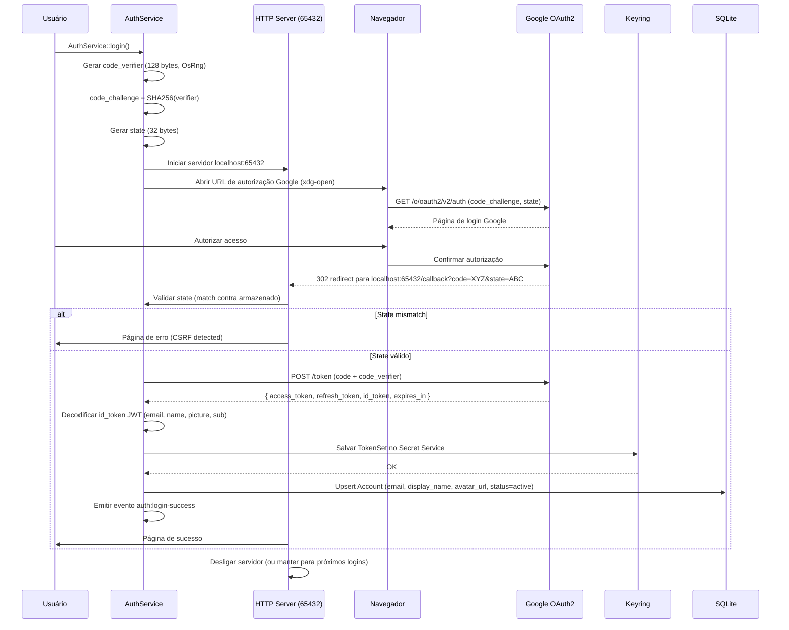

# Spec: Autenticação OAuth2 + PKCE

> **Status:** Rascunho  
> **Versão:** 1.0  
> **Última atualização:** 2026-07-26  
> **Responsável:** Engineering  
> **Componente:** `libresync-auth` — OAuth2 + PKCE  
> **Linguagem:** Rust (tokio async)  
> **Banco:** SQLite (via `rusqlite`) + Linux Secret Service

---

## 1. Resumo

O componente de **Autenticação OAuth2 + PKCE** gerencia todo o ciclo de vida de autenticação do LibreSync com o Google Drive. Implementa o fluxo **Authorization Code + PKCE (Proof Key for Code Exchange)** sem `client_secret`, utilizando o navegador do sistema para autorização inicial com fallback para **Device Flow** em ambientes headless (SSH, servidores, TTY).

O fluxo PKCE gera `code_verifier` de 128 bytes criptograficamente aleatórios via `OsRng`, computa `code_challenge = SHA256(code_verifier)`, e utiliza `state` CSRF para proteção anti-tampering do callback. Um servidor HTTP local na porta `65432` captura o redirect `localhost:65432/callback` e extrai o código de autorização, que é trocado por um `access_token` + `refresh_token` via `POST /token`.

Os tokens são armazenados no **Linux Secret Service** (GNOME Keyring / KWallet via `secret-service` crate) com fallback para arquivo criptografado local com **AES-256-GCM + HKDF**. O refresh automático ocorre com 5 minutos de margem pré-expiração, utilizando double-check locking para evitar concorrência. Múltiplas contas são suportadas com isolamento completo de credenciais.

---

## 2. Contexto

O LibreSync depende exclusivamente da API Google Drive, que exige autenticação OAuth2. Os tokens de acesso expiram em **1 hora**, exigindo refresh automático transparente. O componente precisa operar em:

- **Estações desktop:** com navegador disponível para o fluxo PKCE completo
- **Servidores headless:** sem navegador gráfico, exigindo Device Flow
- **Múltiplas contas:** o usuário pode adicionar várias contas Google simultaneamente

### Relação com outros componentes

```
AuthService → Google Drive API (todas as chamadas)
       ↕
Keyring (Secret Service) / Encrypted File Fallback
       ↕
SQLite (account metadata, sem tokens)
```

Todos os outros componentes (Sync Engine, File Watcher, Transfer Managers) dependem do `AuthService` para obter tokens válidos ao fazer chamadas à API Google Drive.

### Scope

`drive.file` — acesso apenas a arquivos criados pelo aplicativo ou abertos via Google Drive picker.

---

## 3. Goals

1. **PKCE sem client_secret:** fluxo Authorization Code + PKCE utilizando `code_challenge` S256, eliminando a necessidade de `client_secret` armazenado
2. **Armazenamento seguro de tokens:** Linux Secret Service (GNOME Keyring / KWallet) como primário, AES-256-GCM como fallback, tokens nunca em disco não criptografado
3. **Refresh automático pré-expiração:** renovar access token 5 minutos antes da expiração, sem interromper operações em andamento
4. **Múltiplas contas:** suporte a N contas Google simultâneas com credenciais e tokens isolados
5. **Device Flow:** fluxo alternativo para ambientes sem navegador gráfico, com código de verificação exibido no terminal
6. **Detecção de revogação:** identificar tokens revogados (HTTP 401) e notificar o usuário, transicionando o estado da conta para `revoked`

---

## 4. Non-Goals

1. **Outros provedores OAuth (Dropbox, OneDrive, Box):** fora do escopo do produto v1.0
2. **Client secret armazenado:** o fluxo PKCE foi projetado para eliminá-lo; nenhum `client_secret` é embarcado ou armazenado
3. **Login com senha:** OAuth2 é exclusivamente via Google; não há autenticação por usuário/senha
4. **Tokens JWT customizados:** o ID token JWT é decodificado apenas para extrair claims (email, nome, avatar); não é usado para autenticação própria
5. **Proxy OAuth customizado:** não há servidor intermediário; o fluxo ocorre 100% local
6. **Suporte a macOS/Windows Keychain:** v1.0 exclusivamente Linux Secret Service; outros SOs em v2.0

---

## 5. Usuários e Personas

### 5.1 Maria (Desenvolvedora)

Usa o LibreSync em sua workstation Linux com GNOME. Espera que ao clicar "Adicionar conta", o navegador abra automaticamente, ela autorize, e o token seja armazenado com segurança no GNOME Keyring. Se ficar inativa por horas, espera que o refresh automático mantenha a sincronização funcionando.

**Relevância para auth:** fluxo PKCE com navegador, keyring integrado, refresh invisível.

### 5.2 Carlos (Usuário corporativo)

Usa o LibreSync em um servidor headless Ubuntu via SSH. Não tem navegador gráfico. Espera que o Device Flow mostre um código no terminal para ele copiar e autorizar no navegador de outro dispositivo.

**Relevância para auth:** Device Flow funcional sem display gráfico, instruções claras no terminal.

### 5.3 Alice (Power User)

Gerencia 3 contas Google (pessoal, trabalho, projeto). Alterna entre elas e espera que cada uma mantenha seu próprio token, refresh e estado independentes.

**Relevância para auth:** isolamento completo de contas, troca de conta ativa sem perda de sessão.

---

## 6. Requisitos Funcionais

### RF-01: Iniciar PKCE com Navegador

O `AuthService` deve iniciar o fluxo PKCE:
1. Gerar `code_verifier` de 128 bytes aleatórios via `OsRng`
2. Computar `code_challenge = BASE64_URL(SHA256(code_verifier))`
3. Gerar `state` de 32 bytes aleatórios para proteção CSRF
4. Montar URL de autorização Google:
   ```
   https://accounts.google.com/o/oauth2/v2/auth?
     client_id={CLIENT_ID}&
     redirect_uri=http://localhost:65432/callback&
     response_type=code&
     scope=drive.file&
     code_challenge={CHALLENGE}&
     code_challenge_method=S256&
     state={STATE}
   ```
5. Abrir navegador padrão do sistema via `xdg-open` ou `open`
6. Armazenar `code_verifier` + `state` em memória (sem persistir)

### RF-02: Servidor Local Callback na Porta 65432

Iniciar servidor HTTP local em `localhost:65432` para capturar o redirect:
1. Escutar em `127.0.0.1:65432`
2. Rota `GET /callback` — extrair `code` e `state` da query string
3. Validar `state` recebido contra o armazenado (rejeitar se mismatch)
4. Retornar página HTML de sucesso ("Autenticação concluída! Feche esta aba.")
5. Em caso de erro, retornar página de erro com mensagem descritiva
6. Timeout de 5 minutos para receber o callback; se expirar, abortar fluxo

### RF-03: Troca de Código por Tokens

Com o `code` recebido, fazer `POST /token`:
```
POST https://oauth2.googleapis.com/token
Content-Type: application/x-www-form-urlencoded

code={CODE}&
client_id={CLIENT_ID}&
redirect_uri=http://localhost:65432/callback&
grant_type=authorization_code&
code_verifier={VERIFIER}
```

Processar resposta:
1. Extrair `access_token`, `refresh_token`, `expires_in`, `id_token`
2. Decodificar `id_token` JWT (sem verificar assinatura — apenas claims: `email`, `name`, `picture`, `sub`)
3. Validar `exp` do ID token (rejeitar se expirado)
4. Extrair `email` e `sub` como identificador único da conta

### RF-04: Armazenamento no Keyring

Salvar tokens no Linux Secret Service via `secret-service` crate:
- **Label:** `libresync-{email}` (ex: `libresync-maria@gmail.com`)
- **Attributes:** `application=libresync`, `account={email}`, `type=oauth`
- **Secret:** JSON serializado do `TokenSet` contendo `{ access_token, refresh_token, id_token, expires_at, token_type, scope }`
- Apenas `TokenSet` vai para o keyring — metadados da conta ficam no SQLite

### RF-05: Fallback Criptografado (AES-256-GCM)

Se o Secret Service estiver indisponível (DBus off, container sem keyring):
1. Gerar chave de 256 bits via HKDF usando uma chave mestre derivada de identificador único da máquina (machine-id + salt)
2. Criptografar JSON do `TokenSet` com AES-256-GCM (nonce de 12 bytes aleatório)
3. Salvar em `~/.config/libresync/tokens/{email}.enc`
4. Autenticação integrada via GCM tag (detecta corrupção)

Formato do arquivo:
```
[12 bytes nonce][28 bytes salt][16 bytes GCM tag][ciphertext]
```

### RF-06: Refresh Automático

Verificar periodicamente (a cada 60s ou antes de cada requisição à API):
1. Se `now + 300s >= token.expires_at` → iniciar refresh
2. `POST /token` com `grant_type=refresh_token` e `refresh_token`
3. Atualizar `access_token` e `expires_at` no keyring
4. Se refresh falhar (HTTP 400: invalid_grant) → marcar conta como `revoked`

### RF-07: Revogação (Logout)

Expor `AuthService::revoke()`:
1. Chamar `POST /revoke` com o `access_token` atual
2. Remover `TokenSet` do keyring
3. Marcar `Account.is_active = false` e `Account.status = 'revoked'` no SQLite
4. Emitir evento `auth:logout-success`
5. Ignorar erros de revoke (se o token já expirou, remover localmente mesmo assim)

### RF-08: Device Flow

Para ambientes headless (sem navegador detectado):
1. `POST /device/code` com `client_id` e `scope=drive.file`
2. Exibir no terminal:
   ```
   ┌──────────────────────────────────────────────────┐
   │                                                  │
   │   Acesse: https://google.com/device              │
   │   Código: ABC-DEF-GHI                           │
   │                                                  │
   │   Este código expira em 15 minutos.              │
   │                                                  │
   └──────────────────────────────────────────────────┘
   ```
3. Polling `POST /token` com `device_code` a cada 5s
4. Aguardar até `user_code` ser autorizado ou expirar
5. Na autorização, trocar device_code por tokens (mesmo fluxo do PKCE)
6. Emitir `auth:device-flow-pending` (polling), `auth:device-flow-complete` (sucesso)

### RF-09: Múltiplas Contas

- `AuthService::list_accounts()` → retorna todas as contas do SQLite
- `AuthService::set_active_account(email)` → altera conta padrão para novas operações
- Cada conta tem `TokenSet` independente no keyring
- Refresh automático roda para todas as contas ativas

### RF-10: Detecção de Token Revogado/Inválido

Antes de cada requisição à API Google:
1. Chamar `AuthService::ensure_valid_token()`
2. Verificar `now + 300s >= expires_at` → refresh síncrono
3. Se refresh falhar → emitir `auth:token-revoked`, notificar UI
4. Marcar conta como `revoked` e interromper sync

### RF-11: Lock para Refresh Concorrente

Usar double-check locking com `tokio::sync::RwLock`:

```rust
async fn ensure_valid_token(account: &Account) -> Result<TokenSet, AuthError> {
    // Fast path: token ainda válido
    let cached = self.cache.read().await;
    if let Some(ts) = cached.get(&account.id) {
        if ts.expires_at > Instant::now() + Duration::from_secs(300) {
            return Ok(ts.clone());
        }
    }
    drop(cached);

    // Slow path: adquirir lock de refresh
    let mut lock = self.refresh_locks.entry(account.id).or_default().lock().await;

    // Double-check: outro thread pode ter refresh enquanto esperávamos
    let cached = self.cache.read().await;
    if let Some(ts) = cached.get(&account.id) {
        if ts.expires_at > Instant::now() + Duration::from_secs(300) {
            return Ok(ts.clone());
        }
    }
    drop(cached);

    // Executar refresh
    let new_tokens = self.refresh_token(account).await?;
    self.cache.write().await.insert(account.id, new_tokens.clone());
    Ok(new_tokens)
}
```

### RF-12: Persistência entre Reinícios

- Ao iniciar o app, `AuthService::init()` carrega contas do SQLite
- Para cada conta `is_active = true`, carrega `TokenSet` do keyring para o cache em memória
- Se keyring falhar, tenta fallback criptografado
- Se ambos falharem, marca conta como `requires_reauth`

---

## 7. Fluxo Principal

### PKCE Flow Completo



---

## 8. Fluxos Alternativos

### FA-01: Device Flow (sem navegador)

```mermaid
sequenceDiagram
    participant U as Usuário
    participant AS as AuthService
    participant G as Google OAuth2
    participant KR as Keyring

    U->>AS: AuthService::login(headless=true)
    AS->>G: POST /device/code (client_id, scope=drive.file)
    G-->>AS: { device_code, user_code, verification_url, interval(5), expires_in(900) }
    loop Polling a cada 5s
        AS->>U: Exibir "Acesse {verification_url} e insira {user_code}"
        U->>U: Abrir navegador em outro dispositivo
        U->>G: Inserir código e autorizar
        AS->>G: POST /token (device_code, grant_type=device)
        alt pending
            G-->>AS: error=authorization_pending
        alt slow_down
            G-->>AS: error=slow_down (ajustar interval)
        else success
            G-->>AS: { access_token, refresh_token, id_token, expires_in }
            AS->>KR: Salvar TokenSet
            AS->>U: "Autenticação concluída!"
        end
    end
```

### FA-02: Refresh Automático

1. Antes de toda chamada à API Google, `ensure_valid_token()` verifica expiração
2. Se `now + 300s >= expires_at`, inicia refresh
3. Double-check lock previne múltiplos refreshs concorrentes para mesma conta
4. Novo `TokenSet` salvo no keyring + cache atualizado
5. Se refresh token for rotacionado (Google devolve novo refresh_token), salvar versão atualizada

### FA-03: Token Revogado

1. API Google retorna HTTP 401
2. `AuthService::ensure_valid_token()` tenta refresh
3. Google retorna `invalid_grant` (refresh token revogado)
4. Conta marcada como `revoked`
5. Evento `auth:token-revoked` emitido
6. Tokens removidos do keyring
7. Usuário notificado para reautenticar

### FA-04: Porta 65432 Ocupada

1. Se `127.0.0.1:65432` estiver ocupada, tentar portas seguintes (65433, 65434...)
2. Atualizar `redirect_uri` na URL de autorização para a porta escolhida
3. Se todas as 5 tentativas falharem, abortar com erro `PortUnavailable`

### FA-05: Network Error Durante PKCE

1. Falha ao abrir navegador ou timeout no callback (5min)
2. Limpar tokens temporários (code_verifier, state)
3. Desligar servidor HTTP
4. Emitir evento `auth:login-error` com mensagem descritiva

### FA-06: Múltiplas Contas — Troca

1. Ao chamar `AuthService::set_active_account("nova@email.com")`
2. Verificar se a conta existe no SQLite e tem `status=active`
3. Carregar tokens do keyring para o cache ativo
4. Emitir `auth:account-switched` com email da nova conta
5. Operações subsequentes usam a nova conta ativa

---

## 9. Requisitos Não-Funcionais

| ID | Requisito | Alvo | Métrica |
|----|-----------|------|---------|
| RNF-01 | Refresh automático | < 1s p95 | Latência da chamada `POST /token` + round-trip |
| RNF-02 | PKCE init (geração verifier + challenge + servidor) | < 500ms | Tempo entre `login()` e navegador aberto |
| RNF-03 | code_verifier entropia | 128 bytes (1024 bits) via `OsRng` | Teste de entropia |
| RNF-04 | Criptografia fallback | AES-256-GCM com HKDF | Teste vetorial NIST |
| RNF-05 | Margem de refresh | 5 minutos antes da expiração | Configurável, padrão 300s |
| RNF-06 | Timeout total PKCE | 5 minutos | Callback deve chegar antes |
| RNF-07 | Double-check lock | Sem refreshs concorrentes para mesma conta | Teste com 10 requisições simultâneas |
| RNF-08 | Device Flow polling | Respeitar `interval` retornado pela API | Mínimo 5s entre polls |
| RNF-09 | Keyring indisponível | Fallback ativado em < 100ms | Detecção de indisponibilidade |
| RNF-10 | Múltiplas contas | Suporte a N contas sem limite artificial | Teste com 10 contas simultâneas |

---

## 10. Modelo de Dados

### Account (SQLite — tabela `accounts`)

```rust
struct Account {
    id: String,                    // Google sub (unique identifier)
    email: String,                 // email da conta (ex: maria@gmail.com)
    display_name: String,          // nome do usuário (do id_token)
    avatar_url: Option<String>,    // URL do avatar Google
    scope: String,                 // escopo autorizado (padrão: "drive.file")
    token_expires_at: i64,         // unix timestamp da expiração do access_token
    status: AccountStatus,         // active | revoked | expired | requires_reauth
    is_active: bool,               // conta atualmente selecionada
    created_at: i64,               // unix timestamp de criação
    last_sync_at: Option<i64>,     // último sync bem-sucedido
    quota_total: Option<i64>,      // quota total em bytes (opcional)
    quota_used: Option<i64>,       // quota usada em bytes (opcional)
}

enum AccountStatus {
    Active,
    Revoked,
    Expired,
    RequiresReauth,
}
```

### TokenSet (NÃO armazenado no SQLite — apenas no Keyring)

```rust
struct TokenSet {
    access_token: SecretString,    // token de acesso (nunca logado!)
    refresh_token: SecretString,   // token de refresh
    id_token: Option<String>,      // JWT ID token (decodificado para claims)
    expires_at: i64,               // unix timestamp de expiração
    token_type: String,            // "Bearer"
    scope: String,                 // escopo autorizado
}
```

### EncryptedTokenFile (Fallback)

Quando o Secret Service está indisponível, o `TokenSet` é serializado como JSON e criptografado com AES-256-GCM. Formato do arquivo:

```
~/.config/libresync/tokens/{base64(sub)}.enc
```

Layout binário:
```
[0..12]   nonce (12 bytes — OsRng)
[12..40]  salt (28 bytes — OsRng)
[40..56]  GCM tag (16 bytes)
[56..]    ciphertext (JSON criptografado do TokenSet)
```

### Refresh Lock (em memória, não persistido)

```rust
struct RefreshState {
    lock: tokio::sync::Mutex<()>,
    last_refresh: Instant,
    attempt: u32,
}
```

---

## 11. Edge Cases

### EC-01: Sem Navegador Disponível

- `xdg-open` falha ou retorna erro
- Detectar ausência de `DISPLAY` / `WAYLAND_DISPLAY`
- **Ação:** Cair automaticamente para Device Flow (FA-01)

### EC-02: Usuário Fecha o Navegador

- Servidor HTTP espera callback; ninguém chega
- Timeout de 5 minutos é acionado
- **Ação:** Desligar servidor, limpar estado, emitir `auth:login-timeout`

### EC-03: CSRF Mismatch

- `state` recebido no callback difere do armazenado
- **Ação:** Rejeitar callback, exibir página de erro, abortar fluxo
- **Segurança:** Nunca trocar código por tokens se `state` mismatch

### EC-04: Google Retorna `access_denied`

- Usuário clica "Cancelar" ou "Negar" na página de autorização Google
- Google redireciona para callback com `error=access_denied`
- **Ação:** Exibir mensagem amigável, emitir `auth:login-denied`

### EC-05: Refresh Concorrente

- 10 threads/workers chamam `ensure_valid_token()` simultaneamente
- **Ação:** Double-check lock garante apenas 1 refresh real; 9 threads usam token já refrescado

### EC-06: Clock Skew

- Relógio da máquina local está adiantado/atrasado em relação ao servidor Google
- **Ação:** Usar `expires_in` relativo (segundos a partir da resposta) em vez de timestamp absoluto. Calcular `expires_at = now + expires_in - 60` (buffer de 60s).

### EC-07: Refresh Token Rotacionado

- Google pode devolver um NOVO `refresh_token` na resposta de refresh
- **Ação:** Sempre salvar o `refresh_token` retornado; se ausente, manter o existente

### EC-08: Keyring Indisponível

- DBus não rodando, container sem Secret Service, ou sessão sem keyring
- **Ação:** Detectar via timeout de conexão DBus, ativar fallback AES-256-GCM automaticamente

### EC-09: Fallback Corrompido

- Arquivo `.enc` foi editado manualmente, truncado, ou GCM tag não valida
- **Ação:** Capturar `AeadError` na decriptação, marcar conta como `requires_reauth`

### EC-10: Porta 65432 Já em Uso

- Outro processo (ou outro login simultâneo) ocupa a porta
- **Ação:** Tentar portas 65433..65436; se todas ocupadas, abortar com erro

### EC-11: Conta Duplicada

- Usuário tenta adicionar email já existente no banco
- **Ação:** Se conta `active`, reautenticar (substituir tokens). Se `revoked`, reativar.

### EC-12: Token Removido Manualmente

- Usuário remove entrada do keyring via `secret-tool`
- **Ação:** Na próxima `ensure_valid_token()`, falha ao carregar do keyring. Marcar `requires_reauth`. Emitir `auth:token-missing`.

### EC-13: HTTP 403 (Insufficient Scope)

- Token não tem escopo suficiente para a operação solicitada
- **Ação:** Emitir `auth:insufficient-scope`. Marcar conta. Reautenticação necessária com escopo completo.

### EC-14: HTTP 429 (Rate Limiting)

- Múltiplas tentativas de refresh em curto período
- **Ação:** Respeitar `Retry-After` header. Se ausente, backoff exponencial (5s, 10s, 20s, 40s, 60s max).

### EC-15: Conta Removida Durante Operação

- Usuário remove conta enquanto `ensure_valid_token()` está rodando
- **Ação:** Verificar se conta ainda existe no SQLite antes de usar token. Se removida, abortar com `AccountNotFound`.

---

## 12. Segurança

### 12.1 Geração de Aleatoriedade

- `code_verifier`: 128 bytes via `OsRng` (`rand::rngs::OsRng`)
- `state`: 32 bytes via `OsRng`
- Nonce AES-GCM: 12 bytes via `OsRng`
- Salt HKDF: 28 bytes via `OsRng`
- Máximo de entropia disponível do SO

### 12.2 Proteção CSRF

- `state` é gerado por fluxo de login e verificado no callback
- Rejeitar callback se `state` não corresponder
- `state` armazenado apenas em memória (nunca em disco)

### 12.3 Armazenamento Segregado

- Tokens (`TokenSet`) **nunca** no SQLite
- Apenas metadados da conta (`Account`) no SQLite
- Keyring como primário; fallback criptografado como secundário
- Tokens em memória apenas no cache temporário (protegido por `SecretString`)

### 12.4 Criptografia do Fallback (AES-256-GCM + HKDF)

Derivação da chave:
```rust
let salt = OsRng.gen::<[u8; 28]>();
let ikm = machine_id::get_machine_id();
let key = hkdf::Hkdf::<Sha256>::new(Some(&salt), &ikm);
let mut okm = [0u8; 32];
key.expand(b"libresync-token-encryption", &mut okm)?;
```

Criptografia:
```rust
let cipher = Aes256Gcm::new_from_slice(&okm)?;
let nonce = Nonce::from_slice(&OsRng.gen::<[u8; 12]>());
let ciphertext = cipher.encrypt(nonce, plaintext.as_ref())?;
```

Formato do arquivo: `nonce || salt || tag || ciphertext`

### 12.5 Double-Check Lock

Padrão testado contra race conditions:
1. Fast path sem lock (apenas leitura do cache)
2. Slow path adquire mutex por conta
3. Double-check após adquirir lock
4. Lock por conta (não global) — contas independentes não competem

### 12.6 Cleanup de Tokens

- Ao revogar conta, remover entrada do keyring ou deletar arquivo `.enc`
- Se migrar de fallback para keyring (ex: DBus ficou disponível), remover arquivo `.enc`
- Timeout de sessão: tokens não utilizados por > 30 dias são considerados stale (logging warning)

### 12.7 Privacy (Logs sem Tokens)

- Nunca logar `access_token`, `refresh_token`, `id_token` ou `code_verifier`
- Logs de erro de autenticação: `"Auth failed for account {email}: {error_kind}"` (sem tokens)
- Logs de refresh: `"Token refreshed for {email}, expires in {expires_in}s"`
- `code` de autorização e `device_code` nunca logados

### 12.8 Proteção contra Path Traversal no Fallback

Validar que o email está normalizado antes de usá-lo como nome de arquivo:
```rust
fn sanitize_email_for_filename(email: &str) -> String {
    email.to_lowercase().replace('@', "_at_").replace('.', "_dot_")
}
```
Evita injeção de `../` no caminho do arquivo de fallback.

---

## 13. Rollout

### 13.1 Estratégia de Ativação

| Fase | Escopo | Validação | Dependências |
|------|--------|-----------|--------------|
| **P1 — Core** | AuthService, PKCE flow, servidor HTTP callback, keyring storage | Testes unitários com mock Google API | Nenhuma |
| **P2 — Refresh + Fallback** | Refresh automático com double-check lock, fallback AES-256-GCM | Testes integração com mock HTTP + keyring off | P1 |
| **P3 — Device Flow + Multi-contas** | Device flow, detecção headless, múltiplas contas, switch | Testes E2E com real Google OAuth sandbox | P2 |
| **P4 — UI Integration** | Integração com frontend Tauri (eventos, telas de login/logout), notificações de token revogado | Testes manuais + automação | P3 |

### 13.2 Feature Flags

```rust
pub struct AuthFeatureFlags {
    pub enable_device_flow: bool,        // P3
    pub enable_multiple_accounts: bool,  // P3
    pub enable_encrypted_fallback: bool, // P2 (sempre true se keyring off)
    pub refresh_margin_secs: u64,        // 300 (configurável)
}
```

### 13.3 Monitoring

Métricas expostas via evento de log estruturado:

```json
{
  "event": "auth_refresh",
  "account": "maria@gmail.com",
  "duration_ms": 234,
  "success": true,
  "expires_in": 3600
}
```

| Métrica | Onde |
|---------|------|
| Número de contas ativas | SQLite query |
| Token expires_at por conta | Cache |
| Taxa de refresh bem-sucedido | Log |
| Latência p95 de refresh | Log |
| Número de fallbacks ativos (keyring off) | Log |
| Falhas de revogação | Log |

### 13.4 Rollback Safety

- Tokens são versionados: ao atualizar `TokenSet`, versão anterior é mantida como backup (keyring tem slot extra `libresync-{email}-backup`)
- Se novo formato de `TokenSet` quebrar, fallback AES-256-GCM da versão anterior pode ser recuperado manualmente
- Rollback de código: versão antiga do `AuthService` consegue ler versão N-1 do `TokenSet` (compatibility shim)

---

## 14. Open Questions

1. **Rotação de refresh_token:** Google pode rotacionar refresh tokens. Com que frequência? Precisamos de alerta se a rotação falhar?
2. **Device Flow timeout:** 15 minutos é tempo suficiente? Usuários headless podem demorar mais para achar outro dispositivo.
3. **Concorrência entre instâncias:** Se duas instâncias do LibreSync rodarem (ex: duas sessões do mesmo usuário), ambas tentarão refresh? Lock local não resolve — precisamos de lock externo?
4. **Machine ID volátil:** Containers podem ter `/etc/machine-id` volátil. O fallback AES-256-GCM quebraria ao recriar container. Usar `client_id + client_secret` derivado como alternativa?
5. **Scope upgrade:** Se no futuro precisarmos de mais escopos (ex: `drive.readonly` para backup), o fluxo de reautenticação com scope estendido é transparente?
6. **Cleanup de contas órfãs:** Contas com token revogado mantidas no SQLite devem ser removidas automaticamente após quanto tempo?
7. **PKCE sem `client_secret` no Google Cloud Console:** O Google exige que o OAuth client seja do tipo "Desktop application" para PKCE sem secret funcionar? Confirmar na documentação.

---

## 15. Decisões Técnicas

| Decisão | Opção Escolhida | Alternativas | Motivação |
|---------|----------------|--------------|-----------|
| Porta callback | 65432 (range tentativa: 65432-65436) | 3000, 8080, 9999 | Porta alta evita conflito com dev servers; range pequeno para fallback |
| Geração code_verifier | `OsRng` + 128 bytes | 64 bytes (mínimo RFC), 256 bytes | 128 bytes é confortavelmente acima do mínimo RFC 7636 (43 chars) sem overhead |
| Servidor HTTP | `axum` (tokio async) | `tiny_http`, `warp`, `actix-web` | Já usado no projeto; async; zero custo para callback único |
| Keyring crate | `secret-service` | `libsecret` (C bindings), `keyring` (abstração) | Rust nativo, async, suporte a GNOME + KDE |
| Criptografia fallback | AES-256-GCM + HKDF | age, NaCl secretbox, libsodium | AES-256-GCM é hardware-accelerated em CPUs modernas (AES-NI); HKDF deriva chave deterministicamente |
| Double-check lock | `tokio::sync::Mutex` por conta | `tokio::sync::RwLock` global, `tokio::sync::Semaphore` | Lock por conta minimiza contenção entre contas diferentes |
| Cache de tokens | `HashMap<String, TokenSet>` + `RwLock` | `Arc<Mutex<...>>`, `dashmap` | Cache pequeno (N contas, tipicamente < 5); RwLock leitura concorrente |
| ID token decoding | `jsonwebtoken` crate (sem verificação) | `base64` decode manual | `jsonwebtoken` faz decode + validação de `exp` nativa |
| Device flow polling | `tokio::time::interval` | `loop + sleep` | Intervalo respeita `interval` da API; evita rate limiting |
| Detecção headless | `std::env::var("DISPLAY")` / `WAYLAND_DISPLAY` | `xdg-open` test, `is_tty()` | Simples e confiável; `xdg-open` falha silenciosamente sem display |
