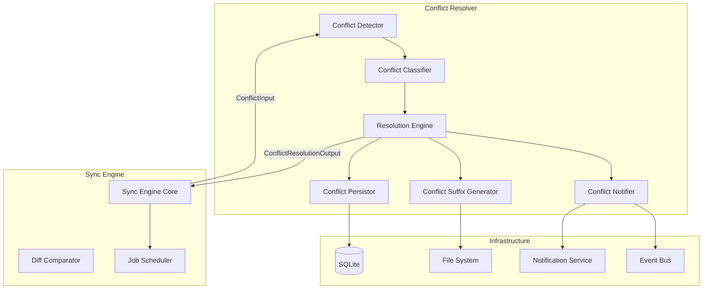
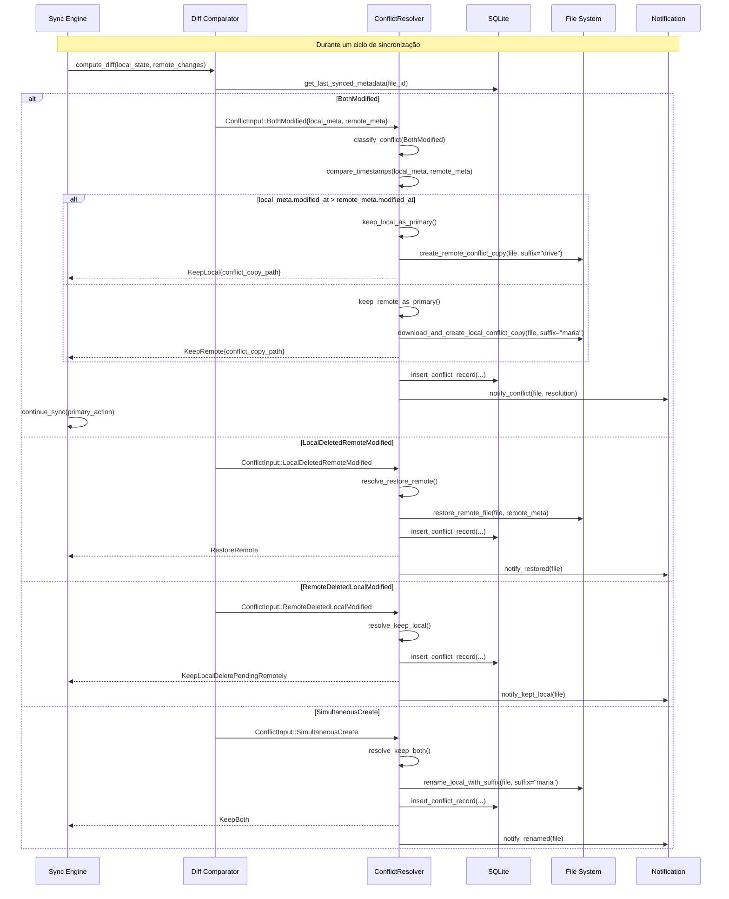
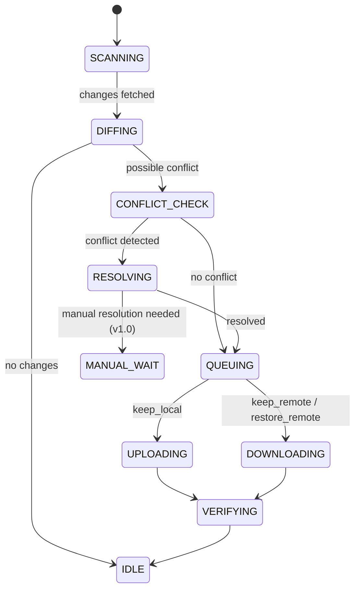

# Spec: Resolução de Conflitos

**Status:** Rascunho  
**Versão:** 1.0  
**Última atualização:** 2026-07-26  

---

## 1. Resumo

Este documento especifica o componente de **Resolução de Conflitos** do LibreSync. Define o algoritmo de detecção, as estratégias de resolução automática, a geração de nomes com sufixo, a persistência de decisões, a notificação ao usuário e a integração com o Sync Engine.

### 1.2 Escopo

Cobre todos os cenários de conflito entre estado local e remoto de arquivos sincronizados, incluindo modificação simultânea, exclusão vs modificação, criação simultânea, e edge cases como diretórios, binários, symlinks e arquivos vazios. Não cobre resolução manual (v1.0), versionamento de arquivos (v1.5) ou conflitos entre múltiplas contas.

### 1.3 Definições

| Termo | Definição |
|-------|-----------|
| Conflito | Arquivo modificado tanto local quanto remotamente desde a última sincronização bem-sucedida |
| Timestamp | `modified_at` do arquivo (nano-segundos desde epoch) |
| Estado canônico | O arquivo que "vence" o conflito — permanece sem sufixo |
| Cópia de conflito | Cópia renomeada com sufixo ` (conflito NOME).ext` |
| NOME | Identificador de origem: `"maria"` (máquina local) ou `"drive"` (Google Drive) |
| Resolução automática | Decisão tomada sem intervenção do usuário, baseada em regras determinísticas |

---

## 2. Contexto e Motivação

### 2.1 Responsabilidades

1. **Detectar** conflitos entre versão local e remota de um arquivo
2. **Classificar** o tipo de conflito (modificação dupla, exclusão vs modificação, criação simultânea)
3. **Resolver** automaticamente com base em regras determinísticas
4. **Gerar** cópia de conflito com nome único
5. **Persistir** a decisão em `conflict_records`
6. **Notificar** o usuário sobre cada conflito
7. **Reportar** ao Sync Engine o resultado para continuidade da sincronização

### 2.2 Interfaces

```rust
// Entrada: chamado pelo Sync Engine quando detecta divergência
pub enum ConflictInput {
    BothModified {
        file_id: String,
        local_meta: FileMetadata,
        remote_meta: FileMetadata,
    },
    LocalDeletedRemoteModified {
        file_id: String,
        remote_meta: FileMetadata,
    },
    RemoteDeletedLocalModified {
        file_id: String,
        local_meta: FileMetadata,
    },
    SimultaneousCreate {
        folder_id: String,
        name: String,
        local_meta: FileMetadata,
        remote_meta: FileMetadata,
    },
}

// Saída: resultado da resolução
pub enum ConflictResolutionOutput {
    KeepLocal {
        file_id: String,
        conflict_copy_path: Option<String>,  // cópia da versão remota
    },
    KeepRemote {
        file_id: String,
        conflict_copy_path: Option<String>,  // cópia da versão local
    },
    KeepBoth {
        local_path: String,
        remote_copy_path: String,
    },
    RestoreRemote {
        file_id: String,
        restored_path: String,
    },
    KeepLocalDeletePendingRemotely {
        file_id: String,
    },
}

pub struct ConflictResolver {
    db: Arc<Database>,
    fs: Arc<FileSystem>,
    notifier: Arc<NotificationService>,
}

impl ConflictResolver {
    pub async fn resolve(&self, input: ConflictInput) -> Result<ConflictResolutionOutput>;
}
```

---

## 3. Arquitetura do Componente

### 3.1 Diagrama de Componentes



### 3.2 Fluxo de Detecção e Resolução



---

## 4. Algoritmo de Detecção de Conflito

### 4.1 Momento Exato da Detecção

A detecção de conflito ocorre em dois momentos:

**Momento A — Durante diff local vs remoto (polling remoto):**

```
1. Sync Engine recebe changes do Google Drive (changes.list)
2. Para cada change com arquivo:
   a. Busca FileEntry no cache SQLite por remote_file_id
   b. Se FileEntry existe e status != synced AND status != pending_upload:
      → Pula (já está em processamento)
   c. Compara modified_at_remote (da change) com modified_at_remote (do cache)
   d. Se different AND cache.modified_at_local > cache.last_synced_at:
      → CONFLITO DETECTADO (BothModified)
   e. Se change.type == "removed" AND local file exists AND local file foi modificado:
      → CONFLITO DETECTADO (RemoteDeletedLocalModified)
   f. Se local file não existe (FileEntry sem remote_file_id) AND change tem arquivo com mesmo nome:
      → CONFLITO DETECTADO (SimultaneousCreate)
```

**Momento B — Durante upload (resposta 409 da API):**

```
1. UploadManager tenta upload via drive.files.update
2. Google Drive retorna HTTP 409 Conflict
3. UploadManager chama SyncEngine::handle_conflict(file_id)
4. SyncEngine busca metadados atuais do remoto via drive.files.get
5. SyncEngine compara metadados remotos com cache local:
   a. Se remote.modified_at > cache.last_synced_at AND local foi modificado:
      → CONFLITO DETECTADO (BothModified)
```

### 4.2 Critério de Comparação

A comparação usa **três fontes de informação**:

| Fonte | Onde obter | Formato |
|-------|-----------|---------|
| `local_modified_at` | `file_entries.modified_at_local` no SQLite | Unix timestamp nanos |
| `remote_modified_at` | `file_entries.modified_at_remote` (vindo da API) | RFC 3339 → convertido para Unix nanos |
| `last_synced_at` | `file_entries.last_synced_at` no SQLite | Unix timestamp nanos |
| `local_sha256` | `file_entries.sha256_hash` (atualizado pelo File Watcher) | String hex 64 |
| `remote_sha256` | Google Drive `md5Checksum` ou `sha256` (se disponível) | String hex |

**Regra de detecção de "modificado desde última sync":**

```
local_modificado = local_modified_at > last_synced_at
remote_modificado = remote_modified_at > last_synced_at
```

Ambos verdadeiros → conflito BothModified.

### 4.3 Pseudo-código do Detector

```rust
fn detect_conflict(
    cached: &FileEntry,
    remote: &RemoteFileMeta,
    local_exists: bool,
) -> Option<ConflictInput> {
    let local_modified_since_sync = cached.modified_at_local > cached.last_synced_at;
    let remote_modified_since_sync = remote.modified_at > cached.last_synced_at;
    let remote_deleted = remote.is_removed;

    match (local_modified_since_sync, remote_modified_since_sync, remote_deleted, local_exists) {
        (true, true, false, true) => Some(ConflictInput::BothModified {
            file_id: cached.id.clone(),
            local_meta: FileMetadata {
                modified_at: cached.modified_at_local,
                sha256: cached.sha256_hash.clone(),
                size: cached.size,
            },
            remote_meta: FileMetadata {
                modified_at: remote.modified_at,
                sha256: remote.sha256.clone(),
                size: remote.size,
            },
        }),
        (false, true, false, false) => Some(ConflictInput::LocalDeletedRemoteModified {
            file_id: cached.id.clone(),
            remote_meta: FileMetadata {
                modified_at: remote.modified_at,
                sha256: remote.sha256.clone(),
                size: remote.size,
            },
        }),
        (true, _, true, true) => Some(ConflictInput::RemoteDeletedLocalModified {
            file_id: cached.id.clone(),
            local_meta: FileMetadata {
                modified_at: cached.modified_at_local,
                sha256: cached.sha256_hash.clone(),
                size: cached.size,
            },
        }),
        _ => None,
    }
}

fn detect_simultaneous_create(
    local_entries: &[FileEntry],
    remote_entries: &[RemoteFileMeta],
) -> Vec<ConflictInput> {
    let local_names: HashSet<String> = local_entries
        .iter().filter(|e| e.remote_file_id.is_none())
        .map(|e| e.name.clone()).collect();

    let remote_names: HashSet<String> = remote_entries
        .iter().map(|r| r.name.clone()).collect();

    let mut conflicts = Vec::new();
    for name in local_names.intersection(&remote_names) {
        let local = local_entries.iter().find(|e| e.name == *name).unwrap();
        let remote = remote_entries.iter().find(|r| r.name == *name).unwrap();
        // Ambos foram criados DEPOIS da última sync
        if local.created_at_local > local.last_synced_at
            && remote.created_at > local.last_synced_at
        {
            conflicts.push(ConflictInput::SimultaneousCreate {
                folder_id: local.folder_id.clone(),
                name: name.clone(),
                local_meta: FileMetadata { .. },
                remote_meta: FileMetadata { .. },
            });
        }
    }
    conflicts
}
```

---

## 5. Estratégias de Resolução Automática

### 5.1 BothModified — Resolução por Timestamp

```
ENTRADA: local.modified_at > last_synced_at AND remote.modified_at > last_synced_at

REGRAS:
  1. Se local.modified_at > remote.modified_at:
       → Principal: versão local
       → Cópia de conflito: versão remota baixada com sufixo " (conflito drive).ext"
       → Ação no Sync Engine: upload da versão local (substitui remoto)
       → Output: KeepLocal { conflict_copy_path: Some(remote_copy) }

  2. Se remote.modified_at > local.modified_at:
       → Principal: versão remota
       → Cópia de conflito: versão local renomeada com sufixo " (conflito maria).ext"
       → Ação no Sync Engine: download da versão remota (substitui local)
       → Output: KeepRemote { conflict_copy_path: Some(local_copy) }

  3. Se local.modified_at == remote.modified_at:
       → Desempate por SHA256
       → Se SHA256 iguais: não é conflito real (mesmo conteúdo), ignorar
       → Se SHA256 diferentes: tratar como regra #2 (keep_remote)
       → Output: KeepRemote { conflict_copy_path: Some(local_copy) }
```

### 5.2 LocalDeleted vs RemoteModified

```
ENTRADA: local não existe (deletado) AND remote.modified_at > last_synced_at

REGRAS:
  1. O arquivo remoto é restaurado localmente
  2. NENHUMA cópia de conflito é criada (não há versão local para preservar)
  3. FileEntry.status = 'pending_download'
  4. Sync Engine enfileira download com prioridade Normal (5)
  5. Output: RestoreRemote { restored_path }

NOTA AO USUÁRIO:
  "O arquivo X foi restaurado do Google Drive, pois foi removido localmente
   enquanto era modificado remotamente."
```

### 5.3 RemoteDeleted vs LocalModified

```
ENTRADA: remote foi removido AND local.modified_at > last_synced_at

REGRAS:
  1. A versão local é mantida como principal
  2. O Sync Engine NÃO tenta deletar o arquivo local
  3. FileEntry.status = 'synced'
  4. Remote: o Sync Engine ignora a exclusão remota (não propaga)
  5. Output: KeepLocalDeletePendingRemotely

NOTA AO USUÁRIO:
  "O arquivo X foi mantido localmente, pois foi modificado enquanto era
   removido do Google Drive. A exclusão remota foi ignorada."
```

### 5.4 SimultaneousCreate

```
ENTRADA: local e remoto criaram arquivo com mesmo nome (name conflitante)
         Ambos criados após last_synced_at
         Nenhum dos dois possui remote_file_id correspondente

REGRAS:
  1. A versão remota permanece com o nome original
  2. A versão local é RENOMEADA com sufixo " (conflito maria).ext"
  3. FileEntry local: name é atualizado, local_path é renomeado no disco
  4. Sync Engine enfileira upload do arquivo renomeado
  5. Output: KeepBoth { local_path: renamed_path, remote_copy_path: original_remote_name }

GARANTIA:
  - A operação de rename no disco é atômica via rename() da libc
  - Se rename falhar (permissão, disco cheio), o conflito NÃO é resolvido
  - O erro é propagado para o Sync Engine que tentará novamente
```

### 5.5 Tabela de Decisão

| Cenário | Condição Local | Condição Remota | Resolução | Principal | Cópia Sufixo |
|---------|---------------|-----------------|-----------|-----------|--------------|
| BothModified | mod > last_sync | mod > last_sync | timestamp | quem tiver timestamp > | " (conflito NOME).ext" do perdedor |
| BothModified empate | mod == last_sync? e SHA256 diff | mod > last_sync | keep_remote | remoto | " (conflito maria).ext" do local |
| BothModified mesmo hash | mod > last_sync | mod > last_sync, SHA256 igual | no_conflict | ambos iguais | nenhum |
| LocalDeleted | não existe | mod > last_sync | restore_remote | remoto | nenhum |
| RemoteDeleted | mod > last_sync | não existe (remoto) | keep_local | local | nenhum |
| SimultaneousCreate | novo pós-sync | novo pós-sync | keep_both | remoto (nome original) | " (conflito maria).ext" no local |

---

## 6. Geração de Nomes com Sufixo

### 6.1 Algoritmo de Sufixo

```
ENTRADA:
  - original_name: "relatorio.docx"
  - origem: "maria" | "drive"

SUFIXO:
  - Formato: " (conflito {origem})"
  - Exemplo: "relatorio (conflito maria).docx"
  - Exemplo: "foto (conflito drive).png"

REGRAS:
  1. O sufixo é inserido ANTES da extensão
  2. Se o arquivo não tem extensão (ex: "Makefile", "README"):
       → Sufixo no final: "Makefile (conflito drive)"
  3. Se o arquivo tem múltiplas extensões (ex: "backup.tar.gz"):
       → Sufixo antes da PRIMEIRA extensão:
       → "backup (conflito maria).tar.gz"
  4. Se o nome já contém sufixo de conflito (re-conflito):
       → Incrementar: "relatorio (conflito maria 2).docx"
  5. Se o nome com sufixo já existe no diretório:
       → Incrementar contador: "relatorio (conflito maria 2).docx"
```

### 6.2 Pseudo-código do Gerador de Sufixo

```rust
fn generate_conflict_name(original: &str, origin: &str) -> String {
    let (stem, ext) = split_extension(original);
    let suffix = format!(" (conflito {})", origin);

    if ext.is_empty() {
        format!("{}{}", stem, suffix)
    } else {
        format!("{}{}.{}", stem, suffix, ext)
    }
}

fn ensure_unique_name(dir: &Path, desired: &str) -> String {
    if !Path::new(dir).join(&desired).exists() {
        return desired.to_string();
    }
    // Já existe — incrementar contador
    let (stem, ext) = split_extension(desired);
    let mut counter = 2;
    loop {
        let candidate = if ext.is_empty() {
            format!("{} {}", stem, counter)
        } else {
            format!("{} {}.{}", stem, counter, ext)
        };
        if !Path::new(dir).join(&candidate).exists() {
            return candidate;
        }
        counter += 1;
    }
}

fn split_extension(name: &str) -> (&str, &str) {
    // Procura o primeiro ponto, não o último
    // Ex: "backup.tar.gz" → ("backup", "tar.gz")
    if let Some(pos) = name.find('.') {
        (&name[..pos], &name[pos+1..])
    } else {
        (name, "")
    }
}
```

### 6.3 Casos de Uso do Sufixo

| Nome Original | Origem | Sufixo Gerado | Observação |
|--------------|--------|---------------|------------|
| `documento.docx` | maria | `documento (conflito maria).docx` | Caso padrão |
| `documento.docx` | drive | `documento (conflito drive).docx` | |
| `foto (1).jpg` | drive | `foto (1) (conflito drive).jpg` | Parênteses no nome original |
| `Makefile` | maria | `Makefile (conflito maria)` | Sem extensão |
| `.gitignore` | drive | `.gitignore (conflito drive)` | Arquivo oculto |
| `.hidden` | maria | `.hidden (conflito maria)` | Só extensão? Não — `.hidden` é o nome todo |
| `backup.tar.gz` | maria | `backup (conflito maria).tar.gz` | Split no primeiro `.` |
| `arquivo (conflito drive).txt` | maria | `arquivo (conflito drive) (conflito maria).txt` | Re-conflito — segundo sufixo |
| `documento (conflito maria).docx` | drive | `documento (conflito maria) (conflito drive).docx` | Múltiplas origens |
| `documento (conflito maria).docx` | maria | `documento (conflito maria 2).docx` | Mesma origem, segunda vez |

---

## 7. Notificação ao Usuário

### 7.1 Tipos de Notificação

```rust
pub enum ConflictNotification {
    /// BothModified resolvido por timestamp
    TimestampResolved {
        file_name: String,
        winner: String,        // "local" | "remote"
        conflict_copy: String, // nome do arquivo de conflito criado
    },
    /// Local deletado, remoto restaurado
    RemoteRestored {
        file_name: String,
    },
    /// Remoto deletado, local mantido
    LocalKept {
        file_name: String,
    },
    /// Criação simultânea
    SimultaneousCreate {
        file_name: String,
        renamed_copy: String,  // nome do arquivo renomeado
    },
}
```

### 7.2 Canais de Notificação

**Notificação Desktop (via libnotify/freedesktop):**

```
[LibreSync] ⚠ Conflito resolvido em "relatorio.docx"
A versão local foi mantida (modificação mais recente).
Cópia de conflito criada: "relatorio (conflito drive).docx"
[Abrir pasta] [Ignorar]
```

**Evento no Event Bus (para UI e log):**

```rust
EventBus::emit(ConflictResolved {
    file_id: "uuid",
    file_name: "relatorio.docx",
    resolution_type: "keep_local",
    conflict_copy: Some("relatorio (conflito drive).docx"),
    timestamp: 1721912345,
});
```

**Log no sync_events:**

```sql
INSERT INTO sync_events (folder_id, file_entry_id, event_type, file_path, message, level)
VALUES (
    'folder_uuid',
    'file_uuid',
    'conflict_resolved',
    '/home/maria/Drive/relatorio.docx',
    'Conflito resolvido: mantido local (timestamp mais recente). Cópia de conflito: relatorio (conflito drive).docx',
    'warn'
);
```

### 7.3 Regras de Notificação

| Condição | Notificação Desktop | Log | Event Bus |
|----------|-------------------|-----|-----------|
| BothModified resolvido | Sim (warn) | warn | Sim |
| LocalDeletedRemoteModified | Sim (info) | info | Sim |
| RemoteDeletedLocalModified | Sim (warn) | warn | Sim |
| SimultaneousCreate | Sim (warn) | warn | Sim |
| Múltiplos conflitos em lote | Agrupar em 1 notificação (max 1/min) | Todos individualmente | Todos individualmente |

**Anti-flood:** Não mais que 1 notificação de conflito por minuto. Conflitos adicionais são registrados em log e no event bus, mas não geram nova notificação desktop até o cooldown expirar.

---

## 8. Persistência da Decisão

### 8.1 Tabela conflict_records

```sql
-- Já definida no schema v1, repetida aqui para referência:
CREATE TABLE conflict_records (
    id                  TEXT PRIMARY KEY,                          -- UUID v4
    file_entry_id       TEXT NOT NULL REFERENCES file_entries(id) ON DELETE CASCADE,
    local_sha256        TEXT,                                      -- 64 hex chars (NULL se arquivo deletado local)
    remote_sha256       TEXT,                                      -- 64 hex chars (NULL se deletado remoto)
    local_modified_at   INTEGER,                                   -- Unix timestamp nanos (NULL se deletado local)
    remote_modified_at  INTEGER,                                   -- Unix timestamp parsed (NULL se deletado remoto)
    detected_at         INTEGER NOT NULL DEFAULT (strftime('%s', 'now')),
    resolution          TEXT CHECK (resolution IN ('keep_local', 'keep_remote', 'keep_both', 'pending')) DEFAULT 'pending',
    resolved_at         INTEGER,
    resolved_by         TEXT DEFAULT 'auto' CHECK (resolved_by IN ('auto', 'user')),
    conflict_type       TEXT CHECK (conflict_type IN (
                            'both_modified', 'local_deleted_remote_modified',
                            'remote_deleted_local_modified', 'simultaneous_create'
                        )),
    original_name       TEXT NOT NULL,                              -- Nome do arquivo no momento do conflito
    conflict_copy_name  TEXT,                                       -- Nome do arquivo de conflito gerado (se houver)
    details             TEXT                                        -- JSON com metadados extras da resolução
);

CREATE INDEX idx_conflicts_file ON conflict_records(file_entry_id);
CREATE INDEX idx_conflicts_pending ON conflict_records(resolution) WHERE resolution = 'pending';
CREATE INDEX idx_conflicts_detected ON conflict_records(detected_at);
```

### 8.2 Campos `details` — Schema JSON

```json
{
  "schemaVersion": 1,
  "resolutionStrategy": "timestamp",
  "localModifiedAt": 1721912345000000000,
  "remoteModifiedAt": 1721912340000000000,
  "localSha256": "abc123...",
  "remoteSha256": "def456...",
  "winner": "local",
  "losserCopyPath": "relatorio (conflito drive).docx",
  "localPath": "/home/maria/Drive/relatorio.docx",
  "remotePath": "/Meu Drive/relatorio.docx",
  "accountEmail": "maria@gmail.com"
}
```

### 8.3 Transação de Persistência

```sql
BEGIN IMMEDIATE TRANSACTION;

-- 1. Atualizar FileEntry status para 'synced' (ou 'pending_upload' / 'pending_download')
UPDATE file_entries
SET status = CASE
    WHEN ?resolution = 'keep_local' THEN 'synced'
    WHEN ?resolution = 'keep_remote' THEN 'pending_download'
    WHEN ?resolution = 'keep_both' THEN 'synced'
    WHEN ?resolution = 'restore_remote' THEN 'pending_download'
    ELSE status
    END,
    last_synced_at = strftime('%s', 'now'),
    modified_at_local = CASE WHEN ?resolution = 'keep_local' THEN modified_at_local ELSE ?remote_modified END,
    modified_at_remote = ?remote_modified
WHERE id = ?file_entry_id;

-- 2. Inserir registro de conflito
INSERT INTO conflict_records (
    id, file_entry_id, local_sha256, remote_sha256,
    local_modified_at, remote_modified_at, detected_at,
    resolution, resolved_at, resolved_by, conflict_type,
    original_name, conflict_copy_name, details
) VALUES (?, ?, ?, ?, ?, ?, ?, ?, ?, ?, ?, ?, ?, ?);

-- 3. Inserir evento no log
INSERT INTO sync_events (folder_id, file_entry_id, event_type, file_path, message, level)
VALUES (?, ?, 'conflict_resolved', ?, ?, 'warn');

COMMIT;
```

Tudo na mesma transação SQLite. Se qualquer passo falhar, a transação é revertida e o conflito NÃO é considerado resolvido.

---

## 9. Edge Cases

### 9.1 Conflito em Diretório

Diretórios não têm conteúdo, apenas metadados. Conflito de diretório ocorre quando ambos os lados modificam metadados (permissões, etc). Como o Google Drive não expõe permissões via API v3 de forma granular, o comportamento é:

- **BothModified em diretório:** A resolução por timestamp decide qual versão prevalece. NÃO há cópia de conflito (não faria sentido copiar um diretório com sufixo). O conflito é registrado e resolvido silenciosamente.
- **LocalDeleted vs RemoteModified em diretório:** O diretório é recriado localmente (equivalente a `mkdir -p`).
- **SimultaneousCreate de diretório:** O diretório local é renomeado com sufixo ` (conflito maria)`.

```rust
fn resolve_dir_conflict(input: ConflictInput) -> ConflictResolutionOutput {
    match input {
        ConflictInput::BothModified { .. } => {
            // Diretório: apenas metadados, sem conflito de conteúdo
            // Timestamp define qual lado prevalece
            // NENHUMA cópia de conflito
            ConflictResolutionOutput::KeepLocal { conflict_copy_path: None }
        }
        ConflictInput::SimultaneousCreate { name, .. } => {
            // Renomeia o diretório local
            let new_name = generate_conflict_name(&name, "maria");
            fs::rename(local_path, parent.join(&new_name))?;
            ConflictResolutionOutput::KeepBoth {
                local_path: parent.join(&new_name),
                remote_copy_path: name.clone(),
            }
        }
        _ => unreachable!(),
    }
}
```

### 9.2 Conflito em Arquivo Binário

Arquivos binários (imagens, vídeos, PDFs, executáveis) seguem EXATAMENTE as mesmas regras. Não há tratamento especial. O algoritmo de resolução não inspeciona conteúdo — apenas metadados (timestamps, hashes).

- A cópia de conflito é uma cópia byte-a-byte do arquivo
- A comparação de conteúdo usa SHA256 bidirecionalmente
- A resolução por timestamp funciona independentemente do tipo MIME

### 9.3 Conflito em Arquivo Symlink

O LibreSync trata symlinks como arquivos especiais:

- **Leitura do symlink:** `fs::read_link()` para obter o alvo
- **SHA256 de symlink:** hash do CAMINHO do alvo (string), não do conteúdo apontado
- **Conflito de symlink:** resolvido por timestamp, assim como arquivos regulares
- **Cópia de conflito:** o symlink é copiado como symlink (via `fs::symlink_metadata` + `std::os::unix::fs::symlink`)
- **Google Drive:** symlinks não são suportados nativamente. O LibreSync serializa symlinks como arquivos especiais com metadados extras. No Drive, um symlink é armazenado como um arquivo de conteúdo `->/caminho/alvo` com MIME type `application/x-symlink`.

### 9.4 Conflito em Arquivo de 0 Bytes

Arquivos de 0 bytes seguem as mesmas regras. O SHA256 de um arquivo vazio é `e3b0c44298fc1c149afbf4c8996fb92427ae41e4649b934ca495991b7852b855`.

- Se ambos os lados têm 0 bytes E mesmo timestamp → ignorar (não é conflito real)
- Se ambos têm 0 bytes mas timestamps diferentes → resolver por timestamp. A cópia de conflito é um arquivo vazio com sufixo.

### 9.5 Múltiplos Conflitos Simultâneos

Quando múltiplos conflitos são detectados no mesmo ciclo de sincronização:

1. Cada conflito é processado INDIVIDUALMENTE e em ORDEM DETERMINÍSTICA (ordenado por `local_path` ascendente)
2. A resolução de um conflito NÃO afeta a resolução de outro (são independentes)
3. A notificação desktop é limitada: apenas 1 notificação agregada
4. O log registra todos individualmente
5. A transação SQLite engloba todos os inserts

**Limite de processamento:** No máximo 20 conflitos são processados por ciclo. Se houver mais, o restante é postergado para o próximo ciclo. Isso evita um flood de I/O em casos extremos (ex: sync inicial com conflitos em massa).

### 9.6 Conflito com Arquivo já em Estado de Conflito

Se um arquivo já possui um `conflict_records` com `resolution = 'pending'` (resolução manual aguardando):

- O Sync Engine pula o arquivo e NÃO tenta resolver automaticamente
- Um aviso é registrado no log: "Conflito pendente para arquivo X — aguardando resolução manual"
- O conflito anterior DEVE ser resolvido (via UI ou DB) antes que novo conflito seja processado

Se um arquivo já possui `conflict_records` com `resolution = 'keep_*'` (já resolvido) e um NOVO conflito ocorre:

- O novo conflito é tratado como qualquer outro conflito (regras normais se aplicam)
- Um novo registro é inserido em `conflict_records`
- O sufixo de re-conflito é aplicado: `documento (conflito drive) (conflito maria).docx`

### 9.7 Conflito Durante Upload Parcial (Resumable)

Se um upload resumable está em andamento e um conflito é detectado:

1. UploadManager recebe 409 Conflict → `SyncEngine::handle_conflict`
2. O conflito é resolvido normalmente
3. Se a resolução é `KeepLocal`: o upload resumable CONTINUA (a sessão existente ainda é válida)
4. Se a resolução é `KeepRemote`: o upload resumable é CANCELADO e o download da versão remota é enfileirado
5. Se a resolução é `KeepBoth`: o upload resumable muda para fazer upload do arquivo renomeado

### 9.8 Conflito em Arquivo Oculto / Ponto

Arquivos que começam com `.` (ex: `.bashrc`, `.env`) seguem as mesmas regras. O sufixo é inserido após o nome base:

- `.env` → `.env (conflito drive)` — correto, o nome do arquivo é `.env`
- `.gitignore` → `.gitignore (conflito maria)` — sufixo após nome completo

### 9.9 Conflito em Arquivo com Encoding Especial no Nome

Nomes com caracteres Unicode, espaços, acentos, emojis:

- O nome é tratado como UTF-8 String em Rust
- A geração do sufixo preserva o encoding original
- A operação de rename no Linux funciona com bytes, independente de encoding
- Não há normalização Unicode (NFC/NFD) — o nome é usado como está

---

## 10. Prevenção de Conflitos

### 10.1 Leitura de Timestamps Antes de Escrever

Antes de QUALQUER operação de escrita local (download) ou remota (upload), o sistema segue este fluxo:

```rust
async fn safe_write(
    fs: &FileSystem,
    db: &Database,
    file_id: &str,
    new_content: &[u8],
) -> Result<()> {
    // 1. TRAVAR o arquivo no cache (mutex por file_id)
    let _lock = db.acquire_file_lock(file_id).await;

    // 2. RELER o timestamp atual do remoto (se for download)
    let current_remote = fetch_remote_meta(file_id).await?;

    // 3. Comparar com o timestamp que tínhamos quando o job foi criado
    if current_remote.modified_at > job_snapshot.remote_modified_at {
        // O arquivo remoto mudou desde que este job foi criado!
        return Err(ConflictError::RemoteChangedDuringJob);
    }

    // 4. Se passou, escrever com segurança
    fs.write(file_id, new_content).await?;
    db.update_last_synced(file_id).await?;

    Ok(())
}
```

**Momento da verificação:**

| Operação | Quando verificar | O que verificar |
|----------|-----------------|-----------------|
| Download (escrever local) | Imediatamente antes de `open()` para escrita | `remote_modified_at` atual vs snapshot do job |
| Upload (escrever remoto) | Imediatamente antes de chamar `drive.files.update` | `remote_modified_at` (obtido via `drive.files.get`) vs snapshot |
| Delete local | Antes de `unlink()` | `remote_modified_at` atual vs snapshot |
| Delete remoto | Antes de `drive.files.delete` | `remote_modified_at` atual vs snapshot |

### 10.2 File Locking no Cache

```sql
-- Tabela para locking otimista:
CREATE TABLE file_locks (
    file_entry_id   TEXT PRIMARY KEY REFERENCES file_entries(id) ON DELETE CASCADE,
    locked_at       INTEGER NOT NULL DEFAULT (strftime('%s', 'now')),
    lock_token      TEXT NOT NULL,  -- UUID do worker que detém o lock
    expires_at      INTEGER         -- Lock expira após 30s (timeout safety)
);
```

**Regras:**
- Lock é adquirido antes de iniciar qualquer operação de escrita
- Lock é liberado após conclusão (ou falha) da operação
- Lock expira automaticamente após 30s (anti-deadlock)
- Lock é tentado com timeout de 5s — se não adquirir, o job falha com "resource_busy"

### 10.3 Verificação Dupla (Double-Check)

```rust
// Fluxo de double-check antes de escrever:
// 1. Snapshot: quando o job é criado (armazenado em sync_jobs.details)
// 2. Re-verify: imediatamente antes de executar
//
// Se o re-verify detectar divergência:
//   a. O job atual é cancelado
//   b. Um novo ciclo de diff é disparado
//   c. Se o diff detectar conflito, o ConflictResolver é chamado
```

---

## 11. Integração com Sync Engine

### 11.1 Quando o Conflito é Detectado



### 11.2 Interface SyncEngine → ConflictResolver

```rust
impl SyncEngine {
    /// Chamado durante o diff quando divergência é encontrada
    async fn handle_conflict(&self, input: ConflictInput) -> Result<ConflictResolutionOutput> {
        // 1. Log do conflito
        log::warn!("Conflito detectado: {:?}", input);

        // 2. Delegar para o resolver
        let output = self.conflict_resolver.resolve(input).await?;

        // 3. Processar o resultado
        match &output {
            ConflictResolutionOutput::KeepLocal { conflict_copy } => {
                // Upload do arquivo local (como principal)
                self.enqueue_job(SyncJob::upload(file_id, priority::HIGH));
                // Se cópia de conflito do remoto foi criada localmente,
                // enfileirar upload da cópia também
                if let Some(copy_path) = conflict_copy {
                    self.enqueue_job(SyncJob::upload_new(copy_path, priority::LOW));
                }
            }
            ConflictResolutionOutput::KeepRemote { .. } => {
                // Download da versão remota (como principal)
                self.enqueue_job(SyncJob::download(file_id, priority::HIGH));
            }
            ConflictResolutionOutput::KeepBoth { local_path, .. } => {
                // Upload do arquivo renomeado local
                self.enqueue_job(SyncJob::upload_new(local_path, priority::NORMAL));
            }
            ConflictResolutionOutput::RestoreRemote { .. } => {
                // Download do arquivo remoto (restauração)
                self.enqueue_job(SyncJob::download(file_id, priority::NORMAL));
            }
            ConflictResolutionOutput::KeepLocalDeletePendingRemotely { .. } => {
                // Marcar como synced, propagar exclusão remota NÃO
                self.db.mark_synced(file_id);
            }
        }

        // 4. Emitir evento para UI
        self.event_bus.emit(SystemEvent::ConflictResolved {
            file_id: input.file_id().to_string(),
            resolution: output.resolution_type(),
        });

        Ok(output)
    }

    /// Chamado quando o Google Drive retorna 409 durante upload
    async fn on_upload_conflict(&self, file_id: &str, local_content: &[u8]) -> Result<()> {
        let remote_meta = self.drive.get_file_meta(file_id).await?;
        let cached = self.db.get_file_entry(file_id).await?;

        let input = ConflictInput::BothModified {
            file_id: file_id.to_string(),
            local_meta: FileMetadata {
                modified_at: cached.modified_at_local,
                sha256: sha256(local_content),
                size: local_content.len() as i64,
            },
            remote_meta: FileMetadata {
                modified_at: remote_meta.modified_at,
                sha256: remote_meta.sha256.clone(),
                size: remote_meta.size,
            },
        };

        self.handle_conflict(input).await?;
        Ok(())
    }
}
```

### 11.3 Reação do Sync Engine por Tipo de Resolução

| Resolução | Engine Ação Imediata | Engine Ação Posterior | FileEntry Status Final |
|-----------|---------------------|----------------------|----------------------|
| KeepLocal | Upload file_id (HIGH) | Upload conflict_copy (LOW) se houver | synced |
| KeepRemote | Download file_id (HIGH) | Nenhuma | synced |
| KeepBoth | Upload renamed_path (NORMAL) | Registrar novo FileEntry | synced (original) / pending_upload (renamed) |
| RestoreRemote | Download file_id (NORMAL) | Nenhuma | synced |
| KeepLocalDeletePendingRemotely | Nenhum job | Nenhum | synced |

### 11.4 Fila de Jobs Pós-Resolução

```rust
// Jobs gerados após resolução de conflito têm prioridades específicas:
//
// KeepLocal:
//   - Upload do principal: priority=HIGH (10) — rápido, substitui remoto
//   - Upload da cópia de conflito: priority=LOW (2) — sem pressa
//
// KeepRemote:
//   - Download do principal: priority=HIGH (10)
//
// KeepBoth:
//   - Upload do arquivo renomeado: priority=NORMAL (5)
//
// RestoreRemote:
//   - Download do arquivo restaurado: priority=NORMAL (5)
```

---

## 12. Resolução Manual (v1.0)

### 12.1 Interface Futura

Embora a resolução manual esteja prevista para v1.0, o componente já é preparado:

- **ConflictRecord.resolution = 'pending'**: Quando `resolved_by = 'auto'` não for desejável em alguns cenários, o campo suporta `'pending'` para aguardar intervenção.
- **Índice `idx_conflicts_pending`**: Já existe para consultar rapidamente conflitos não resolvidos.
- **API pública prevista para v1.0**:

```rust
// v1.0 — Resolução manual
impl ConflictResolver {
    /// Listar conflitos pendentes (resolution = 'pending')
    pub async fn list_pending(&self) -> Result<Vec<ConflictRecord>>;

    /// Resolver manualmente um conflito
    pub async fn resolve_manual(
        &self,
        conflict_id: &str,
        decision: ManualDecision,  // KeepLocal | KeepRemote | KeepBoth
    ) -> Result<()>;

    /// Reabrir um conflito já resolvido
    pub async fn reopen(&self, conflict_id: &str) -> Result<()>;
}
```

### 12.2 Gatilhos para Resolução Manual

Situações onde a resolução manual será necessária (v1.0):

1. **Usuário opta por "Perguntar sempre"** na preferência de conflitos
2. **Empate de timestamp E SHA256 diferentes** (caso raro, mas ambíguo)
3. **Conflito envolvendo arquivo binário crítico** onde o usuário quer decidir
4. **Reabertura**: usuário discorda da resolução automática e quer reverter

### 12.3 Interface do Usuário (v1.0)

```
+--------------------------------------------------+
|  ⚠ Conflito em "relatorio.docx"                  |
|                                                    |
|  O arquivo foi modificado localmente e no         |
|  Google Drive desde a última sincronização.       |
|                                                    |
|  Local:  Hoje, 14:32 (2.4 KB)                     |
|  Remoto: Hoje, 14:28 (2.1 KB)                     |
|                                                    |
|  ○ Manter versão local (recomendado)              |
|  ○ Manter versão remota                           |
|  ○ Manter ambos (criar cópia)                     |
|  ○ Abrir comparação (diff)                        |
|                                                    |
|  [Resolver]  [Resolver e não perguntar de novo]    |
+--------------------------------------------------+
```

---

## 13. Tratamento de Erros

### 13.1 Erros do ConflictResolver

| Erro | Causa | Ação | Retry |
|------|-------|------|-------|
| `FileNotFound` | Arquivo local não existe quando tentamos criar cópia | Re-avaliar conflito como LocalDeleted | Não |
| `DiskFull` | Disco sem espaço para cópia de conflito | Retry com backoff, notificar usuário | Sim (3x) |
| `PermissionDenied` | Sem permissão de escrita no diretório | Notificar usuário, pular conflito | Não |
| `ConflictRaceCondition` | Arquivo mudou durante resolução (re-detected) | Re-avaliar conflito do zero | Sim (1x) |
| `DatabaseError` | Falha ao inserir conflict_records | Reverter transação, retry | Sim (3x) |
| `SymlinkLoop` | Symlink aponta para si mesmo ou loop | Ignorar conflito, marcar como ignored | Não |
| `NameCollision` | Gerador de nome não encontra nome único após N tentativas | Usar UUID como fallback: `arquivo_CONFLICT_UUID.ext` | Não |

### 13.2 Política de Retry

| Erro | Retry? | Intervalo | Max |
|------|--------|-----------|-----|
| DiskFull | Sim | 30s, 60s, 120s | 3 |
| DatabaseError | Sim | 1s, 2s, 4s | 3 |
| ConflictRaceCondition | Sim | 1s | 1 |
| PermissionDenied | Não | — | 0 |
| FileNotFound | Não | — | 0 |
| SymlinkLoop | Não | — | 0 |
| NameCollision | Não | — | 0 |

### 13.3 Rollback em Caso de Falha

Se a resolução falha após criar a cópia de conflito mas antes de persistir no DB:

1. A cópia de conflito no disco é ORFÃ
2. No próximo ciclo de sync, o arquivo órfão será detectado como "arquivo local não rastreado"
3. O usuário pode removê-lo manualmente, ou o sistema pode oferecer limpeza periódica

Para evitar isso, a ORDEM DE OPERAÇÕES é:

```
1. Gerar nome único (sem tocar no disco)
2. Abrir transação SQLite
3. Criar cópia no disco
4. Inserir conflict_records
5. Atualizar file_entry
6. Commitar transação
7. Notificar usuário

Se 3 falhar → rollback da transação (nada persiste)
Se 4 ou 5 falhar → remover cópia do disco + rollback
```

---

## 14. Métricas e Monitoramento

### 14.1 Métricas Expostas

```rust
pub struct ConflictMetrics {
    pub total_conflicts_detected: Counter,     // Total de conflitos detectados desde início
    pub total_conflicts_resolved: Counter,     // Total resolvidos automaticamente
    pub conflicts_by_type: HashMap<ConflictType, Counter>,
    pub conflicts_by_resolution: HashMap<Resolution, Counter>,
    pub resolution_duration_ms: Histogram,     // Tempo de resolução (ms)
    pub pending_conflicts: Gauge,              // Conflitos com resolution = 'pending'
    pub conflict_copy_bytes: Counter,          // Bytes escritos em cópias de conflito
}
```

### 14.2 Eventos de Log

| Nível | Evento | Mensagem |
|-------|--------|----------|
| WARN | conflict_detected | "Conflito detectado: arquivo=X tipo=both_modified" |
| INFO | conflict_resolved | "Conflito resolvido: arquivo=X estratégia=timestamp winner=local" |
| WARN | conflict_restored | "Arquivo restaurado do remoto: X" |
| WARN | conflict_local_kept | "Arquivo mantido localmente (exclusão remota ignorada): X" |
| WARN | conflict_simultaneous | "Criação simultânea: arquivo=X renomeado para=Y" |
| ERROR | conflict_failed | "Falha ao resolver conflito: arquivo=X erro=DiskFull" |
| DEBUG | conflict_detection_start | "Iniciando detecção de conflitos para N arquivos" |
| DEBUG | conflict_detection_end | "Detecção concluída: N conflitos encontrados" |

---

## 15. Testes

### 15.1 Testes Unitários

```rust
#[cfg(test)]
mod tests {
    use super::*;

    // === Detecção ===

    #[test]
    fn test_detect_both_modified() { .. }
    #[test]
    fn test_detect_local_deleted() { .. }
    #[test]
    fn test_detect_remote_deleted() { .. }
    #[test]
    fn test_detect_simultaneous_create() { .. }
    #[test]
    fn test_no_conflict_if_not_modified() { .. }
    #[test]
    fn test_no_conflict_if_same_hash() { .. }

    // === Resolução por Timestamp ===

    #[test]
    fn test_timestamp_local_wins() { .. }
    #[test]
    fn test_timestamp_remote_wins() { .. }
    #[test]
    fn test_timestamp_equal_different_hash_remote_wins() { .. }
    #[test]
    fn test_timestamp_equal_same_hash_no_conflict() { .. }

    // === Geração de Sufixo ===

    #[test]
    fn test_suffix_basic() { .. }
    #[test]
    fn test_suffix_no_extension() { .. }
    #[test]
    fn test_suffix_double_extension() { .. }
    #[test]
    fn test_suffix_hidden_file() { .. }
    #[test]
    fn test_suffix_existing_name_increments() { .. }
    #[test]
    fn test_suffix_reconflict_same_origin() { .. }
    #[test]
    fn test_suffix_reconflict_different_origin() { .. }
    #[test]
    fn test_suffix_unicode() { .. }

    // === Edge Cases ===

    #[test]
    fn test_empty_file_conflict() { .. }
    #[test]
    fn test_symlink_conflict() { .. }
    #[test]
    fn test_directory_conflict() { .. }
    #[test]
    fn test_binary_file_conflict() { .. }
    #[test]
    fn test_multiple_simultaneous_conflicts() { .. }
    #[test]
    fn test_pending_conflict_skipped() { .. }
    #[test]
    fn test_conflict_during_resumable_upload() { .. }

    // === Persistência ===

    #[test]
    fn test_conflict_record_inserted() { .. }
    #[test]
    fn test_transaction_rollback_on_failure() { .. }
    #[test]
    fn test_conflict_record_fields() { .. }

    // === Prevenção ===

    #[test]
    fn test_double_check_before_write_safe() { .. }
    #[test]
    fn test_double_check_detects_change() { .. }
    #[test]
    fn test_file_lock_acquire_release() { .. }
    #[test]
    fn test_file_lock_expires() { .. }
}
```

### 15.2 Testes de Integração

```rust
#[cfg(test)]
mod integration_tests {
    // Cenários com SQLite em memória + FileSystem temporário

    #[tokio::test]
    async fn test_full_conflict_resolution_cycle() {
        // 1. Setup: pasta temp, DB, arquivo sincronizado
        // 2. Simular modificação local + remota
        // 3. Executar detecção → resolução
        // 4. Verificar: arquivo principal correto, cópia de conflito existe
        // 5. Verificar: conflict_records populado
        // 6. Verificar: sync_events populado
    }

    #[tokio::test]
    async fn test_local_deleted_remote_modified() { .. }
    #[tokio::test]
    async fn test_remote_deleted_local_modified() { .. }
    #[tokio::test]
    async fn test_simultaneous_create() { .. }
    #[tokio::test]
    async fn test_conflict_name_already_exists() { .. }

    #[tokio::test]
    async fn test_disk_full_during_conflict_copy() {
        // Simular disco cheio durante criação de cópia
        // Verificar rollback completo
    }

    #[tokio::test]
    async fn test_concurrent_conflicts_same_file() {
        // Dois workers tentando resolver o mesmo conflito
        // Apenas um deve vencer (lock)
    }
}
```

### 15.3 Property-Based Tests

```rust
#[cfg(test)]
mod proptests {
    use proptest::prelude::*;

    proptest! {
        #[test]
        fn test_generate_name_never_collides(
            original_name in "[a-zA-Z0-9._-]{1,50}",
            origin in prop::sample::select(vec!["maria", "drive"]),
        ) {
            let name = generate_conflict_name(&original_name, &origin);
            // O nome gerado NUNCA deve ser igual ao original
            assert_ne!(name, original_name);
            // O nome gerado DEVE conter o sufixo
            assert!(name.contains("(conflito"));
            assert!(name.contains(origin));
        }

        #[test]
        fn test_deterministic_resolution(
            local_ts in 0..1_000_000_000i64,
            remote_ts in 0..1_000_000_000i64,
        ) {
            let result = resolve_by_timestamp(local_ts, remote_ts);
            if local_ts > remote_ts {
                assert_eq!(result, KeepLocal);
            } else {
                assert_eq!(result, KeepRemote);
            }
        }
    }
}
```

---

## 16. Priorização de Implementação

### Fase 1 — MVP (Atual)

| Item | Prioridade | Esforço |
|------|-----------|---------|
| Estrutura `ConflictInput` e `ConflictResolutionOutput` | P0 | 1h |
| Detector de BothModified | P0 | 3h |
| Resolução por timestamp | P0 | 2h |
| Gerador de sufixo | P0 | 2h |
| Persistência em conflict_records | P0 | 3h |
| Notificação desktop + log | P0 | 2h |
| Integração Sync Engine (handle_conflict) | P0 | 4h |
| Detector LocalDeleted + RemoteModified | P1 | 2h |
| Detector RemoteDeleted + LocalModified | P1 | 2h |
| Detector SimultaneousCreate | P1 | 3h |
| Double-check antes de escrever | P1 | 4h |
| File locking | P1 | 3h |
| Testes unitários (deck) | P1 | 6h |
| Testes de integração | P1 | 6h |

### Fase 2 — v1.0

| Item | Prioridade | Esforço |
|------|-----------|---------|
| Resolução manual (UI + API) | P0 | 12h |
| Listar conflitos pendentes | P0 | 3h |
| Reabertura de conflito | P1 | 4h |
| Preferência "Perguntar sempre" | P1 | 3h |
| Limpeza de cópias órfãs | P2 | 3h |
| Property-based tests | P2 | 4h |

---

## 17. Glossário

| Termo | Definição |
|-------|-----------|
| Cópia de conflito | Arquivo renomeado com sufixo que preserva a versão "perdedora" do conflito |
| Estado canônico | O arquivo principal (sem sufixo) que representa a versão vencedora |
| Resolução automática | Decisão tomada por regras de código sem intervenção do usuário |
| Resolução manual | Decisão feita pelo usuário via interface futura (v1.0) |
| Re-conflito | Novo conflito em um arquivo que já foi conflito anteriormente |
| Lock otimista | Lock no banco que expira após timeout, sem blocking entre workers |
| Double-check | Verificação de timestamp imediatamente antes de escrever, para evitar race conditions |

---

## 18. Referências

- PRD.md — Seção 9.4 (Fluxo de Resolução de Conflitos)
- PRD.md — Seção 14 (Tabela `conflict_records`)
- PRD.md — Seção 8.1 (Modelo `ConflictRecord` e `ConflictResolution` enum)
- PRD.md — Seção 7.4 (State Machine: estados CONFLICT → RESOLVING)
- Google Drive API v3 — `drive.files.update` (409 Conflict)
- Google Drive API v3 — `drive.changes.list` (detecção de mudanças remotas)
