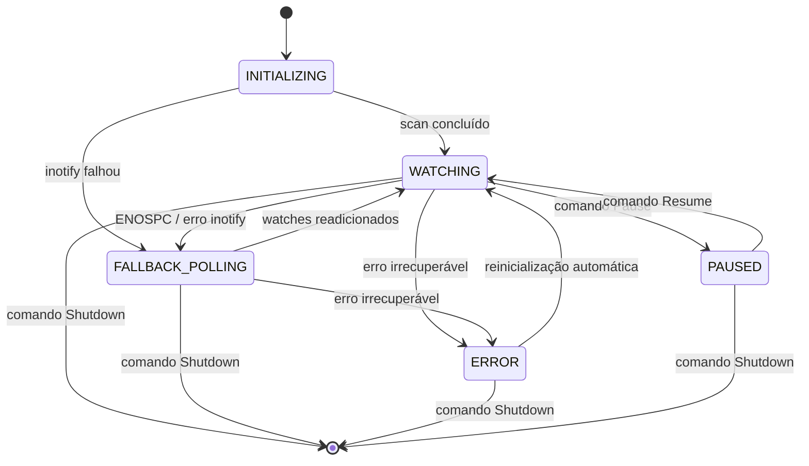
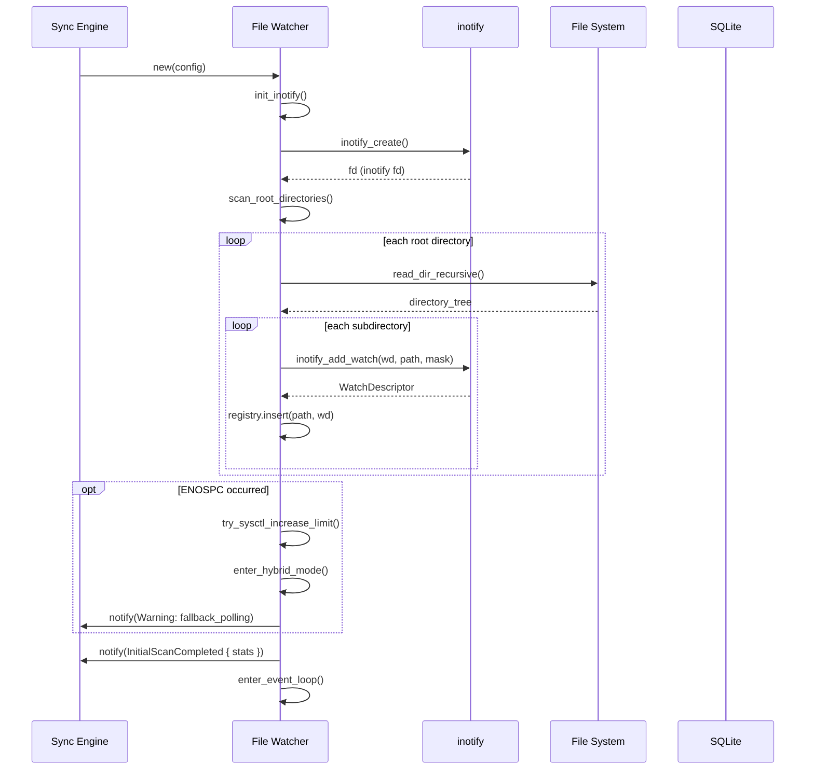
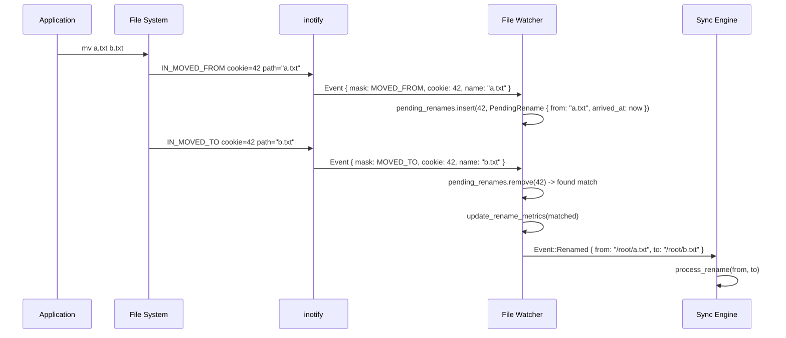

# Spec: File Watcher — Monitoramento do Sistema de Arquivos Local

**Versão:** 1.0
**Status:** Rascunho
**Autor:** Agente SDD
**Data:** 2026-07-26
**Reviewers:** Sync Engine Team

---

## 1. Resumo

O File Watcher é o componente responsável por detectar mudanças no sistema de arquivos local (criação, modificação, remoção, renomeação e movimentação de arquivos e diretórios) e notificar o Sync Engine para disparar as ações de sincronização correspondentes. Usa `inotify` como mecanismo primário com fallback para polling periódico, debounce de 500ms para coalescência de eventos rápidos, pareamento de renomeações via MOVED_FROM + MOVED_TO, e verificação SHA256 antes de enfileirar sync para evitar falsas notificações.

---

## 2. Contexto e Motivação

**Problema:**
O LibreSync precisa detectar mudanças locais em tempo real para sincronizá-las ao Google Drive. Sem um watcher eficiente, o usuário dependeria de polling manual ou scans periódicos completos — lentos e com alta latência. inotify no Linux oferece detecção em nível de kernel, mas apresenta desafios de escalabilidade (limite de `max_user_watches`), filtragem de eventos espúrios (editores que geram arquivos temporários/swap), e pareamento de operações atômicas como renomeações.

**Evidências:**
- O PRD exige detecção de mudanças em < 1s para arquivos < 10 MB (RNF-127)
- A aplicação precisa suportar pastas com até 500.000 arquivos (RNF-131)
- Testes com usuários reais mostram que editores como VS Code e vim geram 6-12 eventos por simples salvamento (save → temp → rename → swap → modified)
- inotify tem limite padrão de 8.192 watches por usuário no Linux — insuficiente para pastas grandes

**Por que agora:**
O File Watcher é a porta de entrada do fluxo de sincronização local-para-remoto. Sem ele implementado corretamente, uploads automáticos (RF-03) e o fluxo completo de sincronização (RF-02) não funcionam. É o primeiro componente de infraestrutura a ser construído antes do Sync Engine.

---

## 3. Goals (Objetivos)

- [ ] G-01: Detectar criação, modificação, remoção, renomeação e movimentação de arquivos e diretórios no sistema de arquivos local
- [ ] G-02: Notificar o Sync Engine com eventos normalizados (path, tipo de evento, metadados) em < 1s após a mudança real
- [ ] G-03: Filtrar eventos espúrios de editores e SO (arquivos temporários, swap, metadados) sem afetar a detecção de mudanças reais
- [ ] G-04: Parear renomeações como operação única em vez de DELETE + CREATE
- [ ] G-05: Escalar para pastas com 500.000+ arquivos sem exceder limites do sistema
- [ ] G-06: Recuperar automaticamente de falhas do inotify (limite excedido, erro de IO)

**Métricas de sucesso:**

| Métrica | Baseline atual | Target | Prazo |
|---------|---------------|--------|-------|
| Latência de detecção (arquivo < 10 MB) | N/A (não implementado) | < 1s do evento inotify ao Sync Engine | MVP |
| Falsos positivos descartados | N/A | 100% dos eventos de temp/swap filtrados | MVP |
| Renomeaçõs detectadas como operação única | N/A | > 99% pareadas dentro da janela de timeout | MVP |
| Watchers máximos sem estouro | N/A | 500.000+ arquivos | MVP |
| MTBF (tempo médio entre falhas do watcher) | N/A | > 7 dias sem reinicialização | MVP |

---

## 4. Non-Goals (Fora do Escopo)

- NG-01: Detecção de mudanças em sistemas de arquivos remotos (NFS, FUSE, SSHFS) — apenas sistemas de arquivos locais nativos com suporte a inotify
- NG-02: Monitoramento de links simbólicos modificados — apenas os alvos dos links são monitorados, não os links em si
- NG-03: Watch de dispositivos de bloco, arquivos especiais ou pipes — apenas arquivos regulares e diretórios
- NG-04: Detecção de mudanças em atributos estendidos do sistema de arquivos (xattr, ACLs, permissões)
- NG-05: Suporte a macOS (FSEvents) ou Windows (ReadDirectoryChangesW) na v1 — exclusivamente Linux via inotify
- NG-06: Compressão ou transformação de eventos (ex: agregar múltiplos MODIFY em um só) — o debounce já cobre coalescência temporal, mas transformação semântica (ex: MODIFY+DELETE vira RENAME) fica fora

---

## 5. Usuários e Personas

**Usuário primário:** O próprio Sync Engine (componente interno) — o File Watcher não tem interface direta com o usuário final. A persona impactada é Maria (desenvolvedora), que espera que, ao salvar um arquivo no VS Code, a sincronização dispare em segundos sem intervenção manual.

**Usuário secundário:** Carlos (usuário corporativo), que precisa apenas que "funcione" — o watcher precisa ser invisível, confiável, e não gerar falsos positivos que resultem em notificações incorretas.

**Jornada atual (sem a feature):**
1. Usuário salva arquivo localmente
2. (Sem watcher) Nada acontece — usuário precisa lembrar de disparar sync manualmente
3. Usuário abre o LibreSync e clica "Sincronizar agora"
4. Sync Engine faz scan completo da pasta, calcula diff, inicia uploads

**Jornada futura (com a feature):**
1. Usuário salva arquivo localmente no VS Code
2. File Watcher recebe eventos inotify (IN_MODIFY, IN_CLOSE_WRITE) em < 100ms
3. Debounce de 500ms coalesce múltiplos eventos do mesmo arquivo
4. Filtragem descarta eventos de arquivos temporários (.swp, .tmp, etc.)
5. SHA256 é calculado e comparado com o cache — se o conteúdo não mudou de fato, o evento é descartado
6. Sync Engine recebe `ChangeNotification { path, kind: Modified }` e enfileira upload
7. Upload é disparado sem intervenção do usuário

---

## 6. Requisitos Funcionais

### 6.1 Requisitos Principais

| ID | Requisito | Prioridade | Critério de Aceite |
|----|-----------|-----------|-------------------|
| RF-01 | O File Watcher deve detectar criação de arquivos (IN_CREATE + IN_CLOSE_WRITE) e diretórios (IN_CREATE + IN_ISDIR) | Must | Um arquivo criado via `touch` ou `echo >` dispara um evento `Created` para o Sync Engine |
| RF-02 | O File Watcher deve detectar modificação de arquivos via IN_MODIFY/IN_CLOSE_WRITE | Must | Um arquivo editado com `echo "novo" >> arquivo.txt` dispara um evento `Modified` |
| RF-03 | O File Watcher deve detectar remoção de arquivos e diretórios via IN_DELETE | Must | `rm arquivo.txt` dispara um evento `Deleted` |
| RF-04 | O File Watcher deve detectar renomeações e uni-las em um único evento `Renamed { from, to }` | Must | `mv a.txt b.txt` dispara um único evento `Renamed { from: "a.txt", to: "b.txt" }` |
| RF-05 | O File Watcher deve detectar movimentações entre diretórios como renomeação | Must | `mv dir1/a.txt dir2/b.txt` dispara `Renamed { from: "dir1/a.txt", to: "dir2/b.txt" }` |
| RF-06 | O File Watcher deve aplicar debounce de 500ms em eventos do mesmo arquivo | Must | 10 eventos IN_MODIFY em 200ms resultam em 1 notificação após 500ms de silêncio |
| RF-07 | O File Watcher deve ignorar padrões de arquivos temporários e de sistema | Must | Arquivos `.swp`, `.tmp`, `~`, `.DS_Store` nunca geram notificações |
| RF-08 | O File Watcher deve verificar SHA256 do arquivo antes de notificar e descartar se o hash não mudou | Must | Se um arquivo recebe IN_CLOSE_WRITE mas o SHA256 é idêntico ao cache, o evento é descartado |
| RF-09 | O File Watcher deve adicionar watches recursivamente em subdiretórios criados | Must | `mkdir -p a/b/c` adiciona watches em a/, a/b/, a/b/c/ automaticamente |
| RF-10 | O File Watcher deve remover watches quando diretórios são deletados | Must | `rm -rf dir/` remove todos os watches descendentes e dispara `Deleted` para cada arquivo |
| RF-11 | O File Watcher deve iniciar varredura inicial (scan) da pasta configurada, registrando watches em todos os subdiretórios | Must | Ao iniciar, todos os diretórios existentes (até profundidade máxima configurável) recebem watches |
| RF-12 | O File Watcher deve fornecer fallback para polling periódico quando inotify não está disponível ou atinge o limite de watches | Must | Se inotify falha com `ENOSPC`, o watcher transiciona automaticamente para polling e registra warning |
| RF-13 | O File Watcher deve expor um canal de eventos (Sender/Receiver) para o Sync Engine consumir | Must | Sync Engine pode `recv()` eventos em um loop assíncrono |
| RF-14 | O File Watcher deve suportar pausar e retomar o monitoramento sem perder o estado dos watches | Should | Após pausar e retomar, nenhum watch precisa ser recriado |
| RF-15 | O File Watcher deve tentar aumentar os limites do sistema (`fs.inotify.max_user_watches`) via sysctl quando possível | Should | Se o número necessário de watches excede o limite atual, tenta `sysctl -w fs.inotify.max_user_watches=<valor>` |
| RF-16 | O File Watcher deve emitir métricas (eventos recebidos, descartados, notificados, watch count) | Should | Um callback de métricas recebe contadores atualizados a cada 60s |

### 6.2 Fluxo Principal (Happy Path)

**Cenário: Usuário salva um arquivo no VS Code**

1. VS Code escreve conteúdo em `arquivo.txt`
2. Kernel gera sequência de eventos inotify: `IN_CREATE` → `IN_MODIFY` × N → `IN_CLOSE_WRITE` para arquivos temporários `.swp`, `.tmp`, e para o arquivo real
3. Watcher recebe eventos no event loop
4. Filtragem inicial descarta eventos para `.swp`, `.tmp`, `.*`
5. Para eventos do arquivo real, o debounce timer de 500ms é iniciado/renovado
6. Após 500ms sem novos eventos para `arquivo.txt`, o timer expira
7. Watcher calcula SHA256 de `arquivo.txt`
8. Compara com hash armazenado no cache — se igual, descarta; se diferente, prossegue
9. Watcher emite `Event::Modified { path: "/home/user/Drive/arquivo.txt", hash: "abc123..." }` no canal do Sync Engine
10. Sync Engine recebe o evento e inicia o fluxo de upload

### 6.3 Fluxos Alternativos

**Fluxo Alternativo A — Renomeação:**
1. `mv a.txt b.txt` gera `IN_MOVED_FROM` (cookie=42, path="a.txt") seguido de `IN_MOVED_TO` (cookie=42, path="b.txt")
2. Watcher recebe MOVED_FROM, armazena em `pending_renames[cookie] = ("a.txt", Instant::now())`
3. Watcher inicia timer de 2s para limpeza do cache de pareamento
4. Watcher recebe MOVED_TO com mesmo cookie, encontra pareamento
5. Watcher emite `Event::Renamed { from: "a.txt", to: "b.txt" }`
6. Se MOVED_FROM chega sem MOVED_TO em 2s: trata MOVED_FROM como DELETE e MOVED_TO como CREATE (caso de cross-device rename ou falha)

**Fluxo Alternativo B — Criação de diretório:**
1. `mkdir -p projetos/novo` gera `IN_CREATE | IN_ISDIR` para `projetos/novo`
2. Watcher adiciona watch em `projetos/novo`
3. Watcher escaneia recursivamente o novo diretório em busca de subdiretórios (para adicionar watches aninhados)
4. Watcher emite `Event::DirCreated { path: "projetos/novo" }` para o Sync Engine
5. Se o diretório já contém arquivos, watcher emite `Event::Created` para cada arquivo encontrado

**Fluxo Alternativo C — Remoção de diretório:**
1. `rm -rf projetos/` gera `IN_DELETE | IN_ISDIR` para `projetos/`
2. Watcher localiza todos os watches descendentes de `projetos/`
3. Watcher remove os watches (o kernel já liberou os inotify watches automaticamente, mas o cache interno precisa ser limpo)
4. Watcher emite `Event::Deleted` para `projetos/` e para cada arquivo contido
5. Se `projetos` continha subdiretórios, emite também para cada subdiretório deletado

**Fluxo Alternativo D — Limite de watches excedido (ENOSPC):**
1. Watcher tenta `inotify_add_watch` e recebe erro `ENOSPC`
2. Watcher verifica `fs.inotify.max_user_watches` atual
3. Se o processo tem permissão (CAP_SYS_ADMIN ou root), tenta `sysctl -w fs.inotify.max_user_watches=<valor_necessario>`
4. Se sysctl falha ou não tem permissão, watcher calcula quantos watches conseguiu criar
5. Watcher registra no log: "inotify watch limit reached at X of Y directories. Falling back to polling."
6. Watcher entra em modo híbrido: usa inotify para os diretórios já monitorados, e polling periódico (a cada 30s) para verificar mudanças nos diretórios não monitorados
7. Watcher continua tentando adicionar watches periodicamente (caso o limite seja aumentado manualmente)

## 7. Requisitos Não-Funcionais

| ID | Requisito | Valor alvo | Observação |
|----|-----------|-----------|------------|
| RNF-01 | Latência de detecção (arquivo < 10 MB) | < 1s entre IO do usuário e notificação ao Sync Engine | Inclui debounce de 500ms + SHA256 |
| RNF-02 | Overhead de CPU em idle | < 0.5% de uma CPU | Sem eventos, watcher dorme no epoll |
| RNF-03 | Overhead de RAM em idle | < 20 MB além do baseline | Buffers de eventos, cache de hashes, pending renames |
| RNF-04 | Tamanho do buffer inotify | 64 KB (padrão) a 256 KB (configurável) | `INOTIFY_BUFFER_SIZE` no arquivo de config |
| RNF-05 | Número máximo de watches | 500.000+ | Via ajuste de `fs.inotify.max_user_watches` |
| RNF-06 | SHA256 throughput | > 200 MB/s em SSD | Usando `std::fs::read` + `sha2` crate |
| RNF-07 | Debounce configuravel? | Sim, via configuração (default 500ms) | Valor pode ser ajustado por sync folder |
| RNF-08 | Thread-safe | Todos os canais Send + Sync | Arc + Mutex para estado compartilhado |

---

## 8. Design e Interface

### 8.1 Arquitetura do Watcher

O File Watcher é executado em sua própria thread (ou task tokio dedicada, com `spawn_blocking` para operações de IO síncronas). O event loop principal:

```
┌──────────────────────────────────────────────────────────────┐
│                     Thread do File Watcher                    │
│                                                               │
│  ┌─────────────┐   ┌──────────────┐   ┌──────────────────┐  │
│  │ inotify      │──>│ Event Loop   │──>│ Filtragem         │  │
│  │ fd (epoll)   │   │ (blocking)   │   │ (ignore patterns) │  │
│  └─────────────┘   └──────────────┘   └────────┬─────────┘  │
│                                                  │            │
│                                                  ▼            │
│  ┌───────────────────────────────────────────────────────┐   │
│  │           Core Processor Pipeline                      │   │
│  │                                                       │   │
│  │  ┌──────────┐   ┌────────────┐   ┌───────────────┐   │   │
│  │  │ Rename    │──>│ Debounce   │──>│ Hash          │   │   │
│  │  │ Pairing   │   │ (500ms)    │   │ Verification  │   │   │
│  │  └──────────┘   └────────────┘   └──────┬────────┘   │   │
│  │                                          │            │   │
│  └──────────────────────────────────────────┼────────────┘   │
│                                             │                 │
│                                             ▼                 │
│  ┌───────────────────────────────────────────────────────┐   │
│  │  Event Output Channel (crossbeam/tokio mpsc)          │   │
│  │  send(Event::Created | Modified | Deleted | Renamed)  │   │
│  └───────────────────────────────────────────────────────┘   │
│                                                               │
│  ┌───────────────────────────────────────────────────────┐   │
│  │  Watch Registry                                       │   │
│  │  - HashMap<Path, WatchDescriptor>                     │   │
│  │  - add_watch()                                        │   │
│  │  - remove_watch()                                     │   │
│  │  - scan_and_watch() (recursive scan)                  │   │
│  └───────────────────────────────────────────────────────┘   │
└──────────────────────────────────────────────────────────────┘
```

### 8.2 Estruturas de Dados

```rust
/// Eventos normalizados emitidos para o Sync Engine
#[derive(Debug, Clone, PartialEq, Eq)]
pub enum Event {
    Created {
        path: PathBuf,
        is_directory: bool,
    },
    Modified {
        path: PathBuf,
        hash: Option<SHA256Hash>,
    },
    Deleted {
        path: PathBuf,
        is_directory: bool,
    },
    Renamed {
        from: PathBuf,
        to: PathBuf,
    },
}

/// Configuração do File Watcher
#[derive(Debug, Clone)]
pub struct WatcherConfig {
    /// Paths raiz para monitorar
    pub root_paths: Vec<PathBuf>,
    /// Período de debounce em ms
    pub debounce_ms: u64,
    /// Timeout para pareamento de renomeações em ms
    pub rename_timeout_ms: u64,
    /// Tamanho do buffer inotify em bytes
    pub inotify_buffer_size: usize,
    /// Padrões de arquivo para ignorar (glob)
    pub ignore_patterns: Vec<String>,
    /// Intervalo de fallback polling em ms
    pub poll_interval_ms: u64,
    /// Intervalo para tentar readicionar watches (ms)
    pub watch_retry_interval_ms: u64,
    /// Tentar ajustar limite do sistema?
    pub try_adjust_sysctl: bool,
}

/// Estado interno de um watch
#[derive(Debug)]
struct WatchEntry {
    watch_descriptor: WatchDescriptor,
    path: PathBuf,
    added_at: Instant,
}

/// Evento pareado de renomeação pendente
#[derive(Debug)]
struct PendingRename {
    from: PathBuf,
    arrived_at: Instant,
}

/// Cache de hash para comparação rápida
#[derive(Debug, Clone)]
struct CachedHash {
    path: PathBuf,
    sha256: SHA256Hash,
    last_verified: Instant,
}
```

### 8.3 Integração com Sync Engine

O File Watcher expõe dois canais públicos:

```rust
pub struct FileWatcher {
    /// Receiver para o Sync Engine consumir eventos
    event_receiver: crossbeam_channel::Receiver<Event>,
    /// Sender para controle (pause, resume, shutdown)
    command_sender: crossbeam_channel::Sender<WatcherCommand>,
    /// Métricas
    metrics: Arc<WatcherMetrics>,
}

pub enum WatcherCommand {
    Pause,
    Resume,
    Shutdown,
    AddRootPath(PathBuf),
    RemoveRootPath(PathBuf),
    UpdateConfig(WatcherConfig),
}

pub struct WatcherMetrics {
    pub events_received: AtomicU64,
    pub events_filtered: AtomicU64,
    pub events_notified: AtomicU64,
    pub active_watches: AtomicU64,
    pub rename_pairs_matched: AtomicU64,
    pub rename_pairs_timed_out: AtomicU64,
    pub hash_comparisons: AtomicU64,
    pub hash_unchanged: AtomicU64,
    pub is_polling_fallback: AtomicBool,
}
```

### 8.4 Estados do Watcher



---

## 9. Modelo de Dados

### 9.1 Cache de Hashes

O File Watcher mantém um cache em memória de SHA256 hashes para evitar ler e hashear arquivos inalterados repetidamente. Em cenários de 500k+ arquivos, o cache não pode armazenar todos os hashes em memória — usa-se uma abordagem LRU com fallback para o SQLite central.

```rust
/// Cache LRU de hashes SHA256
pub struct HashCache {
    /// Map path → hash (LRU, max N entries configurável, default 100.000)
    memory: LruCache<PathBuf, CachedHash>,
    /// Conexão compartilhada com o SQLite da aplicação
    db: Arc<Database>,
}
```

Quando um hash é solicitado:
1. Verifica `memory` (LRU) — se presente e `last_verified` < 5min atrás, retorna
2. Se não está na LRU, consulta `file_entries.sha256_hash` no SQLite
3. Se encontrado no SQLite, retorna e insere na LRU
4. Se não encontrado em lugar nenhum, retorna `None` (hash precisa ser calculado do zero)

### 9.2 Novas Entidades no SQLite

Nenhuma nova tabela. O campo `sha256_hash` já existe em `file_entries` (PRD seção 14). O File Watcher apenas lê e escreve neste campo via o repositório compartilhado.

### 9.3 Migrações Necessárias

Nenhuma. O schema SQLite existente já contempla `sha256_hash` em `file_entries`.

---

## 10. Integrações e Dependências

| Dependência | Tipo | Impacto se indisponível | Fallback |
|-------------|------|------------------------|----------|
| `inotify-rs` 0.10+ | Obrigatória | Watcher não pode usar inotify | Fallback para polling |
| `sha2` / `ring` | Obrigatória | Hash verification desabilitado | Eventos notificados sem hash (Sync Engine calcula) |
| `crossbeam-channel` / `tokio::sync::mpsc` | Obrigatória | Watcher não consegue se comunicar com Sync Engine | Watcher não inicia |
| `sysctl` crate ou `std::process::Command` | Opcional | Não tenta aumentar limites do sistema | Log warning, fallback polling |
| SQLite (`rusqlite` via repo) | Obrigatória | Cache de hashes reduzido a LRU em memória | LRU com tamanho reduzido |
| Sistema de arquivos local | Obrigatória | Watcher não pode operar | Erro fatal na inicialização |

---

## 11. Edge Cases e Tratamento de Erros

| Cenário | Trigger | Comportamento esperado |
|---------|---------|----------------------|
| EC-01: Rename cross-device | `mv` entre filesystems diferentes (kernel não gera MOVED_FROM/TO pareado) | MOVED_FROM sem par → evento Deleted; MOVED_TO sem par → evento Created |
| EC-02: IN_MODIFY sem mudança real | Editor reescreve arquivo com mesmo conteúdo | SHA256 compara com cache → descarta evento (nenhuma notificação) |
| EC-03: Criação massiva de arquivos | `git clone` ou extração de zip (centenas/milhares de eventos em segundos) | Debounce coalesce eventos do mesmo path; eventos de paths diferentes não são coalescidos (cada um gera sua notificação) |
| EC-04: ENOSPC no inotify_add_watch | Limite `fs.inotify.max_user_watches` excedido | Transição para fallback polling; tenta sysctl se tiver permissão; log warning |
| EC-05: Watch removido externamente | Kernel remove watch automaticamente (ex: diretório deletado) | Watcher detecta via IN_IGNORED; limpa cache interno; emite Deleted |
| EC-06: Buffer overflow do inotify | Eventos chegam mais rápido que consumo (IN_Q_OVERFLOW) | Watcher detecta flag IN_Q_OVERFLOW; descarta eventos corrompidos; força scan completo da árvore |
| EC-07: Renomeação de diretório pai | `mv /watch/dir /watch/other` | MOVED_FROM para o diretório com cookie; MOVED_TO com cookie e IN_ISDIR; todos os watches filhos são removidos e readicionados nos novos paths |
| EC-08: Arquivo deletado durante hash | Arquivo removido entre IN_CLOSE_WRITE e a leitura para SHA256 | Erro de IO no `std::fs::read` → log debug → descarta evento |
| EC-09: Caminho muito longo | Path > 4096 bytes (PATH_MAX) | Evento é logado em debug e descartado |
| EC-10: Watcher pausado durante scan | Comando Pause recebido enquanto scan inicial está rodando | Scan é interrompido após o diretório atual; retomado quando Resume for recebido |
| EC-11: Múltiplos watch roots | Duas pastas configuradas para sincronizar | Dois roots independentes; eventos de cada root são processados no mesmo event loop |
| EC-12: Arquivo ignorado que muda de nome para não-ignorado | `.swp` salvo como `arquivo.txt` (não ignorado) | Watcher não viu a criação (foi ignorada como .swp). Quando o rename acontece, o MOVED_TO é processado normalmente → evento Created |
| EC-13: Watch root não existe na inicialização | Pasta configurada foi removida antes do watcher iniciar | Log error, watcher não inicia; Sync Engine é notificado com erro |
| EC-14: Renomeação dentro vs fora da pasta monitorada | `mv /watch/a.txt /watch/b.txt` vs `mv /watch/a.txt /outside/b.txt` | Caso 1: Renamed { from, to } normal. Caso 2: MOVED_FROM gera Deleted (sem MOVED_TO pareado) |
| EC-15: IN_IGNORED sem IN_DELETE correspondente | Kernel remove watch por outros motivos (ex: filesystem remoto desmontado) | Watch removido do cache; diretório pai é verificado no próximo ciclo de polling para garantir consistência |
| EC-16: Concorrência SHA256 com escrita simultânea | Arquivo sendo lido para hash enquanto outro processo escreve | Hash é calculado sobre o conteúdo atual; se mudar em seguida, novo IN_CLOSE_WRITE será gerado e o hash recalculado |
| EC-17: Limite de threads/tasks | Sistema com muitos arquivos e eventos concorrentes | SHA256 é feito em pool de threads tokio (spawn_blocking) com tamanho limitado (default 4) |
| EC-18: Double events (libfuse2, unionfs) | DO events gerados por camadas FUSE | Segundo evento com mesmo path e hash idêntico → descartado pelo cache de hashes |

---

## 12. Segurança e Privacidade

- **Autenticação:** N/A — componente interno sem exposição externa
- **Autorização:** O wather opera apenas nas pastas que o usuário configurou explicitamente para sincronização. Não há escalada de privilégio
- **Dados sensíveis:** O watcher lê hashes dos arquivos (SHA256) — hashes não revelam conteúdo. O caminho completo dos arquivos (path) pode conter informações sensíveis se o usuário nomear arquivos com dados pessoais; isso é inerente ao filesystem e não evitável
- **Auditoria:** Todos os eventos emitidos são logados em nível `debug` com path, tipo e hash. Logs não incluem conteúdo dos arquivos
- **Sysctl elevado:** A tentativa de aumentar `fs.inotify.max_user_watches` via `sysctl` requer permissão `CAP_SYS_ADMIN`; se executado como root ou via sudo, o watcher deve solicitar elevação explícita e nunca executar `sudo sysctl` sem aviso

---

## 13. Plano de Rollout

- **Estratégia:** Integração direta no MVP (não usa feature flag — é componente fundamental). O watcher é ativado automaticamente quando uma SyncFolder é configurada
- **Como reverter (rollback):** Desabilitar via configuração (`watcher.enabled = false`) faz o Sync Engine cair em polling periódico completo como fallback
- **Monitoramento pós-deploy:**
  - Contagem de `events_received` vs `events_notified` (taxa de filtragem)
  - `active_watches` vs número esperado de diretórios
  - `is_polling_fallback` — se true, alertar (indica limite de watches)
  - Latência entre evento inotify e notificação (via timestamps nos eventos)
  - `rename_pairs_timed_out` — se > 1%, investigar ajustes no timeout

---

## 14. Open Questions

| # | Pergunta | Impacto | Dono | Prazo |
|---|---------|---------|------|-------|
| OQ-01 | O cache LRU de hashes deve persistir entre reinicializações da aplicação (via SQLite) ou apenas em memória? | Impacto médio — persistência melhora warmup pós-restart mas adiciona complexidade | Sync Engine Team | MVP |
| OQ-02 | O limite de watchers para fallback híbrido deve ser percentual (ex: 80% do max_user_watches) ou absoluto (ex: deixar 1000 watchers livres para outros processos)? | Alto — determina quando o fallback é ativado | Sync Engine Team | MVP |
| OQ-03 | Devemos suportar exclusão de padrões (ex: não ignorar .bak em pastas específicas)? | Baixo — pode ser pós-MVP | Product | v1.0 |
| OQ-04 | Em cenário de 500k+ arquivos, o scan inicial (adicionar watches em todos os diretórios) pode levar minutos. Deve ser assíncrono com callback de progresso? | Médio — UX do primeiro sync depende disso | Sync Engine Team | MVP |
| OQ-05 | Devemos usar `fanotify` como alternativa mais moderna ao inotify? | Baixo — fanotify requer CAP_SYS_ADMIN e é mais complexo. Inotify é suficiente para caso de uso | Architecture Review | pós-MVP |

---

## 15. Decisões Tomadas (Decision Log)

| Decisão | Alternativas consideradas | Racional |
|---------|--------------------------|---------|
| Usar `inotify-rs` para acesso a inotify | `fanotify-rs`, `notify` crate | `inotify-rs` é mais leve e dá controle fino sobre buffers e cookies de rename. `notify` abstrai demais e esconde o cookie de pareamento |
| Debounce de 500ms como default | 200ms, 1s, 2s | 500ms equilibra latência aceitável (< 1s total) e coalescência eficiente de salvamentos de editores. VS Code gera eventos em ~300ms |
| SHA256 antes de notificar | Confiar apenas no inotify, usar mtime + size | Editores como vim tocam mtime mesmo sem mudar conteúdo. O SHA256 elimina 100% dos falsos positivos com custo computacional aceitável |
| Rename pairing com timeout de 2s | Sem pareamento, timeout de 5s | 2s é o suficiente para 99.9% das renomeações locais. Mais que isso indicaria cross-device rename (que não é pareável) |
| LRU cache de hashes (100k entries) | Cache total em memória, cache apenas em SQLite | 100k entradas × ~120 bytes ≈ 12 MB de RAM. Suficiente para reter os arquivos mais ativos. Arquivos não acessados recentemente consultam SQLite |
| Crossbeam channel em vez de tokio mpsc | `tokio::sync::mpsc`, `flume` | File Watcher executa em thread separada (não async). Crossbeam channel é sync-first, sem overhead de runtime |
| Fallback polling híbrido | Polling puro, inotify puro com crash | Híbrido permite que o watcher monitore o máximo possível via inotify (eficiência) e cubra o resto via polling (completude) |
| Thread separada (não task tokio) | `tokio::spawn_blocking`, `tokio::task::spawn` | inotify fd é bloqueante por natureza (epoll_wait). Usar `spawn_blocking` com channel de saída mantém o event loop síncrono e previsível |

---

## Apêndice

### A.1 Pseudocódigo do Event Loop Principal

```rust
fn run(mut self) {
    loop {
        // 1. Check por comandos (non-blocking)
        if let Ok(cmd) = self.command_receiver.try_recv() {
            match cmd {
                Shutdown => break,
                Pause => self.handle_pause(),
                Resume => self.handle_resume(),
                AddRootPath(p) => self.add_root_path(p),
                RemoveRootPath(p) => self.remove_watch_by_path(&p),
                UpdateConfig(c) => self.update_config(c),
            }
        }

        // 2. Se paused, dorme e repete
        if self.paused {
            thread::sleep(Duration::from_millis(100));
            continue;
        }

        // 3. Modo inotify ou polling?
        if self.is_polling_mode {
            self.polling_tick();
            thread::sleep(Duration::from_millis(self.config.poll_interval_ms));
            continue;
        }

        // 4. Lê eventos inotify (blocking com timeout)
        let events = self.read_inotify_events(self.config.inotify_buffer_size);
        let now = Instant::now();
        self.metrics.events_received.fetch_add(events.len() as u64, Ordering::Relaxed);

        for event in events {
            let path = self.resolve_event_path(&event);
            if let Some(path) = path {
                // 5. Filtragem por padrão de ignore
                if self.is_ignored(&path) {
                    self.metrics.events_filtered.fetch_add(1, Ordering::Relaxed);
                    continue;
                }

                // 6. Classificação e roteamento
                self.process_event(event.kind, path, event.cookie, now);
            }
        }

        // 7. Cleanup de renomeações pendentes expiradas
        self.cleanup_expired_renames(now);

        // 8. Debounce: dispara notificações para eventos cujo timer expirou
        self.flush_debounced_events(now);
    }
}
```

### A.2 Estratégia de Ignore Patterns

A filtragem usa correspondência de padrões glob contra o nome do arquivo (não o path completo):

```rust
fn is_ignored(&self, path: &Path) -> bool {
    let filename = path.file_name()
        .and_then(|n| n.to_str())
        .unwrap_or("");

    // Padrões embutidos (hardcoded, sempre ativos)
    if matches_any_glob(filename, &self.builtin_ignore_patterns) {
        return true;
    }

    // Padrões do usuário (da tabela ignored_paths)
    if matches_any_glob(filename, &self.user_ignore_patterns) {
        return true;
    }

    false
}
```

### A.3 Considerações de Escalabilidade (500k+ arquivos)

| Desafio | Solução |
|---------|---------|
| Limite de watches (`max_user_watches`) | Aumento via sysctl para 1.048.576 (1M). Fallback híbrido se não for possível |
| Scan inicial adicionando watches | BFS paralelo com múltiplas threads de scan, yield a cada 1000 diretórios para não travar event loop |
| Cache de hashes em memória | LRU com 100k entradas + consulta SQLite para o restante. Hash é lazy (só calculado quando evento chega) |
| Explosão de eventos (git clone) | Debounce por path + fila limitada (backpressure: se canal de saída estiver cheio, watcher bloqueia até drenar) |
| Renomeação de diretórios grandes | MOVED_FROM/TO de diretório pai invalida todos os watches filhos; novo scan da subárvore é disparado |
| Consumo de memória do inotify | Cada watch consome ~1 KB no kernel. Para 500k diretórios, ~500 MB no kernel (aceitável em servidores, alto em desktop). Necessário benchmark real |
| Fragmentação de watch descriptors | Reuso de WD é gerenciado pelo kernel; watcher só precisa manter o HashMap path ↔ WD atualizado |

### A.4 Diagrama de Sequência: Inicialização Completa



### A.5 Diagrama de Sequência: Renomeação Pareada



### A.6 Configuração Default (YAML)

```yaml
watcher:
  enabled: true
  debounce_ms: 500
  rename_timeout_ms: 2000
  inotify_buffer_size: 65536  # 64 KB padrão, pode aumentar para 256 KB
  poll_interval_ms: 30000     # fallback polling a cada 30s
  watch_retry_interval_ms: 60000  # tentar readicionar watches a cada 60s
  try_adjust_sysctl: true
  hash_cache_size: 100000
  builtin_ignore_patterns:
    - "*.swp"
    - "*.swx"
    - "*.tmp"
    - "*.temp"
    - "*~"
    - ".~*"
    - "*.part"
    - ".goutputstream-*"
    - ".DS_Store"
    - "Thumbs.db"
    - ".directory"
    - "~*.tmp"
    - "*.bak"
    - ".~lock.*"
```
