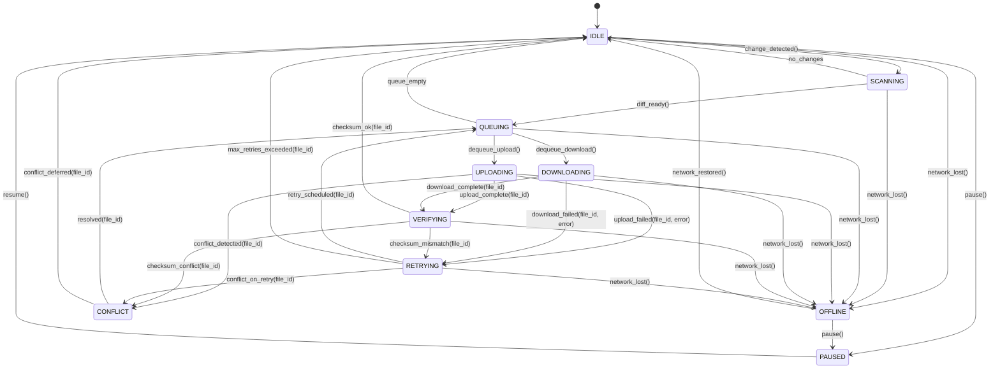
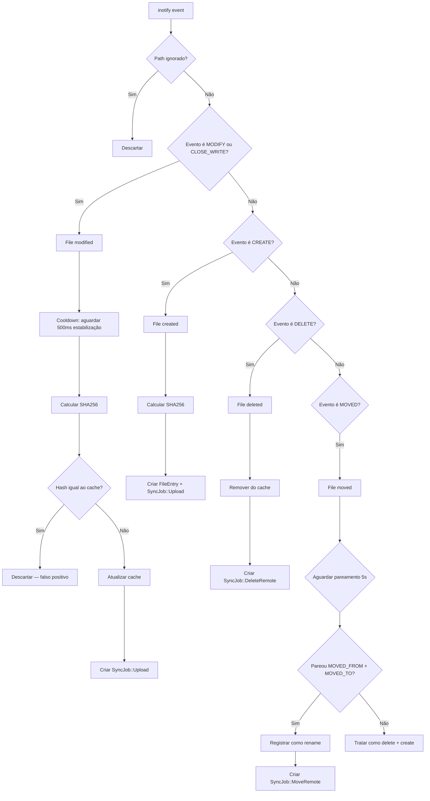
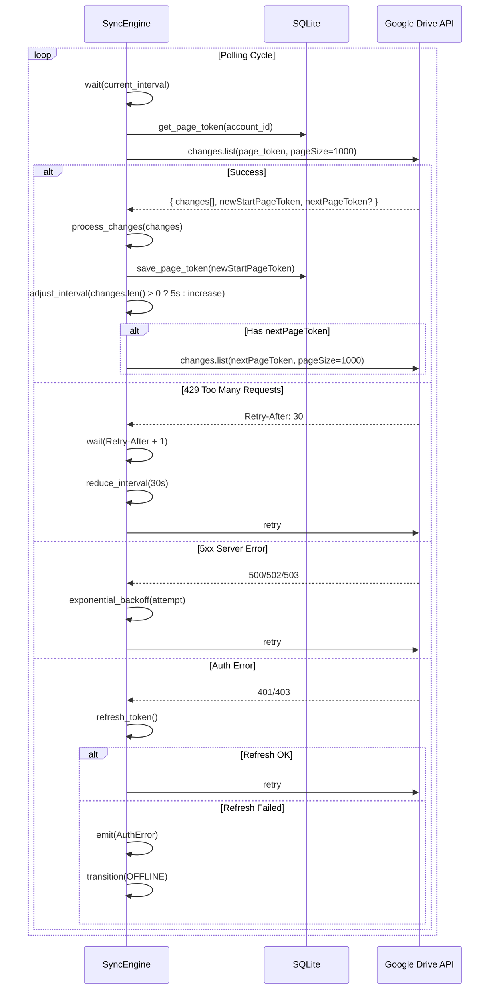
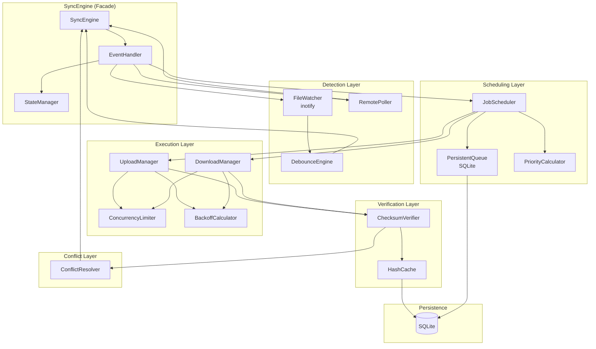

# Spec: Sync Engine

**Status:** Rascunho  
> **Versão:** 1.0  
> **Última atualização:** 2026-07-26  
> **Responsável:** Engineering  
> **Componente:** `libresync-core` — Sync Engine  
> **Linguagem:** Rust (tokio async)  
> **Banco:** SQLite (via `rusqlite`)

---

## 1. Resumo

O **Sync Engine** é o núcleo do LibreSync: uma máquina de estados assíncrona responsável por orquestrar a sincronização bidirecional entre uma pasta local e o Google Drive. Ele gerencia detecção de mudanças (inotify + polling), job scheduling com prioridades, execução concorrente de uploads/downloads, verificação de checksums pós-transferência, retry com backoff exponencial, resolução de conflitos, e recuperação automática de falhas.

O engine opera como uma state machine com 10 estados possíveis, processa jobs com prioridade 0–20, mantém uma fila persistente em SQLite, e executa até 4 uploads + 4 downloads em paralelo.

---

## 2. Contexto

O Google Drive não possui cliente nativo Linux. O LibreSync preenche essa lacuna. O Sync Engine é o componente central que garante que arquivos estejam sempre consistentes entre o sistema de arquivos local e o Google Drive remoto.

O engine precisa ser:
- **Confiável:** recuperar automaticamente de falhas de rede, rate limiting, e corrupção de dados
- **Eficiente:** minimizar transferências desnecessárias via hash-based gate (SHA256)
- **Responsivo:** detectar mudanças locais em <1s via inotify
- **Econômico:** polling remoto com intervalo dinâmico (5–60s) para reduzir carga na API
- **Determinístico:** comportamento previsível mesmo sob contenção e erros

### Relação com outros componentes

```
FileWatcher → SyncEngine → JobScheduler → UploadManager / DownloadManager
                  ↕               ↕
             ConflictResolver   SQLite (fila + cache)
```

O SyncEngine recebe eventos do FileWatcher (mudanças locais), dispara polling remoto periódico, alimenta o JobScheduler com jobs, e coordena a execução via UploadManager e DownloadManager.

---

## 3. Goals

1. **Sincronização bidirecional determinística:** todo arquivo modificado localmente é enviado ao Drive; toda mudança remota é baixada localmente; sem perda de dados
2. **Zero transferências desnecessárias:** hash SHA256 gate impede upload/download quando o conteúdo não mudou
3. **Auto-recuperação:** retry exponencial para erros transitórios (rede, rate limit); recovery automático após queda de conexão
4. **Sincronização inicial rápida:** scan completo com paralelismo, aproveitando mudanças.list para diff contra cache vazio
5. **Operação continua em background:** engine roda como daemon, processa eventos em tempo real sem intervenção do usuário
6. **Uso mínimo de recursos:** <80 MB RAM idle, <1% CPU idle
7. **Consistência eventual:** dentro de segundos para mudanças locais, até 60s para mudanças remotas

---

## 4. Non-Goals

1. **Sincronização P2P entre dispositivos:** v2.0; por enquanto apenas Google Drive como remote
2. **Versionamento de arquivos:** v1.5; o engine só mantém a versão atual + conflitos
3. **Upload resumable em chunks:** v1.0; MVP faz upload direto para arquivos <5MB
4. **Compressão ou criptografia do lado do cliente:** v2.0
5. **Outros providers (Dropbox, OneDrive):** fora do escopo do produto
6. **Sincronização seletiva de subpastas:** MVP sincroniza a pasta raiz configurada; subpastas vêm em v1.0
7. **Interface gráfica de configuração do engine:** o engine expõe API IPC para o frontend Tauri; a UI é responsabilidade separada
8. **CLI interativo:** pode existir futuramente, mas não é responsabilidade do engine

---

## 5. Usuários e Personas

### 5.1 Maria (Desenvolvedora)

Usa o LibreSync para sincronizar projetos pessoais e dotfiles. O engine precisa ser rápido, confiável, e não atrapalhar o fluxo de trabalho. Espera detecção quase instantânea de mudanças no VS Code e ausência de falsos positivos.

**Relevância para o engine:** performance de detecção, baixa latência, evitando loops de sincronização.

### 5.2 Carlos (Usuário corporativo)

Precisa que "funcione depois de instalado". Edita planilhas e documentos no Drive web, espera que apareçam automaticamente na pasta local. Não quer ver mensagens de erro complexas.

**Relevância para o engine:** auto-recuperação, notificações claras via eventos, polling eficiente para detectar mudanças remotas.

### 5.3 Alice (Power User)

Trabalha com arquivos grandes (vídeo, foto). Precisa de upload confiável sem falhas, retry automático, e não quer que o sync sature a banda.

**Relevância para o engine:** backoff exponencial, paralelismo configurável, verificação de checksum pós-transferência.

---

## 6. Requisitos Funcionais

### RF-01: State Machine de Sincronização

O engine deve implementar uma máquina de estados com os seguintes estados e transições:



**Regras de transição:**

| De | Para | Gatilho | Ação |
|----|------|---------|------|
| IDLE | SCANNING | `change_detected()` | Iniciar scan diferencial |
| IDLE | OFFLINE | `network_lost()` | Marcar OFFLINE, pausar jobs |
| IDLE | PAUSED | `pause()` | Pausar polling e watcher |
| PAUSED | IDLE | `resume()` | Retomar watcher e polling |
| OFFLINE | IDLE | `network_restored()` | Reaquecer conexões |
| SCANNING | QUEUING | `diff_ready()` | Enfileirar jobs |
| SCANNING | IDLE | `no_changes` | Sem mudanças desde último scan |
| QUEUING | UPLOADING | `dequeue_upload()` | Slot de upload disponível |
| QUEUING | DOWNLOADING | `dequeue_download()` | Slot de download disponível |
| UPLOADING | VERIFYING | `upload_complete(file_id)` | Verificar checksum |
| UPLOADING | RETRYING | `upload_failed(file_id, e)` | Incrementar retry, agendar retry |
| UPLOADING | CONFLICT | `conflict_detected(file_id)` | Criar ConflictRecord |
| DOWNLOADING | VERIFYING | `download_complete(file_id)` | Verificar checksum |
| DOWNLOADING | RETRYING | `download_failed(file_id, e)` | Incrementar retry, agendar retry |
| VERIFYING | IDLE | `checksum_ok(file_id)` | Atualizar metadata, marcar synced |
| VERIFYING | RETRYING | `checksum_mismatch(file_id)` | Re-enfileirar job |
| VERIFYING | CONFLICT | `checksum_conflict(file_id)` | Mudança simultânea detectada |
| RETRYING | QUEUING | `retry_scheduled(file_id)` | Reinserir na fila com prioridade ajustada |
| RETRYING | CONFLICT | `conflict_on_retry(file_id)` | Remote version divergiu |
| RETRYING | IDLE | `max_retries_exceeded(file_id)` | Notificar erro, marcar como failed |
| CONFLICT | QUEUING | `resolved(file_id)` | Re-enfileirar após resolução |
| CONFLICT | IDLE | `conflict_deferred(file_id)` | Usuário decide resolver depois |

### RF-02: Detecção de Mudanças Locais (inotify)

**Gatilho:** eventos `IN_CREATE`, `IN_MODIFY`, `IN_DELETE`, `IN_MOVED_FROM`, `IN_MOVED_TO` no diretório sincronizado.

**Fluxo:**



**Debounce:** eventos `IN_MODIFY` são coalescidos por path com janela de 500ms. Salvamentos de editores (VS Code, vim) geram múltiplos eventos; apenas o último dispara o hash.

**Ignored paths:**
- `.git/`, `node_modules/`, `.DS_Store`, `Thumbs.db`
- Arquivos temporários: `*.swp`, `*.tmp`, `~$*`, `*.bak`
- Padrões glob configuráveis na tabela `ignored_paths`

**Hash-based gate:** mesmo com inotify, só enfileira upload se o SHA256 for diferente do cache. Elimina falsos positivos de editores que tocam metadados sem modificar conteúdo.

### RF-03: Detecção de Mudanças Remotas (Polling)

**Mecanismo:** chamada periódica a `changes.list` com `page_token`.

**Intervalo dinâmico:**

| Situação | Intervalo |
|----------|-----------|
| Após mudanças detectadas | 5s |
| Sem mudanças por 2 ciclos | 10s |
| Sem mudanças por 5 ciclos | 30s |
| Sem mudanças por 10+ ciclos | 60s (idle) |
| Após erro 429 (rate limit) | `Retry-After` header + 1s |

**Reset do intervalo:** qualquer mudança detectada retorna para 5s.

**Fluxo completo de polling:**



**Paginação automática (implementação atual):** `files.list` usa `pageSize=1000` (máximo da API) e itera sobre `nextPageToken` até listar todos os arquivos do Drive. Cada página é logada individualmente. O loop para quando `nextPageToken` é `null`.

### RF-04: Job Scheduling com Prioridade

**Modelo de job:**

```rust
struct SyncJob {
    id: Uuid,
    file_entry_id: Uuid,
    folder_id: Uuid,
    job_type: JobType,       // Upload, Download, DeleteRemote, etc.
    priority: Priority,      // 0..20
    state: JobState,         // Queued, Running, Failed, etc.
    retry_count: u32,
    max_retries: u32,
    next_retry_at: Option<DateTime<Utc>>,
    created_at: DateTime<Utc>,
}
```

**Tabela de prioridades:**

| Prioridade | Valor | Uso |
|------------|-------|-----|
| Critical | 20 | Resolução de conflitos, metadados de autenticação |
| High | 15 | Upload/download de arquivos pequenos (<1MB) |
| Normal | 10 | Upload/download de arquivos médios (1-100MB) |
| Low | 5 | Upload/download de arquivos grandes (>100MB) |
| Background | 0 | Verificações periódicas, scan de consistência |

**Regras de scheduling:**

1. A fila é ordenada por `priority DESC, created_at ASC`
2. Jobs com `next_retry_at > now()` não são elegíveis para dequeue
3. Uploads e downloads são dequeados em *separados* — não compete
4. Até 4 uploads + 4 downloads simultâneos (valores configuráveis)
5. Jobs de `DeleteRemote` têm prioridade High (evitar orphan files)
6. Jobs de `MoveRemote` têm prioridade Normal (rename não é urgente)
7. Jobs de metadados (atualizar modified_at, mime_type) têm prioridade Low

**Algoritmo de dequeue:**

```
function dequeue_upload():
    tx = db.transaction()
    job = tx.query_one("""
        SELECT * FROM sync_jobs
        WHERE state = 'queued'
          AND job_type IN ('upload', 'move_remote')
          AND (next_retry_at IS NULL OR next_retry_at <= now())
          AND folder_id IN (SELECT id FROM sync_folders WHERE is_enabled = 1)
        ORDER BY priority DESC, created_at ASC
        LIMIT 1
        FOR UPDATE SKIP LOCKED
    """)
    if job:
        tx.execute("UPDATE sync_jobs SET state = 'running', started_at = now() WHERE id = ?", [job.id])
        tx.commit()
    return job
```

`FOR UPDATE SKIP LOCKED` garante que múltiplos workers não peguem o mesmo job. SQLite com WAL mode suporta reads concorrentes.

### RF-05: Execução Concorrente com Limite de Paralelismo

**Modelo de concorrência: tokio semáforos.**

```rust
pub struct ConcurrencyLimiter {
    upload_semaphore: Arc<Semaphore>,   // permits: max_parallel_uploads (default 4)
    download_semaphore: Arc<Semaphore>, // permits: max_parallel_downloads (default 4)
}

impl ConcurrencyLimiter {
    pub async fn acquire_upload(&self) -> SemaphorePermit {
        self.upload_semaphore.acquire().await
    }

    pub async fn acquire_download(&self) -> SemaphorePermit {
        self.download_semaphore.acquire().await
    }
}
```

**Workers:**

- **UploadWorker:** loop que chama `dequeue_upload()`, adquire permissão do semáforo de upload, executa upload, libera permissão
- **DownloadWorker:** loop que chama `dequeue_download()`, adquire permissão do semáforo de download, executa download, libera permissão

Workers são `tokio::spawn` independentes. Quando o engine transiciona para PAUSED, workers completam o job corrente e não dequeam novos. Quando OFFLINE, workers aguardam notificação de rede restaurada.

**Estrutura do worker:**

```rust
async fn upload_worker_loop(
    state: Arc<SyncEngineState>,
    limiter: Arc<ConcurrencyLimiter>,
) {
    loop {
        let permit = limiter.acquire_upload().await;

        match state.job_scheduler.dequeue_upload().await {
            Some(job) => {
                let result = state.upload_manager.execute(&job).await;
                match result {
                    Ok(()) => {
                        state.on_upload_complete(&job).await;
                    }
                    Err(UploadError::Transient(e)) => {
                        state.on_job_failed(&job, &e).await;
                    }
                    Err(UploadError::Conflict(e)) => {
                        state.on_conflict(&job, &e).await;
                    }
                    Err(UploadError::Fatal(e)) => {
                        state.on_job_failed(&job, &e).await;
                    }
                }
            }
            None => {
                tokio::time::sleep(Duration::from_millis(200)).await;
            }
        }

        drop(permit);
    }
}
```

### RF-06: Retry com Backoff Exponencial

**Parâmetros configuráveis (padrão):**

| Parâmetro | Valor | Origem |
|-----------|-------|--------|
| `backoff_base_seconds` | 1 | app_config |
| `backoff_max_seconds` | 300 (5 min) | app_config |
| `max_retries` | 5 | app_config |
| `jitter_factor` | 0.2 (20%) | hardcoded |

**Algoritmo:**

```
delay = min(base * 2^attempt, max_delay)
jitter = random(0, delay * jitter_factor)
delay = delay + jitter

attempt 0: 1.0s + jitter
attempt 1: 2.0s + jitter
attempt 2: 4.0s + jitter
attempt 3: 8.0s + jitter
attempt 4: 16.0s + jitter
attempt 5: max = 300s + jitter (fails — max_retries=5)
```

**Quando retentar:**
- Timeout de rede
- Connection reset
- HTTP 429 (Rate Limit) — usa `Retry-After` header se presente
- HTTP 5xx (500, 502, 503, 504)
- Checksum mismatch pós-transferência
- Erro de autenticação transitório (refresh token expirado — tenta refresh primeiro)

**Quando NÃO retentar:**
- HTTP 4xx (400, 403, 404, 410) — erro do cliente, arquivo não existe
- HTTP 401 sem refresh possível — token revogado exige novo login
- Arquivo não encontrado no filesystem local
- Erro de permissão de escrita no diretório

**Agendamento do retry:**

```rust
pub fn schedule_retry(job: &mut SyncJob) {
    job.retry_count += 1;
    if job.retry_count > job.max_retries {
        job.state = JobState::Failed;
        job.next_retry_at = None;
        return;
    }
    let delay = calculate_backoff(job.retry_count);
    job.next_retry_at = Some(Utc::now() + delay);
    job.state = JobState::Queued;
    // Atualiza next_retry_at no banco — o scheduler só pega jobs
    // com next_retry_at <= now()
}
```

### RF-07: Verificação de Checksum Pós-Transferência (Verifying State)

**Upload:**
1. Antes do upload: calcular SHA256 do arquivo local
2. Após upload: Google Drive retorna `md5Checksum` no response
3. Comparar MD5 do Google com MD5 local (calculado no mesmo momento do SHA256)
4. Se divergir: re-enfileirar com retry

**Download:**
1. Antes do download: obter `sha256` ou `md5Checksum` dos metadados remotos
2. Após download: calcular SHA256 do arquivo baixado
3. Se SHA256 for igual ao SHA256 conhecido da versão remota: OK
4. Se divergir (raramente): descartar arquivo baixado, re-enfileirar

**Edge case:** Google Drive retorna MD5, não SHA256. SHA256 para o cache local (hash-based gate) e MD5 para verificação remota são compatíveis: ambos são hashes de conteúdo, e MD5(server) vs MD5(local) é a comparação feita após upload.

```rust
async fn verify_upload(job: &SyncJob, local_path: &Path, remote_md5: &str) -> Result<(), VerifyError> {
    let local_md5 = compute_md5(local_path).await?;
    if local_md5 != remote_md5 {
        return Err(VerifyError::ChecksumMismatch {
            expected: remote_md5.to_string(),
            actual: local_md5,
        });
    }
    // Atualiza hash SHA256 no cache
    let sha256 = compute_sha256(local_path).await?;
    db.update_file_hash(job.file_entry_id, &sha256, &local_md5).await?;
    Ok(())
}

async fn verify_download(job: &SyncJob, local_path: &Path) -> Result<(), VerifyError> {
    let actual = compute_sha256(local_path).await?;
    let expected = db.get_remote_sha256(job.file_entry_id).await?;
    if actual != expected {
        tokio::fs::remove_file(local_path).await?;
        return Err(VerifyError::ChecksumMismatch {
            expected,
            actual,
        });
    }
    Ok(())
}
```

### RF-08: Sincronização Inicial (Full Scan)

**Gatilho:** primeira execução, ou re-scan forçado pelo usuário.

**Fluxo:**

1. Engine transiciona para SCANNING
2. Lista recursivamente todos os arquivos na pasta local (`walkdir`)
3. Lista recursivamente todos os arquivos no Drive (`files.list` com paginação `pageSize=1000`, loop sobre `nextPageToken`)
4. Constrói `folder_map` (HashMap `id → (name, parents)`) com todos os itens de tipo `application/vnd.google-apps.folder`
5. Para cada arquivo não-pasta, resolve o caminho remoto completo via `resolve_remote_path()`:
   - Lê o campo `parents` (lista de folder IDs)
   - Rastreia recursivamente a cadeia de pastas até a raiz
   - Ex: `file.parents → [folder_B]`, `folder_B.parents → [folder_A]` → `folder_A/folder_B/file.pdf`
6. Faz diff:
   - Arquivos apenas locais → enfileirar upload
   - Arquivos apenas remotos → enfileirar download (com caminho completo)
   - Arquivos em ambos → comparar `modified_at` + SHA256
     - SHA256 igual → synced
     - SHA256 diferente → o mais recente vence
7. Transiciona para QUEUING com todos os jobs

**Otimizações:**
- Para pastas com >50k arquivos, o scan usa 4 workers paralelos para o walkdir
- A listagem remota usa `fields` incluindo `nextPageToken,files(id,name,mimeType,size,parents,...)`
- Cada página de 1000 arquivos é processada conforme chega (streaming, não espera todas as páginas)
- O diff é feito em memória usando `HashMap<path, metadata>` — custo O(n+m) no número total de arquivos
- O `folder_map` é construído a partir da mesma listagem, sem chamadas adicionais à API

```rust
async fn initial_scan(state: &SyncEngineState, folder: &SyncFolder) -> Result<Vec<SyncJob>> {
    let (local_tx, local_rx) = tokio::sync::mpsc::channel(1000);
    let (remote_tx, remote_rx) = tokio::sync::mpsc::channel(1000);

    // Parallel local scan
    let local_handle = tokio::spawn(scan_local_files(folder.local_path.clone(), local_tx));
    // Paginated remote scan
    let remote_handle = tokio::spawn(scan_remote_files(folder.folder_id, remote_tx));

    // Merge results
    let local_map = collect_into_map(local_rx).await;
    let remote_map = collect_into_map(remote_rx).await;

    let mut jobs = Vec::new();

    // Local-only: upload
    for (path, entry) in local_map.iter() {
        if !remote_map.contains_key(path) {
            jobs.push(SyncJob::new_upload(folder.id, entry.id));
        }
    }

    // Remote-only: download
    for (path, entry) in remote_map.iter() {
        if !local_map.contains_key(path) {
            jobs.push(SyncJob::new_download(folder.id, entry.id));
        }
    }

    // Both: compare by modified_at and hash
    for (path, local_entry) in local_map.iter() {
        if let Some(remote_entry) = remote_map.get(path) {
            if local_entry.sha256 != remote_entry.sha256 {
                if local_entry.modified_at > remote_entry.modified_at {
                    jobs.push(SyncJob::new_upload(folder.id, local_entry.id));
                } else {
                    jobs.push(SyncJob::new_download(folder.id, remote_entry.id));
                }
            }
        }
    }

    Ok(jobs)
}
```

### RF-09: Detecção Incremental de Mudanças (Hash-Based Gate)

**Problema:** inotify gera eventos mesmo quando o conteúdo não muda (ex: `touch` atualiza mtime, editor reescreve arquivo com mesmo conteúdo, `rsync` copia mantendo conteúdo).

**Solução — Hash Gate:**

```
inotify event → wait debounce(500ms) → compute SHA256(path)
    → compare with cached SHA256 in file_entries table
        → same? → DISCARD (no real change)
        → different? → UPDATE cache → enqueue SyncJob
```

**Cenários cobertos:**

| Cenário | Evento inotify | Hash Gate | Ação |
|---------|---------------|-----------|------|
| `touch arquivo.txt` | IN_MODIFY | SHA256 igual | Descartar |
| vim salva sem modificar | IN_MODIFY | SHA256 igual | Descartar |
| rsync copia arquivo idêntico | IN_CREATE ou IN_MODIFY | SHA256 igual | Descartar |
| Conteúdo realmente mudou | IN_MODIFY | SHA256 diferente | Upload |
| Novo arquivo | IN_CREATE | SHA256 novo | Upload |
| Remoção | IN_DELETE | N/A | DeleteRemote |

**Atualização do cache:** o SHA256 do cache é atualizado **após** transferência bem-sucedida (VERIFYING → IDLE). Isso garante que um arquivo que falhou no upload não seja "ignorado" no próximo ciclo.

**Loop de sincronização avoidance:** download cria um arquivo local, que gera IN_MODIFY, que dispararia upload de volta → loop infinito. O Hash Gate quebra esse loop: o SHA256 do arquivo baixado vai ser igual ao SHA256 recém-armazenado no cache, então o IN_MODIFY pós-download é descartado.

### RF-10: Sincronização Bidirecional Completa

**Regras de reconciliação:**

| Estado Local | Estado Remoto | Ação |
|-------------|---------------|------|
| Synced | Synced | Nada |
| Modified | Synced | Upload |
| Synced | Modified | Download |
| Modified | Modified | Conflito (resolução automática) |
| Deleted | Synced | DeleteRemote |
| Synced | Deleted | DeleteLocal |
| Deleted | Modified | Restore + Download |
| Modified | Deleted | Manter local (upload ou aviso) |
| Created | — | Upload |
| — | Created | Download |
| Created | Created (mesmo nome, diferente hash) | Conflito (KeepBoth) |

**Atomicidade:** cada operação de sync (upload+verify ou download+verify) é atômica do ponto de vista do cache. Se o processo morre durante a transferência, o job permanece como `running` no banco e é retomado na próxima inicialização (jobs `running` reabertos como `queued` com retry).

---

## 7. Requisitos Não Funcionais

| Categoria | Requisito | Critério | Medição |
|-----------|-----------|----------|---------|
| Performance | Consumo de RAM idle | < 80 MB | `heaptrack` ou `valgrind` |
| Performance | Consumo de RAM sincronizando | < 200 MB | `heaptrack` |
| Performance | CPU idle | < 1% | `top` / `/proc/stat` |
| Performance | CPU sincronizando | < 15% | `top` |
| Performance | Detecção local inotify | < 1s | Teste com `touch` + log |
| Performance | Polling remoto idle | min 60s intervalo | Log de polling |
| Performance | Polling remoto ativo | min 5s intervalo | Log de polling |
| Performance | Upload paralelo | até 4 simultâneos | Semáforo |
| Performance | Download paralelo | até 4 simultâneos | Semáforo |
| Performance | Scan inicial 50k arquivos | < 5 min | Benchmark |
| Performance | Scan diferencial 10k mudanças | < 30s | Benchmark |
| Confiabilidade | Recuperação de falha de rede | automática < 5min | Teste de caos |
| Confiabilidade | Integridade pós-transferência | checksum 100% | Teste com corrupção |
| Confiabilidade | Zero sync loops | hash-based gate | Teste com conteúdo idêntico |
| Confiabilidade | Perda de jobs em crash | zero | Kill -9 + verificar fila |
| Disponibilidade | Auto-restart | systemd user service | Teste de crash |

---

## 8. Design

### 8.1 Arquitetura Interna do Sync Engine



### 8.2 Estrutura de Código

```
src/
├── engine/
│   ├── mod.rs                    # SyncEngine struct, run() loop
│   ├── state.rs                  # SyncState enum, StateManager, transições
│   ├── event.rs                  # Event enum, EventHandler
│   ├── config.rs                 # EngineConfig (lê de app_config)
│   └── metrics.rs                # Métricas de sincronização
├── sync/
│   ├── mod.rs
│   ├── detector/
│   │   ├── mod.rs
│   │   ├── inotify.rs            # InotifyWatcher
│   │   ├── debounce.rs           # DebounceEngine (coalesce + hash gate)
│   │   └── polling.rs            # RemotePoller (changes.list)
│   ├── scheduler/
│   │   ├── mod.rs
│   │   ├── job.rs                # SyncJob struct, JobType, JobState, Priority
│   │   ├── queue.rs              # PersistentQueue (SQLite-backed)
│   │   └── priority.rs           # PriorityCalculator
│   ├── transfer/
│   │   ├── mod.rs
│   │   ├── upload.rs             # UploadManager
│   │   ├── download.rs           # DownloadManager
│   │   ├── concurrency.rs        # ConcurrencyLimiter (semáforos)
│   │   └── backoff.rs            # BackoffCalculator
│   ├── verify/
│   │   ├── mod.rs
│   │   ├── checksum.rs           # ChecksumVerifier (SHA256 + MD5)
│   │   └── hash_cache.rs         # HashCache (read-through cache)
│   └── conflict/
│       ├── mod.rs
│       └── resolver.rs           # ConflictResolver, auto + manual
└── db/
    └── queries/
        ├── jobs.sql
        ├── files.sql
        ├── conflicts.sql
        └── polling.sql
```

### 8.3 Ciclo de Vida do Engine (loop principal)

```rust
pub async fn run(self) -> Result<()> {
    loop {
        tokio::select! {
            // 1. Eventos externos (inotify, IPC do frontend)
            event = self.event_handler.recv() => {
                self.handle_event(event).await;
            }

            // 2. Polling remoto periódico
            _ = self.remote_poller.tick() => {
                self.handle_remote_changes().await;
            }

            // 3. Retrys pendentes (acordar quando next_retry_at vence)
            job_id = self.retry_waiter.next() => {
                self.scheduler.re_enqueue(&job_id).await;
            }

            // 4. Monitor de rede
            _ = self.network_monitor.changed() => {
                if self.network_monitor.is_online() {
                    self.state_mgr.on_network_restored().await;
                } else {
                    self.state_mgr.on_network_lost().await;
                }
            }

            // 5. Shutdown
            _ = &mut self.shutdown_signal => {
                self.shutdown().await;
                break;
            }
        }
    }
    Ok(())
}
```

### 8.4 Eventos Internos

```rust
#[derive(Debug, Clone)]
pub enum SyncEvent {
    /// Mudança local detectada (após debounce + hash gate)
    LocalChange { path: PathBuf, kind: ChangeKind },
    /// Mudanças remotas detectadas no polling
    RemoteChanges { changes: Vec<RemoteChange> },
    /// Job completou com sucesso
    JobCompleted { job_id: Uuid },
    /// Job falhou (transitório)
    JobFailed { job_id: Uuid, error: SyncError },
    /// Conflito detectado
    Conflict { job_id: Uuid, file_id: Uuid },
    /// Rede caiu
    NetworkLost,
    /// Rede restaurada
    NetworkRestored,
    /// Usuário pausou
    Pause,
    /// Usuário retomou
    Resume,
    /// Força scan completo
    ForceRescan,
}
```

---

## 9. Modelo de Dados

### 9.1 Entidades (Complemento ao PRD — foco no Sync Engine)

As tabelas são definidas no PRD (`sync_jobs`, `file_entries`, `conflict_records`, `remote_changes_state`, `app_config`). Abaixo as queries específicas do engine.

**Dequeue jobs elegíveis:**

```sql
SELECT * FROM sync_jobs
WHERE state = 'queued'
  AND (next_retry_at IS NULL OR next_retry_at <= strftime('%s', 'now'))
  AND job_type IN ('upload', 'delete_remote', 'move_remote')
  AND folder_id IN (SELECT id FROM sync_folders WHERE is_enabled = 1)
ORDER BY priority DESC, created_at ASC
LIMIT 1;
```

**Obter hash do cache para hash gate:**

```sql
SELECT sha256_hash FROM file_entries
WHERE folder_id = ? AND local_path = ?
  AND status != 'deleted_local';
```

**Atualizar cache após transferência:**

```sql
UPDATE file_entries
SET sha256_hash = ?,
    md5_checksum = ?,
    remote_file_id = ?,
    modified_at_remote = ?,
    status = 'synced',
    last_synced_at = strftime('%s', 'now'),
    version = version + 1
WHERE id = ?;
```

**Marcar job como completo:**

```sql
UPDATE sync_jobs
SET state = 'completed',
    completed_at = strftime('%s', 'now')
WHERE id = ?;
```

**Reabrir jobs órfãos (startup recovery):**

```sql
UPDATE sync_jobs
SET state = 'queued',
    retry_count = retry_count + 1,
    next_retry_at = strftime('%s', 'now') + 5
WHERE state IN ('running', 'paused');
```

### 9.2 Schema (adições específicas do engine)

```sql
-- Remote polling cursor (mesma do PRD, mas com índice adicional)
CREATE INDEX IF NOT EXISTS idx_remote_changes_account_poll
    ON remote_changes_state(account_id, last_polled_at);

-- Índice composto para dequeue eficiente
CREATE INDEX IF NOT EXISTS idx_jobs_dequeue
    ON sync_jobs(state, priority DESC, created_at ASC, next_retry_at)
    WHERE state = 'queued';
```

---

## 10. Integrações

### 10.1 Google Drive API (v3)

| Endpoint | Método | Frequência | Uso no Engine |
|----------|--------|-----------|---------------|
| `changes.getStartPageToken` | GET | 1x por sessão | Obter token inicial |
| `changes.list` | GET | 5–60s (dinâmico) | Detecção de mudanças remotas |
| `files.get` | GET | Por arquivo em conflito | Obter metadados atualizados |
| `files.list` | GET | Scan inicial + verificação | Listar arquivos remotos |
| `files.create` | POST | Upload | Criar novo arquivo |
| `files.update` | PATCH | Upload | Atualizar arquivo existente |
| `files.delete` | DELETE | DeleteRemote | Remover arquivo remoto |

**Rate limiting:** o engine mantém contador interno de requests por janela de 100s. Quando atinge 80% do limite (8k requests), introduz delay artificial de 100ms entre requests.

### 10.2 inotify (Linux)

- Watcher recursivo no diretório sincronizado e subdiretórios
- Máscara de eventos: `IN_CREATE | IN_MODIFY | IN_DELETE | IN_MOVED_FROM | IN_MOVED_TO | IN_CLOSE_WRITE`
- O watcher ignora arquivos temporários por padrão (padrões glob)
- Limite de inotify watchers ajustável via `/proc/sys/fs/inotify/max_user_watches`
- No startup, verifica e avisa se o limite for insuficiente para o número de subdiretórios

### 10.3 Sistema de Arquivos

- Operações de I/O via `tokio::fs` (non-blocking)
- Escrita de download em `path.tmp` → renomeia atômico `rename()` após verificação
- Leitura para hash usa buffer 64KB, streaming (não carrega arquivo inteiro em RAM)
- Permissões preservadas: `chmod` após download

### 10.4 SQLite

- WAL mode para concorrência leitura/escrita
- `busy_timeout = 5000` para evitar `SQLITE_BUSY` em contenção
- Backup automático do banco a cada 24h para `~/.local/share/libresync/backups/`
- Migrações versionadas via `schema_version`

---

## 11. Edge Cases

### 11.1 Loop de Sincronização

**Cenário:** download cria arquivo local → inotify detecta IN_MODIFY → engine tenta upload → conteúdo é idêntico ao remoto → enfileira upload desnecessário.

**Solução: Hash Gate.** O cache SHA256 é atualizado imediatamente antes do download ser escrito (sim, antes — o hash é conhecido dos metadados remotos). Quando o inotify dispara IN_MODIFY, o hash gate compara o SHA256 do arquivo recem-escrito com o SHA256 conhecido. Como são iguais (o download escreveu exatamente o mesmo conteúdo), o evento é descartado.

**Hash Gate no download:**

```rust
async fn handle_download_complete(job: &SyncJob, path: &Path) {
    // 1. ANTES de escrever, já sabemos o SHA256 esperado
    let expected_sha256 = db.get_remote_sha256(job.file_entry_id).await?;

    // 2. Escreve arquivo
    download_to_temp(path, content).await?;

    // 3. Calcula e verifica
    let actual_sha256 = compute_sha256(&temp_path).await?;
    if actual_sha256 != expected_sha256 {
        return Err(VerifyError::ChecksumMismatch);
    }

    // 4. Atualiza cache ANTES de renomear
    db.update_file_sha256(job.file_entry_id, &actual_sha256).await?;

    // 5. Renomeia atômico (temp → final)
    tokio::fs::rename(&temp_path, path).await?;

    // 6. Pronto — quando inotify disparar, hash gate vai descartar
}
```

### 11.2 Concorrência de Hash (Race Condition)

**Cenário:** arquivo A é modificado localmente, upload começa. Durante o upload, o usuário modifica A novamente.

**Solução: version stamp.**
- Ao iniciar upload, o engine armazena o SHA256 do arquivo no momento do dequeue
- Ao completar upload, verifica se o SHA256 atual do arquivo local ainda é o mesmo
- Se mudou: re-enfileira job com prioridade High (o upload que completou é de uma versão antiga, mas o arquivo remoto agora está correto para aquela versão; a nova versão precisa ser enviada)

```rust
async fn execute_upload(job: &SyncJob) -> Result<(), UploadError> {
    let local_sha = compute_sha256(&job.local_path).await?;

    // Upload
    let response = google_drive.upload(&job.local_path).await?;

    // Verificar se o arquivo mudou durante o upload
    let current_sha = compute_sha256(&job.local_path).await?;
    if current_sha != local_sha {
        // Arquivo mudou durante upload — re-enfileirar
        db.re_enqueue_job(job.id, Priority::High).await?;
        // O upload que completou não é perdido — o arquivo remoto
        // está na versão antiga, e a nova será enviada
    }

    // Verificar checksum remoto
    verify_upload_checksum(response.md5, &job.local_path).await?;

    Ok(())
}
```

### 11.3 Falha no Meio do Upload

**Cenário:** upload de 1GB falha aos 80% (queda de rede). O arquivo remoto pode estar parcial.

**Solução (MVP):** o upload é síncrono (não resumable). Se falha, o Google Drive ou cria o arquivo com o conteúdo parcial ou retorna erro. O engine sempre faz upload completo em nova tentativa. O Google Drive API retorna erro se o upload for interrompido (conexão fechada), então não há arquivo parcial no Drive.

**v1.0:** resumable upload com chunks de 5MB, session URI persistida em `chunk_uploads`.

### 11.4 Conflito Durante Retry

**Cenário:** upload falha por timeout. Antes do retry agendado (ex: 4s depois), o arquivo remoto é modificado por outro cliente. No retry, o Google retorna 409 Conflict.

**Solução:** o engine detecta HTTP 412/409, transiciona para CONFLICT, cria `ConflictRecord`, e aplica resolução automática:
- Se o arquivo local foi modificado *depois* do timestamp do conflito remoto → KeepLocal (sobrescreve remoto)
- Se o timestamp remoto for mais recente → KeepRemote (baixa versão remota)
- Se timestamps forem próximos (< 5s de diferença) → KeepBoth (cria cópia com sufixo)

### 11.5 Diretório Sincronizado é Removido

**Cenário:** usuário remove a pasta local que estava sendo sincronizada.

**Solução:**
1. inotify detecta IN_DELETE_SELF no diretório raiz
2. Engine transiciona para IDLE, emite evento de erro
3. A pasta é marcada como `is_enabled = 0` no banco
4. Jobs pendentes são cancelados
5. Notificação é enviada ao frontend

### 11.6 Disco Cheio

**Cenário:** download não consegue escrever arquivo local por falta de espaço.

**Solução:**
1. Erro de I/O (OS error 28: No space left on device)
2. Engine trata como Fatal (não retenta)
3. Marca job como `failed` com `error_code = 'DISK_FULL'`
4. Engine pausa automaticamente (PAUSED) para evitar mais downloads
5. Notifica frontend
6. Quando o usuário liberar espaço, resume manualmente

### 11.7 Mudanças Durante Scan Inicial

**Cenário:** durante o scan inicial de 50k arquivos, o usuário cria/edita/remove arquivos.

**Solução:**
1. O scan captura um snapshot do filesystem no início
2. Mudanças que ocorrem *durante* o scan são detectadas pelo inotify (que já está rodando)
3. Eventos de inotify durante o scan são guardados em fila separada
4. Após o scan, a fila de eventos é processada: se um arquivo já foi incluído no scan, o evento pode modificar o job (ex: scan viu arquivo A como synced, mas evento de modify chega → muda para upload)
5. O cache SHA256 garante que mesmo que o scan veja o arquivo, o evento vai detectar a mudança real

### 11.8 Token Expirado Durante Operação

**Cenário:** refresh token expira (ex: usuário revogou acesso) durante upload.

**Solução:**
1. Google retorna HTTP 401
2. Engine tenta refresh token
3. Refresh falha (token revogado)
4. Engine transiciona para OFFLINE
5. Todos os jobs em `running` são marcados como `queued` com `next_retry_at = now() + 300` (espera 5min antes de tentar de novo — pode ser problema temporário de token)
6. Notificação: "Sua sessão expirou. Faça login novamente."
7. Frontend reexibe tela de login

---

## 12. Segurança

### 12.1 Verificação de Caminho (Path Traversal)

Antes de qualquer operação de I/O, validar que o caminho resolvido está dentro do diretório sincronizado.

```rust
pub fn validate_path(sync_root: &Path, target: &Path) -> Result<(), SecurityError> {
    let canonical_root = sync_root.canonicalize()?;
    let canonical_target = target.canonicalize()?;
    if !canonical_target.starts_with(&canonical_root) {
        return Err(SecurityError::PathTraversal {
            path: target.to_path_buf(),
            root: sync_root.to_path_buf(),
        });
    }
    Ok(())
}
```

Protege contra names potencialmente maliciosos vindos do Google Drive.

### 12.2 Limite de Tamanho de Arquivo

O engine não deve aceitar upload/download de arquivos que excedam:
- Limite do Google Drive: 5 TB (imposto pela API)
- Limite configurável local: padrão 50 GB
- Espaço disponível em disco antes de download: verificar `fs2::available_space()`

### 12.3 Sanitização de Nomes de Arquivo

Nomes de arquivo vindos do Google Drive podem conter caracteres inválidos no Linux (`/`, `\0`). O engine sanitiza:

```rust
pub fn sanitize_filename(name: &str) -> String {
    name.chars()
        .filter(|c| !c.is_control() && *c != '/')
        .collect()
}
```

### 12.4 Isolamento de Contas

Múltiplas contas têm bancos SQLite separados ou `account_id` como partition key. Jobs de uma conta nunca operam em arquivos de outra conta.

---

## 13. Rollout

### 13.1 Estratégia de Ativação

O Sync Engine é ativado em fases:

| Fase | Escopo | Validação |
|------|--------|-----------|
| **P1 — Core Isolado** | State machine, job scheduler, fila SQLite | Testes unitários com cobertura >95% |
| **P2 — Transferência** | UploadManager + DownloadManager com mock Google API | Testes de integração com wiremock |
| **P3 — Detecção Local** | inotify + debounce + hash gate | Testes com tempdir + inotify |
| **P4 — Detecção Remota** | Polling + changes.list | Testes com wiremock simulando mudanças |
| **P5 — Integração** | Engine completo conectado ao Google Drive real | Testes E2E com sandbox account |
| **P6 — Beta** | Liberação para usuários beta | Monitoring: latência, erros, loops |

### 13.2 Feature Flags

```rust
pub struct FeatureFlags {
    pub resumable_upload: bool,         // v1.0
    pub bandwidth_control: bool,        // v1.0
    pub selective_sync: bool,           // v1.0
    pub multiple_accounts: bool,        // v1.0
    pub parallel_scan: bool,            // sempre ativo
}
```

### 13.3 Monitoring

Métricas expostas via evento de log estruturado:

```json
{
  "event": "sync_cycle_complete",
  "account": "maria@gmail.com",
  "duration_ms": 1234,
  "files_uploaded": 3,
  "files_downloaded": 2,
  "files_skipped": 15,
  "errors": 0,
  "state": "IDLE",
  "poll_interval_ms": 5000
}
```

Métricas de saúde do engine:

| Métrica | Onde |
|---------|------|
| Número de jobs na fila (por estado) | Log |
| Latência média de upload/download | Log |
| Taxa de erro por job type | Log |
| Número de retries vs sucessos | Log |
| Estado atual do engine | Evento |
| Memória RSS | `/proc/self/status` |
| Número de watchers inotify | Log |

---

## 14. Open Questions

1. **Resumable upload no MVP?** O PRD diz v1.0, mas arquivos >5MB no MVP sem resumable vão falhar frequentemente. Decisão: MVP faz upload direto (simples) com fallback para erro "arquivo muito grande" se >100MB.

2. **Como lidar com Google Docs (gdoc, gsheet, gslide)?** A API não permite download direto — retorna HTML/PDF/ODF exportados. Decisão: v1.5.

3. **Shortcut files no Google Drive?** São arquivos .gshortcut apontando para outro arquivo. Decisão: ignorar shortcuts no MVP.

4. **Trash do Google Drive vs exclusão?** `changes.list` com `includeRemoved=true` retorna arquivos movidos para a lixeira. Decisão: tratar como deletado (o Google Drive trash não é sincronizado com lixeira local).

5. **Timeouts configuráveis?** Upload/download timeout deve ser dinâmico baseado no tamanho do arquivo. Decisão padrão: 30s + 1s por MB.

6. **Limpeza da tabela sync_events?** Pode crescer indefinidamente. Decisão: reter 7 dias, rotacionar via cron interno.

---

## 15. Decisões Técnicas

| Decisão | Opção Escolhida | Alternativas | Motivação |
|---------|----------------|--------------|-----------|
| State machine | Enum + `trait State` + `transition()` method | State machine crate (sma) | Controle total, sem dependência extra |
| Fila de jobs | SQLite com `SELECT ... FOR UPDATE SKIP LOCKED` | RabbitMQ, Redis, fifo file | Zero dependências externas, transacional |
| Semáforo concorrência | `tokio::sync::Semaphore` | `tokio::sync::Semaphore` | Padrão tokio, integrado com async |
| Hash gate | SHA256 | md5, blake3 | SHA256 tem suporte nativo em Rust std (`sha2` crate) |
| Polling intervalo dinâmico | Algoritmo próprio (5s ativo → 60s idle) | Intervalo fixo | Reduz chamadas API em idle sem perder responsividade |
| Jitter no backoff | 20% aleatório | Sem jitter | Evita thundering herd em rate limit |
| Tokio runtime | multi-thread (default) | current_thread | Paralelismo real para upload/download |
| SQLite mode | WAL + busy_timeout 5000 | DELETE mode | Melhor performance com leitura concorrente |
| IPC com frontend | Tauri events (emit/listen) | Unix socket, HTTP local | Já faz parte do framework Tauri |
| Debounce inotify | 500ms por path | 200ms, 1s, sem debounce | Empírico — 500ms cobre salvamentos de editores comuns |
| Recovery de crash | Reabrir jobs `running` como `queued` | Checkpoint periódico, WAL | Simples e eficaz — perda máxima é de 1 job |
| Lock de job | `FOR UPDATE SKIP LOCKED` | `UPDATE ... WHERE state = 'queued' LIMIT 1` | Evita race condition entre workers sem lock de tabela |
