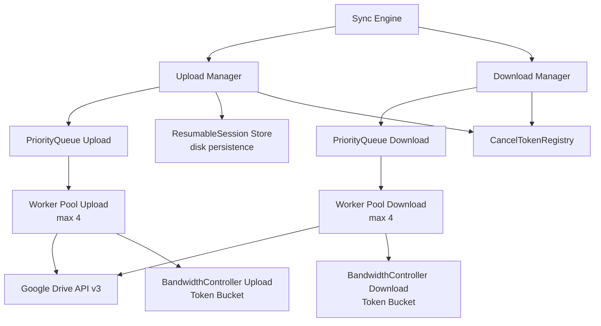

# Spec: Upload Manager e Download Manager

**Versão:** 1.0
**Status:** Aprovada
**Autor:** Engenharia LibreSync
**Data:** 2026-07-26
**Reviewers:** N/A

---

## 1. Resumo

Upload Manager e Download Manager são componentes do núcleo do LibreSync responsáveis por toda transferência de arquivos com o Google Drive API v3. Eles gerenciam filas de jobs, executam upload/download com chunking e retomada, aplicam controle de banda via token bucket, executam verificação de integridade pós-transferência (MD5 upload / SHA256 download) e orquestram concorrência com pool de workers limitado. Ambos integram-se ao Sync Engine e ao Job Scheduler para coordenar priorização, cancelamento e estados de ciclo de vida dos jobs.

---

## 2. Contexto e Motivação

**Problema:**
O LibreSync precisa sincronizar arquivos entre diretórios locais e o Google Drive de forma confiável. As APIs nativas do Google Drive não oferecem garantia de integridade em transferências grandes, não toleram falhas de rede intermitentes e não permitem controle de banda ou priorização. Sem uma camada dedicada de gerenciamento, arquivos corrompem silenciosamente, transferências falham após minutos de upload e o usuário não tem visibilidade do progresso.

**Evidências:**
- Arquivos > 5MB falham sem mecanismo de resumable upload
- Conexões instáveis (Wi-Fi, mobile) causam perda total de progresso
- Ausência de verificação de integridade pós-transferência leva a dados corrompidos não detectados
- Sem controle de banda, o LibreSync satura a conexão do usuário e impacta outros aplicativos
- Concorrência sem limites causa 429 Too Many Requests do Google Drive API

**Por que agora:**
A arquitetura atual do LibreSync já possui Sync Engine e Job Scheduler definidos, mas sem os Transfer Managers o pipeline de sincronização não pode ser implementado. Este é o componente habilitador para toda a sincronização bidirecional.

---

## 3. Goals (Objetivos)

- [ ] G-01: Upload confiável de arquivos de qualquer tamanho (0 bytes a 50GB+) com verificação de integridade MD5
- [ ] G-02: Download confiável com verificação SHA256 e streaming para arquivos de qualquer tamanho
- [ ] G-03: Retomada automática de uploads interrompidos via resumable session URI
- [ ] G-04: Controle de banda independente para upload e download (token bucket)
- [ ] G-05: Concorrência limitada (máx 4 uploads + 4 downloads simultâneos)
- [ ] G-06: Retry robusto com backoff exponencial para todas as falhas recuperáveis
- [ ] G-07: Cancelamento de jobs individuais ou em lote sem vazamento de recursos

**Métricas de sucesso:**
| Métrica | Baseline atual | Target | Prazo |
|---------|---------------|--------|-------|
| Taxa de sucesso de upload (arquivos < 5MB) | N/A | 99,9% | Lançamento |
| Taxa de sucesso de upload (arquivos >= 5MB) | N/A | 99,5% | Lançamento |
| Taxa de sucesso de download | N/A | 99,9% | Lançamento |
| Detecção de corrupção (hash mismatch) | N/A | 100% dos casos | Lançamento |
| Throughput com controle de banda ativo | N/A | Desvio < 5% do limite configurado | Lançamento |

---

## 4. Non-Goals (Fora do Escopo)

- NG-01: Upload/download para provedores que não sejam Google Drive (OneDrive, Dropbox, etc.) — futuras abstrações de storage provider
- NG-02: Sincronização em tempo real / watching de diretório — escopo do Sync Engine principal
- NG-03: Criptografia client-side antes da transferência — o Google Drive já criptografa em trânsito (TLS) e em repouso
- NG-04: Deduplicação de chunks no upload — cada chunk é enviado individualmente sem cache local
- NG-05: Compressão durante a transferência — arquivos são transferidos in natura
- NG-06: Interface gráfica para gerenciamento de jobs — o Transfer Manager expõe API interna consumida pelo Sync Engine e interfaces de usuário

---

## 5. Usuários e Personas

**Usuário primário:** Sync Engine — motor interno do LibreSync que coordena a sincronização bidirecional entre diretório local e Google Drive.

**Usuário secundário:** Job Scheduler — componente que agenda jobs de sincronização periódica ou acionados por evento.

**Jornada atual (sem a feature):**
1. Sync Engine identifica arquivo a ser sincronizado via diff
2. Sync Engine chama Google Drive API diretamente com HTTP multipart
3. Se a conexão cai, todo o progresso é perdido
4. Sync Engine não consegue verificar se o arquivo transferido está íntegro

**Jornada futura (com a feature):**
1. Sync Engine cria um TransferJob com metadados do arquivo
2. Upload Manager ou Download Manager enfileira o job e gerencia todo o ciclo de vida
3. Em caso de falha, retry automático com backoff ocorre sem intervenção do Sync Engine
4. Após conclusão, hash é verificado e resultado é reportado ao Sync Engine

---

## 6. Requisitos Funcionais

### 6.1 Requisitos Principais

| ID | Requisito | Prioridade | Critério de Aceite |
|----|-----------|-----------|-------------------|
| RF-01 | O Upload Manager deve aceitar jobs de arquivos de 0 bytes a 50GB+ | Must | Job criado com arquivo de 0 bytes conclui com sucesso e arquivo de 50GB+ inicia transferência sem erro de alocação |
| RF-02 | O Upload Manager deve usar multipart upload simples para arquivos < 5MB | Must | Arquivo de 4MB é enviado em requisição única; Google Drive API recebe multipart content-type |
| RF-03 | O Upload Manager deve usar resumable upload para arquivos >= 5MB com chunks de 5MB | Must | Arquivo de 15MB é dividido em 3 chunks de 5MB; cada chunk é enviado individualmente |
| RF-04 | O Upload Manager deve armazenar e retomar session URI de resumable upload em caso de interrupção | Must | Upload interrompido após chunk 1/3 retoma do chunk 2/3 usando session URI recuperado |
| RF-05 | O Upload Manager deve verificar integridade MD5 pós-upload | Must | Arquivo enviado tem MD5 calculado localmente comparado com o campo `md5Checksum` do Google Drive API response |
| RF-06 | O Upload Manager deve reportar falha se MD5 pós-upload não corresponder | Must | Job transita para estado `failed` com flag `corrupted_data` |
| RF-07 | O Download Manager deve fazer download de arquivos via streaming com verificação SHA256 | Must | Arquivo baixado tem SHA256 calculado durante o streaming e verificado contra checksum conhecido |
| RF-08 | O Download Manager deve suportar download de arquivos de 0 bytes a 50GB+ | Must | Arquivo de 0 bytes é "baixado" (criado vazio localmente) sem erro |
| RF-09 | O Download Manager deve aplicar token bucket de bandwidth (download_kbps) durante o streaming | Must | Durante download de arquivo de 100MB com limite de 1000 KB/s, a taxa média medida não ultrapassa 1050 KB/s |
| RF-10 | O Upload Manager deve aplicar token bucket de bandwidth (upload_kbps) durante o envio de chunks | Must | Durante upload com limite de 500 KB/s, a taxa medida não ultrapassa 530 KB/s |
| RF-11 | Ambos os managers devem limitar concorrência a no máximo 4 uploads + 4 downloads simultâneos | Must | Com 10 jobs de upload enfileirados, no máximo 4 executam em paralelo |
| RF-12 | Ambos os managers devem implementar retry com backoff exponencial (1s base, max 300s, max 5 tentativas) | Must | Job falha 5 vezes consecutivas; na 5ª falha, job transita para `failed` e não tenta novamente |
| RF-13 | Ambos os managers devem processar jobs em ordem de prioridade: diretórios primeiro, depois arquivos pequenos primeiro | Must | Com fila contendo diretório (1KB), arquivo 10MB e arquivo 1KB, a ordem de execução é: diretório > arquivo 1KB > arquivo 10MB |
| RF-14 | O usuário (Sync Engine) deve poder cancelar jobs em andamento individualmente ou em lote | Must | Job running tem seu cancelamento solicitado; worker libera recursos e job transita para `cancelled` |
| RF-15 | Cada job deve transitar pelos estados: queued, running, paused, completed, failed, cancelled | Must | Job recém-criado está `queued`; ao iniciar execução, transita para `running`; ao finalizar com sucesso, `completed` |
| RF-16 | O sistema deve tratar HTTP 429 (Too Many Requests) com backoff especial (Respect `Retry-After` header) | Must | Resposta 429 dispara backoff usando valor do header `Retry-After` e retry automático |
| RF-17 | O sistema deve tratar HTTP 5xx (Internal Server Error, Bad Gateway, Service Unavailable) com backoff exponencial padrão | Must | Resposta 503 dispara retry com backoff exponencial a partir de 1s |
| RF-18 | O sistema deve tratar HTTP 403/404 como erro permanente (não retentar) | Must | Resposta 403 ou 404: job transita para `failed` imediatamente sem retry |
| RF-19 | O sistema deve detectar connection reset / timeout e aplicar retry automático | Must | Conexão interrompida durante upload de chunk: retry com mesmo chunk após backoff |
| RF-20 | O sistema deve abortar resumable upload no Google Drive se o job for cancelado | Must | Job cancelado envia requisição DELETE para session URI |
| RF-21 | O sistema deve suportar nomes de arquivo com caracteres especiais (Unicode, acentos, espaços, `?`, `*`, `<`, `>`, `:`, `|`, `\`, `"`) | Must | Arquivo `"arquivo de teste? (v1.0) <importante> :relatório|final\" .txt"` é transferido com sucesso sem truncamento ou erro de encoding |
| RF-22 | O sistema deve preservar metadados de modifiedTime e parents do Google Drive durante upload | Must | Upload de arquivo existente (atualização) preserva `modifiedTime` e `parents` se não especificados |

### 6.2 Fluxo Principal — Upload (Happy Path)

1. Sync Engine cria `UploadJob` com metadados (caminho local, nome, mimeType, tamanho) e submete ao Upload Manager
2. Upload Manager calcula MD5 local do arquivo e adiciona job à fila de prioridade
3. Quando worker estiver disponível, job transita para `running` e o upload inicia
4. Se arquivo < 5MB: Upload Manager envia requisição POST multipart simples para `https://www.googleapis.com/upload/drive/v3/files?uploadType=multipart`
5. Se arquivo >= 5MB:
   a. Upload Manager inicia sessão resumable via POST `https://www.googleapis.com/upload/drive/v3/files?uploadType=resumable` com header `X-Upload-Content-Length`
   b. Resposta 200 OK retorna `Location` header com session URI
   c. Upload Manager divide arquivo em chunks de 5MB (último chunk pode ser menor)
   d. Para cada chunk: envia PUT para session URI com header `Content-Range` e body do chunk
   e. Resposta 308 (Resume Incomplete) para chunks intermediários, 200/201 para chunk final
6. Ao receber confirmação do Google Drive, Upload Manager compara MD5 retornado no response (`md5Checksum`) com MD5 calculado localmente
7. MD5 confere: job transita para `completed`, callback notifica Sync Engine
8. Sync Engine atualiza estado local (lastSync, md5Checksum, id remoto)

### 6.3 Fluxo Principal — Download (Happy Path)

1. Sync Engine cria `DownloadJob` com metadados (fileId, caminho destino, SHA256 esperado, modifiedTime) e submete ao Download Manager
2. Download Manager adiciona job à fila de prioridade
3. Quando worker estiver disponível, job transita para `running`
4. Download Manager faz GET `https://www.googleapis.com/drive/v3/files/{fileId}?alt=media`
5. Resposta streaming com body começa a chegar
6. Download Manager alimenta um hasher SHA256 incrementalmente com cada chunk recebido
7. Download Manager grava chunks no disco (arquivo temporário com sufixo `.partial`)
8. Ao finalizar streaming, SHA256 calculado é comparado com SHA256 esperado
9. Se SHA256 confere: arquivo `.partial` é renomeado para nome final, job transita para `completed`, callback notifica Sync Engine
10. Se SHA256 não confere: arquivo `.partial` é deletado, job transita para `failed` com flag `corrupted_download`

### 6.4 Fluxos Alternativos

**Fluxo Alternativo A — Upload Resumable: interrupção durante chunk:**
1. Upload Manager envia chunk N via PUT para session URI
2. Conexão é interrompida (timeout / connection reset / TCP RST)
3. Upload Manager detecta erro de IO no reqwest
4. Upload Manager espera backoff (1s, 2s, 4s... até 300s)
5. Upload Manager envia PUT com header `Content-Range: bytes */{total}` para consultar progresso (sem body)
6. Google Drive responde 308 com header `Range: bytes=0-{lastByte}`
7. Upload Manager retoma de `lastByte + 1` enviando chunk parcial restante
8. Fluxo retorna ao step 4 do happy path

**Fluxo Alternativo B — Upload Resumable: session expirada:**
1. Upload Manager tenta retomar com PUT na session URI antiga
2. Google Drive responde 404 (session não encontrada) ou 410 (Gone)
3. Upload Manager inicia nova sessão resumable do zero
4. Usuário é notificado via callback `upload_session_expired`

**Fluxo Alternativo C — Download SHA256 mismatch:**
1. Download concluído, SHA256 calculado não bate com esperado
2. Job transita para `failed` com flag `corrupted_download`
3. Sync Engine decide se agenda novo download ou reporta ao usuário
4. Arquivo `.partial` é deletado

**Fluxo Alternativo D — Job cancelado durante execução:**
1. Sync Engine chama `cancel(job_id)` no Upload/Download Manager
2. Manager emite sinal de cancelamento via `CancellationToken`
3. Worker que processa o job interrompe a operação atual
4. Para upload resumable: Manager envia DELETE para session URI
5. Para download: Manager fecha conexão e deleta arquivo `.partial`
6. Job transita para `cancelled`
7. Callback notifica Sync Engine

**Fluxo Alternativo E — Arquivo de 0 bytes:**
1. Upload Manager detecta arquivo de 0 bytes
2. Envia POST multipart sem body (apenas metadados) para Google Drive
3. Google Drive retorna 200 com file ID e MD5 (`d41d8cd98f00b204e9800998ecf8427e`)
4. MD5 é verificado: `d41d8cd98f00b204e9800998ecf8427e` (MD5 de empty string)
5. Download de 0 bytes: cria arquivo vazio diretamente (sem chamada de download)

---

## 7. Requisitos Não-Funcionais

| ID | Requisito | Valor alvo | Observação |
|----|-----------|-----------|------------|
| RNF-01 | Throughput de upload com banda livre | Máximo possível da conexão | Limitado apenas pelo bandwidth controller quando configurado |
| RNF-02 | Throughput de download com banda livre | Máximo possível da conexão | Idem |
| RNF-03 | Precisão do controle de banda | Desvio < 5% do limite configurado | Medido em janelas de 10s |
| RNF-04 | Latência de cancelamento | < 500ms do pedido ao estado cancelled | Inclui tempo para abortar session no Google Drive |
| RNF-05 | Consumo de memória por transferência ativa | < 50 MB | Apenas um chunk de 5MB é mantido em memória por vez |
| RNF-06 | Consumo de CPU em idle (sem transfers) | < 0,1% | Workers bloqueiam em canais, sem polling |
| RNF-07 | Tamanho máximo de arquivo suportado | 50GB+ | Testado com 50GB; limitado apenas pelo Google Drive (5TB) |
| RNF-08 | Tolerância a falhas de rede | 5 retries com backoff exponencial 1-300s | Connection reset, timeout, 5xx, 429 |

---

## 8. Design e Interface

**Componentes afetados:** Sync Engine, Job Scheduler, Google Drive Client (biblioteca HTTP), Bandwidth Controller

**Comportamento esperado:**
O Upload Manager e o Download Manager expõem uma API pública (trait `TransferManager<T: TransferJob>`) consumida pelo Sync Engine. Internamente, cada manager mantém:
- Uma `PriorityQueue` de jobs
- Um pool de workers (tokio tasks) limitado
- Uma instância do `BandwidthController` (token bucket)
- Um `CancellationTokenRegistry` para gerenciar cancelamento por job

**API Pública (Rust traits):**

```rust
pub enum JobPriority {
    High,    // diretórios / metadados
    Normal,  // arquivos pequenos (< 5MB)
    Low,     // arquivos grandes (>= 5MB)
}

pub enum JobState {
    Queued,
    Running,
    Paused,
    Completed { md5: String, file_id: String },
    Failed { error: TransferError, retries: u32 },
    Cancelled,
}

pub struct UploadJob {
    pub id: JobId,
    pub local_path: PathBuf,
    pub remote_name: String,
    pub mime_type: String,
    pub size: u64,
    pub parent_id: Option<String>,
    pub existing_file_id: Option<String>,  // para atualizações
    pub priority: JobPriority,
    pub created_at: Instant,
}

pub struct DownloadJob {
    pub id: JobId,
    pub file_id: String,
    pub local_path: PathBuf,
    pub expected_sha256: Option<String>,
    pub size: u64,
    pub priority: JobPriority,
    pub created_at: Instant,
}

pub trait TransferManager<T: TransferJob> {
    async fn enqueue(&self, job: T) -> Result<JobId>;
    async fn cancel(&self, job_id: JobId) -> Result<()>;
    async fn cancel_all(&self) -> Result<()>;
    async fn pause(&self, job_id: JobId) -> Result<()>;
    async fn resume(&self, job_id: JobId) -> Result<()>;
    async fn status(&self, job_id: JobId) -> Result<JobState>;
    fn list_jobs(&self, filter: Option<JobState>) -> Vec<JobInfo>;
    fn set_bandwidth_limits(&self, upload_kbps: Option<u32>, download_kbps: Option<u32>);
}
```

**Estados da UI:** Não aplicável (componente interno, sem UI própria). Os estados são expostos via API para consumo pelo Sync Engine e interfaces de usuário.

---

## 9. Modelo de Dados

**Entidades novas:**

```
TransferJob (trait com implementações UploadJob / DownloadJob) {
  id: Uuid
  job_type: enum { Upload, Download }
  state: JobState
  priority: JobPriority
  retry_count: u8
  max_retries: u8 (default 5)
  bandwidth_controller_id: usize
  created_at: DateTime<Utc>
  started_at: Option<DateTime<Utc>>
  completed_at: Option<DateTime<Utc>>
  last_error: Option<String>
}
```

```
ResumableSession (persistido em disco no state_dir do Sync Engine) {
  job_id: Uuid
  session_uri: String           // https://www.googleapis.com/upload/drive/v3/files?upload_id=...
  file_id: String               // id remoto do arquivo sendo enviado
  total_size: u64
  uploaded_bytes: u64
  chunk_size: u64 = 5242880     // 5MB
  md5_local: String             // MD5 do arquivo completo (calculado antes do upload)
  last_updated: DateTime<Utc>
  expires_at: DateTime<Utc>     // session URIs expiram em ~7 dias no Google Drive
}
```

A `ResumableSession` é salva em disco (JSON ou bincode) no diretório de estado `~/.libresync/sessions/` para permitir retomada mesmo após reinicialização do aplicativo.

**Migrações necessárias:** Sim — criação do diretório `sessions/` e schema de estado local.

---

## 10. Integrações e Dependências

| Dependência | Tipo | Impacto se indisponível |
|-------------|------|------------------------|
| Google Drive API v3 (HTTPS) | Obrigatória | Jobs falham com erro de rede; retry automático |
| reqwest + rustls | Obrigatória | Nenhum upload/download possível |
| Sync Engine | Obrigatória | Transfer Managers não têm utilidade isoladamente |
| Job Scheduler | Opcional | Jobs só executam quando acionados manualmente |
| Sistema de arquivos local | Obrigatória | Falhas de I/O de disco levam jobs a estado `failed` |

---

## 11. Edge Cases e Tratamento de Erros

| Cenário | Trigger | Comportamento esperado |
|---------|---------|----------------------|
| EC-01: Upload de arquivo 0 bytes | Tamanho = 0 | Envia apenas metadados via multipart; verifica MD5 `d41d8cd98f00b204e9800998ecf8427e` |
| EC-02: Download de arquivo 0 bytes | Tamanho = 0 | Cria arquivo vazio sem chamar API; SHA256 é `e3b0c44298fc1c149afbf4c8996fb92427ae41e4649b934ca495991b7852b855` |
| EC-03: Upload de arquivo enorme (50GB+) | Tamanho >= 50GB | Chunk upload normal (5MB); ResumableSession persiste a cada chunk para retomada após crash |
| EC-04: Connection reset durante chunk upload | TCP RST no meio de PUT | Retry após backoff; consulta progresso via PUT com `Content-Range: bytes */{total}` |
| EC-05: Timeout de rede (reqwest default 30s) | Resposta não chega em 30s | Timeout configuravel (default 60s para upload chunk, 120s para download stream); retry |
| EC-06: HTTP 429 Too Many Requests | Google Drive retorna 429 | Extrair header `Retry-After`; esperar valor indicado (default 5s); retry; incrementa contador interno de rate limit |
| EC-07: HTTP 500/502/503 | Google Drive retorna 5xx | Retry com backoff exponencial (1s → 300s); max 5 tentativas |
| EC-08: HTTP 403 Forbidden | Token inválido / sem permissão | Job transita para `failed` imediatamente; sem retry; erro reportado ao Sync Engine |
| EC-09: HTTP 404 Not Found | File ID não existe no download / session expirada | Job transita para `failed`; download: arquivo deletado remotamente; upload: session expirada, reiniciar |
| EC-10: HTTP 410 Gone | Session URI expirou | Iniciar nova sessão resumable do zero |
| EC-11: Corrupted download (SHA256 mismatch) | SHA256 calculado != SHA256 esperado | Job `failed` com flag `corrupted_download`; arquivo `.partial` deletado |
| EC-12: Corrupted upload (MD5 mismatch) | MD5 do Google Drive != MD5 local | Job `failed` com flag `corrupted_data`; opção de reiniciar upload |
| EC-13: Nome de arquivo com caracteres especiais | `? * < > : | \ "` e Unicode | Percent-encoding na URL (`?` → `%3F`, etc.); reqwest + rustls tratam UTF-8 corretamente |
| EC-14: Disco chego durante download | `write()` retorna `No space left` | Job `failed` com erro de I/O; arquivo `.partial` deletado |
| EC-15: Permissão de escrita negada | `open()` para escrita falha | Job `failed` com `PermissionDenied`; sem retry |
| EC-16: Múltiplos cancelamentos simultâneos | Sync Engine chama `cancel()` para 20 jobs ao mesmo tempo | Todos os workers recebem sinal; cada job transita para `cancelled`; sessions são abortadas |
| EC-17: Upload de arquivo que é deletado localmente durante transferência | Arquivo some durante leitura de chunk | Leitura de chunk falha com `NotFound`; job `failed`; session URI é abortada via DELETE |
| EC-18: Google Drive API quota diária excedida | Resposta 403 com reason `quotaExceeded` | Job `failed` com erro específico `QuotaExceeded`; sem retry automático; reportado ao Sync Engine para agendamento futuro |
| EC-19: Chunk final com tamanho diferente de 5MB | Último chunk < 5MB | Enviado com `Content-Range: bytes {start}-{end}/{total}` onde end = total - 1 |
| EC-20: Resumable session URI expira durante upload longo | Upload leva > 7 dias | Raro; se detectado (410 Gone), nova sessão é iniciada do início |
| EC-21: Bandwidth controller com limite zero | upload_kbps = 0 ou download_kbps = 0 | Job permanece `queued` até limite ser alterado para > 0; ou usa valor default (ilimitado) se 0 significar "ilimitado" |
| EC-22: Concorrência máxima estourada por enfileiramento rápido | 100 jobs submetidos instantaneamente | Todos entram na fila; apenas 4 de cada tipo executam; não há perda de jobs |

---

## 12. Segurança e Privacidade

- **Autenticação:** O Access Token OAuth 2.0 é obtido pelo módulo de autenticação do LibreSync e injetado no `reqwest::Client` como header `Authorization: Bearer {token}`. Token é renovado automaticamente antes de expirar.
- **Autorização:** O escopo OAuth `https://www.googleapis.com/auth/drive.file` é utilizado. Apenas arquivos criados ou abertos pelo app são acessíveis.
- **Dados sensíveis:** O session URI do resumable upload contém um `upload_id` que funciona como bearer token. Deve ser armazenado em disco com permissões 0600 ou em keyring do SO.
- **Auditoria:** Cada transição de estado de job é logada com timestamp, job_id, estado anterior e novo estado. Logs não incluem tokens, session URIs ou conteúdo de arquivos.

---

## 13. Plano de Rollout

- **Estratégia:** Big bang — os Transfer Managers são componentes internos sem exposição direta ao usuário. O Sync Engine será a primeira integração.
- **Como reverter (rollback):** O Sync Engine pode ser configurado para bypass dos Transfer Managers (modo legacy) chamando Google Drive API diretamente. Feature flag `use_transfer_managers` no config.
- **Monitoramento pós-deploy:** Métricas de sucesso/falha de jobs, distribuição de latência, taxa de retry, taxa de sessões resumable retomadas.

---

## 14. Open Questions

| # | Pergunta | Impacto | Dono | Prazo |
|---|---------|---------|------|-------|
| OQ-01 | O bandwidth controller deve permitir burst momentâneo acima do limite? (token bucket clássico permite) | Médio — afeta experiência vs. fidelidade ao limite | Engenharia | Antes da implementação |
| OQ-02 | Job paused deve liberar slot de concorrência ou mantê-lo ocupado? | Médio — afeta throughput com muitos jobs paused | Engenharia | Antes da implementação |
| OQ-03 | O ResumableSession deve ser salvo em disco após cada chunk (garantia de crash recovery) ou apenas no início? | Alto — afeta robustez em crashes | Engenharia | Durante implementação |
| OQ-04 | Qual o timeout exato para streaming de download (arquivos muito grandes podem exigir mais)? | Médio — default 120s configurável | Engenharia | Durante implementação |
| OQ-05 | É necessário reportar progresso (bytes transferred) para o Sync Engine em tempo real? | Médio — depende da UI de progresso | Engenharia | Antes da implementação |

---

## 15. Decisões Tomadas (Decision Log)

| Decisão | Alternativas consideradas | Racional |
|---------|--------------------------|---------|
| Token bucket para controle de banda | Leaky bucket, algoritmo de sleep fixo | Token bucket permite burst natural, é simples de implementar com tokio::time::sleep e movel, e é amplamente adotado |
| Chunks de 5MB fixos | Chunks adaptativos, chunks de 10MB | 5MB é o limite do Google Drive para multipart simples e o tamanho recomendado na documentação da API; evita chunks grandes demais que encarecem retry |
| MD5 para verificação de upload | SHA256, SHA1 | Google Drive já expõe `md5Checksum` no response; usar MD5 evita computação extra desnecessária |
| SHA256 para verificação de download | MD5, SHA1 | SHA256 é mais seguro e não há um hash pré-computado no Google Drive para downloads (o `md5Checksum` existe, mas SHA256 é exigência do design do LibreSync para integridade ponta-a-ponta) |
| reqwest + rustls | hyper + openssl, isahc, attohttpc | reqwest é o cliente HTTP async mais maduro no ecossistema Rust; rustls evita dependência C do OpenSSL |
| Persistência de ResumableSession em disco | Apenas em memória | Garante retomada após crash do processo; storage é pequeno (alguns KB por session) |
| Filas separadas para upload e download | Fila única com workers compartilhados | Isolamento evita que uploads bloqueiem downloads e vice-versa; permite limites de concorrência independentes |

---

## Apêndice

### Referências

- [Google Drive API v3 — Upload files](https://developers.google.com/drive/api/guides/manage-uploads)
- [Google Drive API v3 — Download files](https://developers.google.com/drive/api/guides/manage-downloads)
- [Google Drive API v3 — Resumable Upload protocol](https://developers.google.com/drive/api/guides/resumable-upload)
- [Token Bucket Algorithm — Wikipedia](https://en.wikipedia.org/wiki/Token_bucket)
- [reqwest — Rust HTTP Client](https://docs.rs/reqwest)
- Código existente no diretório `src/transfer/` (Upload Manager, Download Manager, bandwidth_controller)

### Diagrama de Arquitetura (Mermaid)



### Histórico de Revisões

| Versão | Data | Autor | Mudanças |
|--------|------|-------|---------|
| 1.0 | 2026-07-26 | Engenharia LibreSync | Criação inicial |
